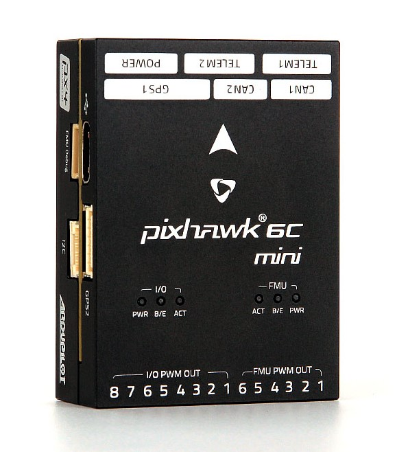

.. _common-holybro-pixhawk6C:

====================================
Pixhawk 6C 6C Mini Flight Controller
====================================

Pixhawk6C is the latest update to the successful family of Pixhawk® autopilots made by Holybro, featuring STM32H7 cpus, vibration isolation of IMUs, redundant IMUs, and IMU heating. It comes in two form factors. The 6C Mini reduces the size and has a built-in PWM motor/servo header, at the expense of a bit fewer ports.

.. image:: ../../../images/holybro-pixhawk6/Pixhawk6C.png
    :target: ../_images/Pixhawk6C.png
    :width: 320px

Where To Buy
============

The Pixhawk6 autopilots are sold by `Holybro <https://shop.holybro.com/c/flight-controllers_0456>`__

Features of Pixhawk6 Series
===========================

+---------------------+-----------------------------+-----------------+----------------------+
|                     |Pixhawk 6X                   |Pixhawk 6C/Mini  |Pix32 v6              |
+=====================+=============================+=================+======================+
|Key Design Point     |Additional Redundancy        |Low profile      |Cost effective        |
|                     +-----------------------------+-----------------+----------------------+
|                     |Modular design, allowing     |Cost effective   |Modular design,       |
|                     |customized baseboard         |                 |allowing customized   |
|                     |                             |                 |baseboard             |
+---------------------+-----------------------------+-----------------+----------------------+
|Processor            |STM32H753                    |               STM32H743                |
+---------------------+-----------------------------+-----------------+----------------------+
|Clock Speed          |                              480 MHz                                 |
+---------------------+-----------------------------+-----------------+----------------------+
|IO Processor         |                              STM32F103                               |
+---------------------+-----------------------------+-----------------+----------------------+
|IMU Redundancy       |Triple                       |Double           |Double                |
+---------------------+-----------------------------+-----------------+----------------------+
|IMU Temperature      |                             Yes                                      |
|Control              |                                                                      |
+---------------------+-----------------------------+-----------------+----------------------+
|Barometer            |                             |                 |                      |
|Redundancy           |Double                       |N/A              | N/A                  |
+---------------------+-----------------------------+-----------------+----------------------+
|Power Monitor        |I2C                          |Analog           |Analog                |
+---------------------+-----------------------------+-----------------+----------------------+
|PWM Outputs          |8 Main, 8 FMU                |8 Main, 8/6 FMU  |8 Main, 6 FMU         |
+---------------------+-----------------------------+-----------------+----------------------+
|UART                 |8                            |7 / 4            |7                     |
+---------------------+-----------------------------+-----------------+----------------------+
|CAN Bus              |                              2                                       |
+---------------------+-----------------------------+-----------------+----------------------+
|GPS/Compass Ports    |                             2                                        |
+---------------------+-----------------------------+-----------------+----------------------+
|UART Flow Control    |3 Ports                      |2/1 Ports        |2 Ports               |
+---------------------+-----------------------------+-----------------+----------------------+
|Additional I2C	      |                             Yes                                      |
+---------------------+-----------------------------+-----------------+----------------------+
|Ethernet Support     |Yes                          |No               |No                    |
+---------------------+-----------------------------+-----------------+----------------------+
|SPI Port             |Yes                          |No               |No                    |
+---------------------+-----------------------------+-----------------+----------------------+
|A/D                  |6.6V,3.3V,RSSI               |RSSI             |RSSI                  |
+---------------------+-----------------------------+-----------------+----------------------+

UART Mapping
============

 - SERIAL0 -> USB 
 - SERIAL1 -> UART7 (Telem1) RTS/CTS pins
 - SERIAL2 -> UART5 (Telem2) RTS/CTS pins
 - SERIAL3 -> USART1 (GPS1)
 - SERIAL4 -> UART8 (GPS2)
 - SERIAL5 -> USART2 (Telem3) RTS/CTS pins (not included on 6C Mini)
 - SERIAL6 -> USART3 (USER) (Debug p)
 - SERIAL7 -> USB (can be used for SLCAN with protocol change)

RC Input
========
The RCIN pin, which by default is mapped to a timer input, can be used for all ArduPilot supported receiver protocols, except CRSF/ELRS and SRXL2 which require a true UART connection. However, FPort, when connected in this manner, will only provide RC without telemetry. 

To allow CRSF and embedded telemetry available in Fport, CRSF, and SRXL2 receivers, a full UART, such as SERIAL5 (UART3) would need to be used for receiver connections. Below are setups using Serial6. For the 6C Mini, SERIAL1 - SERIAL4 would need to be used.

- :ref:`SERIAL5_PROTOCOL<SERIAL5_PROTOCOL>` should be set to "23".

- FPort would require :ref:`SERIAL5_OPTIONS<SERIAL5_OPTIONS>` be set to "15".

- CRSF would require :ref:`SERIAL5_OPTIONS<SERIAL5_OPTIONS>` be set to "0".

- SRXL2 would require :ref:`SERIAL5_OPTIONS<SERIAL5_OPTIONS>` be set to "4" and connects only the TX pin.

Any UART can be used for RC system connections in ArduPilot also, and is compatible with all protocols except PPM. See :ref:`common-rc-systems` for details.

PWM Output
==========

The Pixhawk6C supports up to 16 PWM outputs. All 16 outputs
support all normal PWM output formats. All FMU outputs (marked "FMU PWM Output") also support DShot.

The 8 FMU PWM outputs are in 4 groups:

 - PWM 1, 2, 3 and 4 in group1
 - PWM 5 and 6 in group2
 - PWM 7 and 8 in group3 (not 6C Mini)

FMU outputs within the same group need to use the same output rate and protocol. If
any output in a group uses DShot then all channels in that group need
to use DShot.

.. note:: to use BDShot capability on outputs 1-8, use the firmware in the "Pixhawk6C-bdshot" folder on the `Firmware Server <https://firmware.ardupilot.org>`__

Battery Monitoring
==================

The board has 2 dedicated power monitor ports with a 6 pin
connector. The Pixhawk6C uses analog power monitors on these ports.

- :ref:`BATT_MONITOR<BATT_MONITOR>` = 4
- :ref:`BATT_VOLT_PIN<BATT_VOLT_PIN>` = 8
- :ref:`BATT_CURR_PIN<BATT_CURR_PIN>` = 4
- :ref:`BATT_VOLT_MULT<BATT_VOLT_MULT>` = 18.182
- :ref:`BATT_AMP_PERVLT<BATT_AMP_PERVLT>` = 36.364

- :ref:`BATT2_VOLT_PIN<BATT2_VOLT_PIN>` = 5
- :ref:`BATT2_CURR_PIN<BATT2_CURR_PIN>` = 14
- :ref:`BATT2_VOLT_MULT<BATT2_VOLT_MULT>` = 18.182
- :ref:`BATT2_AMP_PERVLT<BATT2_AMP_PERVLT>` = 36.364

Compass
=======

The Pixhawk6C/Mini has a built-in compass. Due to potential
interference, the autopilot is usually used with an external I2C compass as
part of a GPS/Compass combination.

GPIOs
=====

The FMU PWM outputs can be used as GPIOs (relays, buttons, RPM etc). To use them you need to set the output's ``SERVOx_FUNCTION`` to -1. See :ref:`common-gpios` page for more information.

The numbering of the GPIOs for PIN variables in ArduPilot is:

FMU pins:

 - PWM1 50
 - PWM2 51
 - PWM3 52
 - PWM4 53
 - PWM5 54
 - PWM6 55
 - PWM7 56 (not 6C Mini)
 - PWM8 57 (not 6C Mini)

Analog inputs
=============

The Pixhawk6C has an analog RSSI input pin:

 - Analog 3.3V RSSI input pin = 103

Connectors
==========

Unless noted otherwise all connectors are JST GH

See `Pixhawk6C pinout <https://docs.holybro.com/autopilot/pixhawk-6c/pixhawk-6c-pinout>`__

or `Pixhawk6C Mini pinout <https://docs.holybro.com/autopilot/pixhawk-6c-mini/pixhawk-6c-mini-ports>`__

Loading Firmware
================

The board comes pre-installed with an ArduPilot compatible bootloader,
allowing the loading of xxxxxx.apj firmware files with any ArduPilot
compatible ground station.

Firmware for these boards can be found `here <https://firmware.ardupilot.org>`_ in  sub-folders labeled "Pixhawk6C".

Layout and Dimensions
=====================

See `Pixhawk6C dimensions <https://docs.holybro.com/autopilot/pixhawk-6c/dimensions>`__
[copywiki destination="plane,copter,rover,blimp"]
