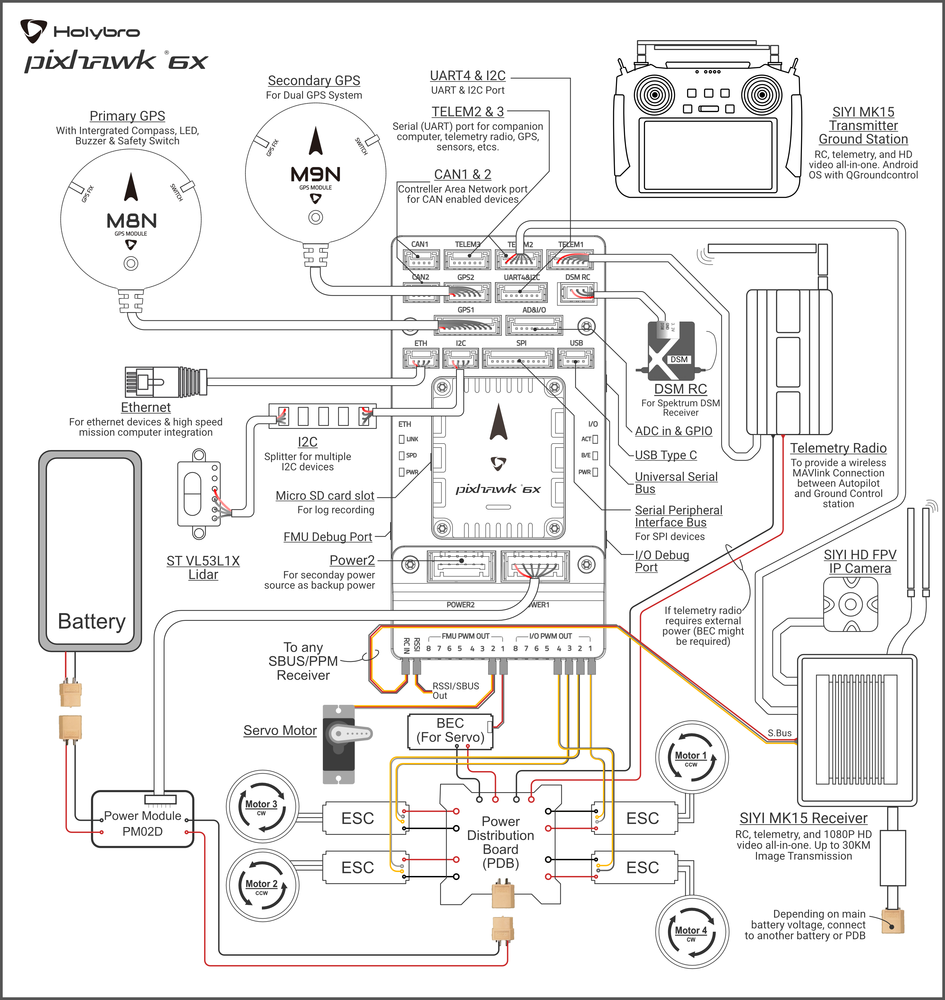

.. _common-holybro-pixhawk6X:

============================
Pixhawk 6X Flight Controller
============================

Pixhawk6X®  is the latest update to the successful family of Pixhawk® autopilots made by Holybro, featuring STM32H7 cpus, vibration isolation of IMUs, redundant IMUs, double redundant barometers on separate buses, IMU heating, and integrated Ethernet for high speed connections to companion computers.

Pixhawk6X:

.. image:: ../../../images/holybro-pixhawk6/Pixhawk6X.png
    :target: ../_images/Pixhawk6X.png
    :width: 450px

Where To Buy
============

The Pixhawk6 autopilots are sold by `Holybro <https://shop.holybro.com/c/flight-controllers_0456>`__

Features of Pixhawk6 Series
===========================

+---------------------+-----------------------------+-----------------+----------------------+
|                     |Pixhawk 6X                   |Pixhawk 6C       |Pix32 v6 (Coming Soon)|
+=====================+=============================+=================+======================+
|Key Design Point     |Additional Redundancy        |Low profile      |Cost effective        |
|                     +-----------------------------+-----------------+----------------------+
|                     |Modular design, allowing     |Cost effective   |Modular design,       |
|                     |customized baseboard         |                 |allowing customized   |
|                     |                             |                 |baseboard             |
+---------------------+-----------------------------+-----------------+----------------------+
|Processor            |STM32H753                    |               STM32H743                |
+---------------------+-----------------------------+-----------------+----------------------+
|Clock Speed          |                              480 MHz                                 |
+---------------------+-----------------------------+-----------------+----------------------+
|IO Processor         |                              STM32F103                               |
+---------------------+-----------------------------+-----------------+----------------------+
|IMU Redundancy       |Triple                       |Double           |Double                |
+---------------------+-----------------------------+-----------------+----------------------+
|IMU Temperature      |                             Yes                                      |
|Control              |                                                                      |
+---------------------+-----------------------------+-----------------+----------------------+
|Barometer            |                             |                 |                      |
|Redundancy           |Double                       |N/A              | N/A                  |
+---------------------+-----------------------------+-----------------+----------------------+
|Power Monitor        |I2C                          |Analog           |Analog                |
+---------------------+-----------------------------+-----------------+----------------------+
|UART                 |8                            |7                |7                     |
+---------------------+-----------------------------+-----------------+----------------------+
|CAN Bus              |                              2                                       |
+---------------------+-----------------------------+-----------------+----------------------+
|GPS/Compass Ports    |                             2                                        |
+---------------------+-----------------------------+-----------------+----------------------+
|UART Flow Control    |3 Ports                      |2 Ports          |2 Ports               |
+---------------------+-----------------------------+-----------------+----------------------+
|Additional I2C	      |                             Yes                                      |
+---------------------+-----------------------------+-----------------+----------------------+
|Ethernet Support     |Yes                          |No               |No                    |
+---------------------+-----------------------------+-----------------+----------------------+
|SPI Port             |Yes                          |No               |No                    |
+---------------------+-----------------------------+-----------------+----------------------+
|A/D                  |6.6V,3.3V,RSSI               |RSSI             |RSSI                  |
+---------------------+-----------------------------+-----------------+----------------------+

Typical Wiring Diagram
======================

.. note:: duplicated RC control and telemetry solutions are shown. Duplicate systems are not usually used.

UART Mapping
============

 - SERIAL0 -> USB 
 - SERIAL1 -> UART7 (Telem1) RTS/CTS pins
 - SERIAL2 -> UART5 (Telem2) RTS/CTS pins
 - SERIAL3 -> USART1 (GPS1)
 - SERIAL4 -> UART8 (GPS2)
 - SERIAL5 -> USART2 (Telem3) RTS/CTS pins
 - SERIAL6 -> UART4 (User)
 - SERIAL7 -> USART3 (Debug)
 - SERIAL8 -> USB (MAVLink, can be used for SLCAN with protocol change)

RC Input
========
The RCIN pin, which by default is mapped to a timer input, can be used for all ArduPilot supported receiver protocols, except CRSF/ELRS and SRXL2 which require a true UART connection. However, FPort, when connected in this manner, will only provide RC without telemetry. 

To allow CRSF and embedded telemetry available in Fport, CRSF, and SRXL2 receivers, a full UART, such as SERIAL6 (UART4) would need to be used for receiver connections. Below are setups using Serial6.

- :ref:`SERIAL6_PROTOCOL<SERIAL6_PROTOCOL>` should be set to "23".

- FPort would require :ref:`SERIAL6_OPTIONS<SERIAL6_OPTIONS>` be set to "15".

- CRSF would require :ref:`SERIAL6_OPTIONS<SERIAL6_OPTIONS>` be set to "0".

- SRXL2 would require :ref:`SERIAL6_OPTIONS<SERIAL6_OPTIONS>` be set to "4" and connects only the TX pin.

Any UART can be used for RC system connections in ArduPilot also, and is compatible with all protocols except PPM. See :ref:`common-rc-systems` for details.

PWM Output
==========

The Pixhawk6X supports up to 16 PWM outputs. All 16 outputs
support all normal PWM output formats. All FMU outputs, except 7 and 8, also support DShot.

The 8 FMU PWM outputs are in 4 groups:

 - Outputs 1, 2, 3 and 4 in group1
 - Outputs 5 and 6 in group2
 - Outputs 7 and 8 in group3

FMU outputs within the same group need to use the same output rate and protocol. If
any output in a group uses DShot then all channels in that group need
to use DShot.

Battery Monitoring
==================

The board has 2 dedicated power monitor ports with a 6 pin
connector. They are intended for use with the I2C power monitor supplied with the autopilot.

.. note:: do not try to use the Mission Planner SETUP->Optional Hardware->Battery Monitor tab to setup the I2C power monitors for the Pixhawk6X. The parameters needed for their operation are already setup by default:

- :ref:`BATT_MONITOR<BATT_MONITOR>` = 21
- :ref:`BATT_I2C_BUS<BATT_I2C_BUS__AP_BattMonitor_INA2xx>` = 1
- :ref:`BATT_I2C_ADDR<BATT_I2C_ADDR__AP_BattMonitor_INA2xx>` = 65 (For Low voltage (6S) Digital Power Module),= 69 (For High Voltage (12S/14S) Digital Power Module)

.. note:: In Ardupilot 4.4 and later, the BATT_I2C_ADDR for Pixhawk 6X is default to be 0. This will perform an auto detection of the I2C address, and you do not need to change BATT_I2C_ADDR parameter.

Compass
=======

The Pixhawk6X has a built-in compass. Due to potential
interference, the autopilot is usually used with an external I2C compass as
part of a GPS/Compass combination.

GPIOs
=====

The 8 FMU outputs can be used as GPIOs (relays, buttons, RPM etc). To use them you need to set the output's ``SERVOx_FUNCTION`` to -1. See :ref:`common-gpios` page for more information.

The numbering of the GPIOs for PIN variables in ArduPilot is:

FMU pins:

 - PWM1 50
 - PWM2 51
 - PWM3 52
 - PWM4 53
 - PWM5 54
 - PWM6 55
 - PWM7 56
 - PWM8 57

Additional GPIOs:

 - FMU_CAP1 58
 - NFC_GPIO 59

Analog inputs
=============

The Pixhawk6X has 2 analog inputs, one 6V tolerant and one 3.3V tolerant

 - ADC Pin12 -> ADC 6.6V Sense
 - ADC Pin13 -> ADC 3.3V Sense
 - Analog 3.3V RSSI input pin = 103

Connectors
==========

Unless noted otherwise all connectors are JST GH

See `Pixhawk6X baseboard pinout <https://docs.holybro.com/autopilot/pixhawk-6x/pixhawk-baseboard-pinout>`__ 

Loading Firmware
================

The board comes pre-installed with an ArduPilot compatible bootloader,
allowing the loading of xxxxxx.apj firmware files with any ArduPilot
compatible ground station.

Firmware for these boards can be found `here <https://firmware.ardupilot.org>`_ in  sub-folders labeled "Pixhawk6X".

Bi-Directional DShot firmware variations are available also.

Layout and Dimensions
=====================

See `Pixhawk6X dimensions <https://docs.holybro.com/autopilot/pixhawk-6x/dimensions>`__ 
[copywiki destination="plane,copter,rover,blimp"]
