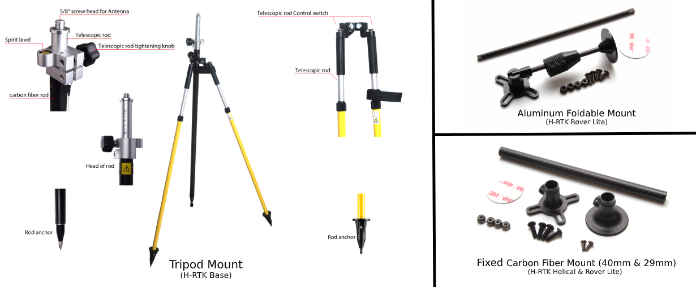

.. _common-holybro-rtk-f9p:

======================
Holybro H-RTK F9P GNSS
======================

.. image:: ../../../images/rtk_holybro_h-rtk-f9p_all_label.jpg
    :target: ../_images/rtk_holybro_h-rtk-f9p_all_label.jpg
    :width: 450px

The `Holybro H-RTK F9P GNSS <http://www.holybro.com/product/h-rtk-f9p/>`_ is an multi-band high-precision RTK GPS series by Holybro. This system provides multi-band RTK with fast convergence times and reliable performance, concurrent reception of GPS, GLONASS, Galileo and BeiDou, and fast update rate for highly dynamic and high volume applications with centimeter-accuracy. It uses a UBLOX F9P module, an IST8310 compass, and a tri-colored NTF LED indicator. It also has a integrated safety switch for simple and convenient operation.

Using RTK allows ArduPilot to get its position with centimeter-level accuracy, which is much more accurate than can be provided by a normal GPS.

There are three models of Holybro H-RTK F9P to choose from, each with different antenna design to meet different needs: 

Pin Map
=======

Wiring and Connections
======================

All H-RTK GNSS models come with a GH 10-pin connector/cable that is compatible with the Pixhawk family and many other autopilots.

.. note:: The cables/connectors may be modified to connect to other flight controller boards, using the Pin Map information provided above.

Configuration
=============

For normal operation, ArduPilot's GPS parameter defaults will work for any serial port configured for ``SERIALx_PROTOCOL`` = 5. 

.. note:: ArduPilot does not currently configure UBlox F9P GPS constellations. User must assure that the GPS is properly configured for his region and application. See :ref:`common-gps-ublox-firmware-update`

GPS Accessories
===============

Where to Buy
============

- `H-RTK F9P <https://shop.holybro.com/h-rtk-f9p_p1226.html?>`_
- `H-RTK Accessories <https://shop.holybro.com/c/h-rtk_0512>`_
