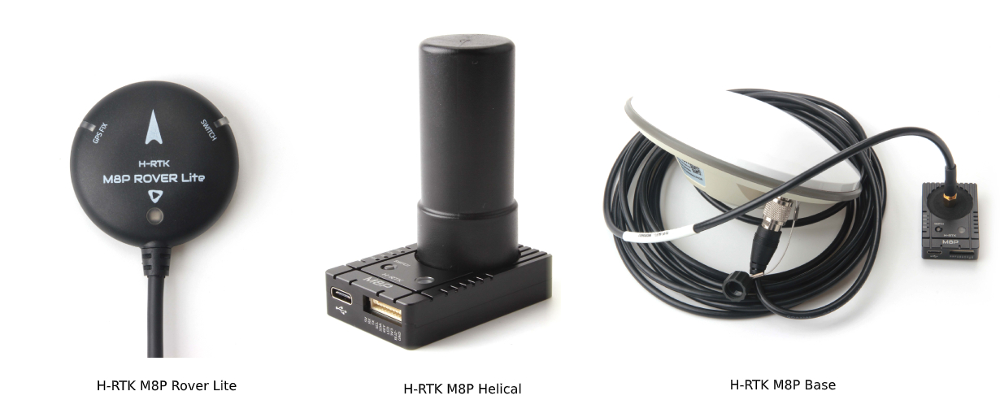
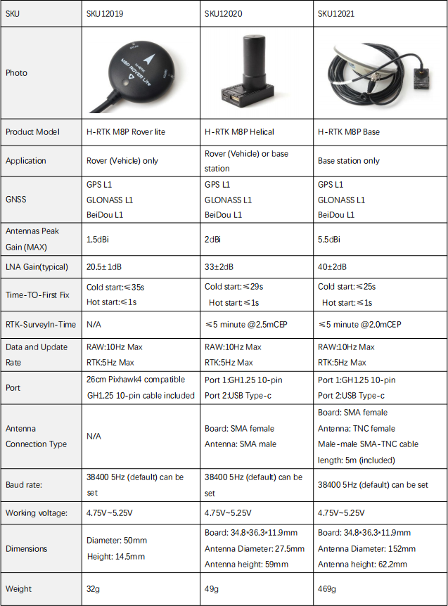
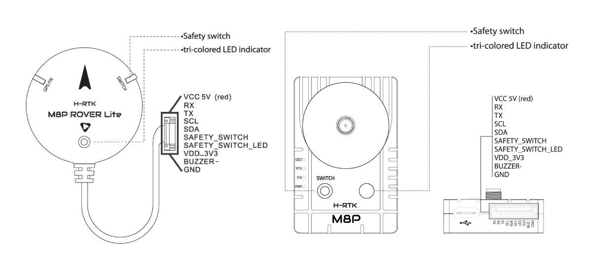
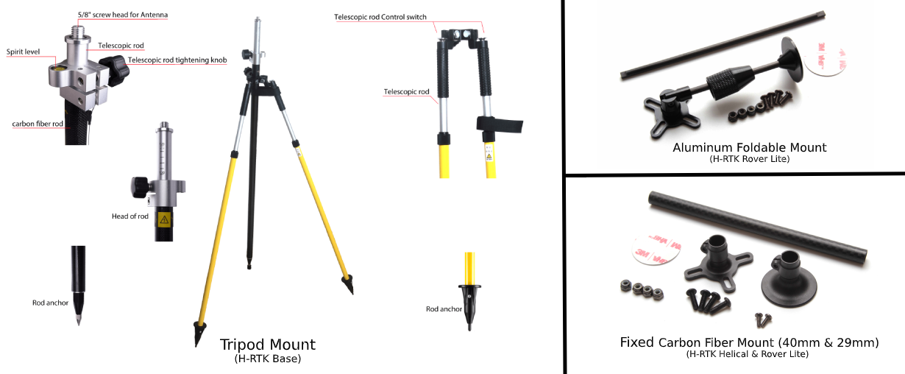

.. _common-holybro-rtk-m8p:

======================
Holybro H-RTK M8P GNSS
======================

The `Holybro H-RTK M8P GNSS <http://www.holybro.com/product/h-rtk-m8p-rover-lite/>`_  is an RTK GNSS module for mass market by Holybro. This family is similar to the :ref:`common-holybro-rtk-f9p` family but uses the smaller, lighter, and less expensive M8P Ublox RTK GNSS module which still provides far superior position resolution than previous generations.
 
Using RTK allows ArduPilot to get its position with centimeter-level accuracy, which is much more accurate than can be provided by a normal GPS.

There are three models of Holybro H-RTK M8P to choose from, each with different antenna design to meet different needs: 

Pin Map
=======

Wiring and Connections
======================

All H-RTK GNSS models come with a GH 10-pin connector/cable that is compatible with the Pixhawk family and many other autopilots.

.. note:: The cables/connectors may be modified to connect to other flight controller boards, using the Pin Map information provided above.

Configuration
=============

For normal operation, ArduPilot's GPS parameter defaults will work for any serial port configured for ``SERIALx_PROTOCOL`` = 5. 

GPS Accessories
===============

Where to Buy
============

- `H-RTK M8P <https://shop.holybro.com/h-rtk-m8p_p1221.html?>`_
- `H-RTK Accessories <https://shop.holybro.com/c/h-rtk_0512>`_
