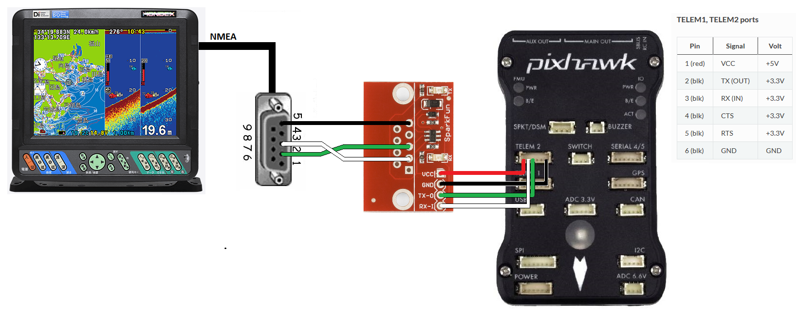

.. _common-hondex-sonar:

============
Hondex Sonar
============

The `Hondex HE-8S <https://www.honda-el.co.jp/product/marine/lineup/gps_plotter_fishfinder/he-8s>`__ is an echosounder (aka underwater sonar) with a 100m range, built-in GPS and NMEA output that can be consumed by ArduPilot.  Other Hondex sonar may also work but this has not yet been confirmed.

*image courtesy of www.honda-el.co.jp*

Recommended Hardware
--------------------

- Hondex HE-8S sonar (`Hondex distributors can be found here <https://www.honda-el.net/marine/distributors.html>`__)
- `Sparkfun RS232 To Serial converter <https://www.sparkfun.com/products/8780>`__
- `USB to RS232 converter <https://www.sparkfun.com/products/11304>`__ to allow testing and configuring the sensor with a PC

Connecting and Configuring
--------------------------

The sonar provides distance measurements using the NMEA protocol over serial at 9600 baud.  There should be a port on the back of the sonar labelled "NMEA" with a DB9 connector.

The sonar's DB9 connector should be wired to the RS232-to-Serial converter board as shown below.  Note that the sonar's DB9 port's pin2 and pin3 are connected to the converter board's pin3 and pin2 (i.e. crossed).  The converter board's serial output can be connected to any available serial port on the autopilot.  In the diagram below the SERIAL2 is used.

If the SERIAL2 is used then the following parameters should be set:

-  :ref:`SERIAL2_PROTOCOL <SERIAL2_PROTOCOL>` = 9 (Lidar)
-  :ref:`SERIAL2_BAUD <SERIAL2_BAUD>` = 9 (9600 baud)

The following range finder related parameters should also be set:

-  :ref:`RNGFND1_TYPE <RNGFND1_TYPE>` = 17 (NMEA)
-  :ref:`RNGFND1_MIN_CM <RNGFND1_MIN_CM>` = 13
-  :ref:`RNGFND1_MAX_CM <RNGFND1_MAX_CM>` = 10000 (i.e. 100m).  *This is the distance in centimeters that the rangefinder can reliably read.*
-  :ref:`RNGFND1_ORIENT <RNGFND1_ORIENT>` = 25 (i.e. down) if mounted on a boat

Testing the sensor
==================

Distances read by the sensor can be seen in the Mission Planner's Flight
Data screen's Status tab. Look closely for "sonarrange".

.. image:: ../../../images/mp_rangefinder_lidarlite_testing.jpg
    :target: ../_images/mp_rangefinder_lidarlite_testing.jpg

More info on NMEA message contents can be found `here <http://www.catb.org/gpsd/NMEA.html>`__

