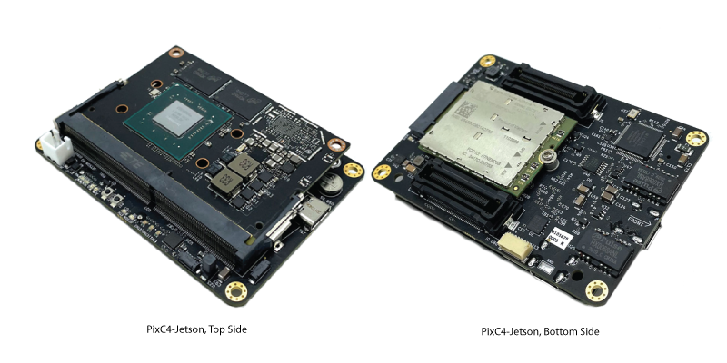
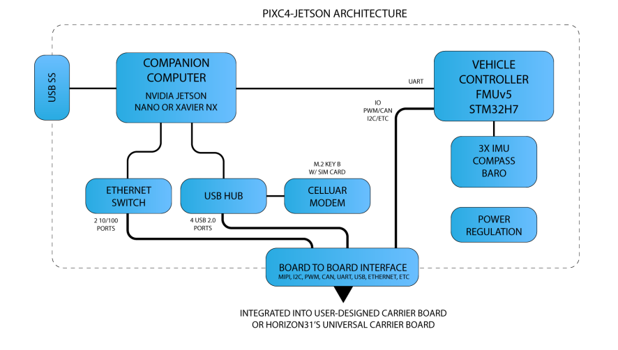

.. _common-horizon31-pixc4-jetson:

=========================
Horizon31 PixC4-Jetson
=========================

The PixC4-Jetson is a professional-quality and NDAA Compliant Flight Management Unit (FMU), powerful single board computer and peripheral support system (USB, MIPI, Ethernet, M.2 slot, etc.) in a small form factor, designed to be integrated into end-user platforms. The term “PixC4” is derived from the Pixhawk, on which the FMU design is based (FMUv5) and C4, representing Command, Control, Compute and Communication.

Available as a turnkey solution including software pre-flashed on the Nvidia Jetson companion computer to enable the following features:

- UDP Unicast/Multicast/Broadcast Telemetry (MAVLink)
- LTE connection management with Layer-2 peer to peer VPN
- Powerful multi-endpoint video encoding pipelines with example/open-source scripts for customization
- `ATAK <https://www.civtak.org/>`__ Integration
- Web interface for configuration and remote terminal access
- Supports multiple simultaneous communication pathways such as LOS, LTE and Satcom with advanced stale command rejection and message deduplication
- Scalable and secure cloud connectivity to Horizon31's US servers and optional access to their cloud GCS and low-latency webRTC video distribution system (https://gcs.horizon31.com)

Specifications
==============

- STM32H743 Processor with STM32F103 IO Processor (FMUv5 design)
- Integrated Nvidia Jetson companion computer, compatible with Nvidia Jetson Nano, Xavier NX or TX2 NX
- Ethernet switch (3 port)
- USB 2.0 Hub (7 port)
- Cellular/LTE Modem support (M.2. Key B slot)
- Support for RockBlock 9603 Iridium Modem
- F-RAM Cypress MF25V02A-DG 256-Kbit nonvolatile memory (Flash memory that performs as fast as RAM)
- Invensense ICM-20602 (x2) 3-axis accelerometer/gyroscope
- Invensense ICM-42688 3-axis accelerometer/gyroscope/magnetometer
- MS5611 barometer
- RM3100 Compass
- Micro SD Card for FMU
- Nano SIM card slot for M.2 cellular Modem

Board to board connector with the following IO: 

- Spektrum DSM / DSM2 / DSM-X® Satellite compatible input and binding (FMU)
- Futaba S.BUS® & S.BUS2® compatible input (FMU)
- 1x Telemetry port output (FMU)
- PPM sum input signal (FMU)
- 14x PWM outputs (6 DShot capable) (FMU)
- 1x RSSI (PWM or voltage) input (FMU)
- 2x I2C (FMU)
- 1x UART (FMU)
- 1x SPI (FMU)
- 2x CAN (FMU)
- Voltage/Current Sense (FMU)
- Safety Switch (FMU)
- Buzzer Out (FMU)
- Jetson UART/Console (Jetson)
- MIPI/CSI (Jetson)
- UART (Jetson)
- I2S (Jetson)
- I2C x2 (Jetson)
- GPIO x5 (Jetson)
- Ethernet (x2) 100 Mbps (Jetson)
- USB 2.0 (x4) (Jetson)
- Power Input (5V, ~2-5A depending on compute module used). Accepts redundant/separate supplies for FMU and Jetson.

Other IO:

- JTAG for FMU and IO
- USB 3.0 SS Type C (Jetson)
- USB 2.0 Type C (FMU)
- Jetson Fan Control
- M.2 Key B Connector
- FMU and IO RGB LED, Ethernet status LEDs, Power LEDs

Weight and Dimensions
=============================
- Weight: 33g (without heatsink)
- Width: 59mm 
- Length: 83mm

More Information
================

Pinouts, wiring diagrams, setup information and more documentation is available here:

`Horizon31 PixC4-Jetson <https://horizon31.com/product/pixc4-jetson/>`_

Where to Buy
============

`Horizon31 <https://horizon31.com/>`_  
Made in the USA  

[copywiki destination="plane,copter,rover,blimp"]