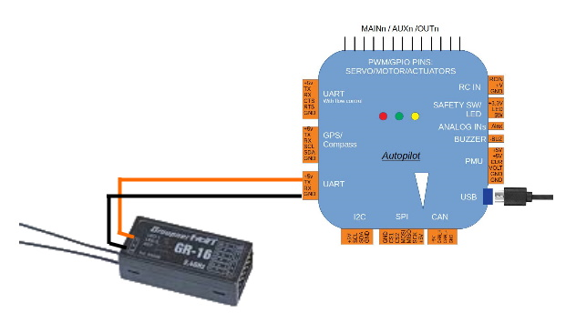

.. _common-hott-telemetry:

==============
HOTT Telemetry
==============

ArduPilot firmware versions later than 4.0 supports the Graupner HOTT telemetry.

.. image:: ../../../images/mz-32.jpg

Wiring and Setup
================

Connection to the autopilot is via any UART port's TX input, although one without RTS/CTS flow control is simpler to configure, since flow control is not required.

To enable HOTT telemetry, for example on the first TELEM port SERIAL1:

:ref:`SERIAL1_BAUD<SERIAL1_BAUD>`  set to 19 (for 19.2KBaud)

:ref:`SERIAL1_PROTOCOL<SERIAL1_PROTOCOL>`  set to 27 (HOTT)

:ref:`SERIAL1_OPTIONS<SERIAL1_OPTIONS>`   set to 4 (Half Duplex)

