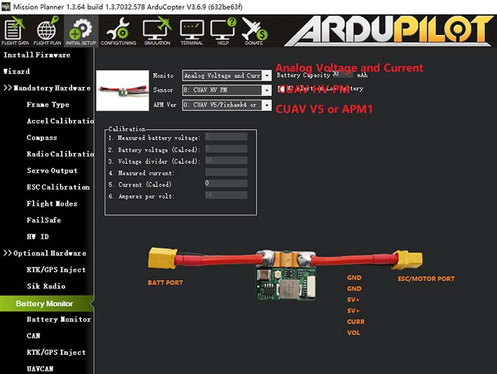

.. _common-hv-pm:

=================================
HV PM (High voltage power module)
=================================

The CUAV HV PM module is a new high voltage voltage power module independently developed by CUAV with the following features:

* High voltage input: 10v-60v (3S~14S battery)
* Highly accurate battery monitor: 
  * voltage detection accuracy: +-0.1v
  * current detection accuracy: +-0.4A
* Bec (5v) max current: 5A
* Max current measurement: 60A
* Max allowable output current(ESC/MOTOR PORT): 60A

Enabling the HV PM
==================

* Set Monitor：Anglog Voltage and Current
* Set Sensor：CUAV HV PM
* Set APM Ver：CUAV v5 or Pixhawk4(for V5 series flight control selects CUAV v5)
* Click on other interface to write parameters
* Restart Mission Planner and autopilot

You can also enable it by setting the following parameters (shown for first battery monitor).

- :ref:`BATT_MONITOR<BATT_MONITOR>` to 4 to Set to analog voltage and current.
- Restart Mission Planner and autopilot
- :ref:`BATT_VOLT_PIN<BATT_VOLT_PIN>` to 0 (for CUAV V5).
- :ref:`BATT_CURR_PIN<BATT_CURR_PIN>` to 1 (for CUAV V5).
- :ref:`BATT_VOLT_MULT<BATT_VOLT_MULT>` to 18
- :ref:`BATT_AMP_PERVLT<BATT_AMP_PERVLT>` to 24
- Restart Mission Planner and autopilot
