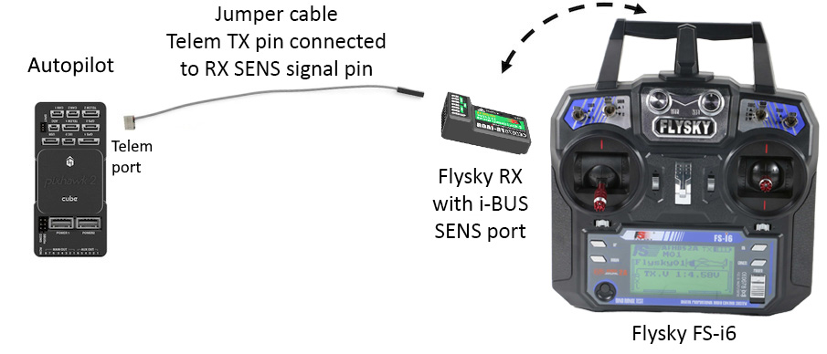

.. _common-ibus-telemetry:
[copywiki destination="plane,copter,rover,blimp"]
===============
i-BUS Telemetry
===============

i-BUS telemetry allows you to display ArduPilot information such as flight modes, battery level, and speed, as well as information from other supported i-BUS telemetry values on `Flysky <https://www.flysky-cn.com/plane>`__ and Turnigy transmitters (using stock, modified, or OpenTX firmware) when using an i-BUS receiver with a SENS port (such as the `iA6B <https://www.flysky-cn.com/ia6b-canshu>`__, `FTr8B <https://www.flysky-cn.com/ftr8bspecifications>`__, etc).

It is particularly useful:

- for flying without a ground control station (no need for MAVLink telemetry radio),
- as a backup in case the ground station fails (e.g., loss of MAVLink radio link),
- when a separate person operates the ground control station,
- for quick situational awareness by the pilot.

Moreover, some RC transmitters such as the Flysky FS-i6X can be modified with OpenTX firmware, enabling a lot more functionality based on incoming telemetry than stock firmware allows.

    i-BUS Telemetry setup with Flysky FS-i6 transmitter running stock firmware.

Setup
=====

.. note:: Support for this peripheral is included on all boards with *more* than 2MB flash memory. It is also available for other boards using the `Custom Firwmare Build Server <https://custom.ardupilot.org/>`__ , by creating a firmware build including this feature listed under the Telemetry category.

In order to use i-BUS telemetry, the following steps are required:

- Connect the TX pin of an autopilot telemetry port to the signal pin of your i-BUS receiver's SENS interface. No voltage or ground pins should be needed as the receiver will already be powered by the PPM RC connection or the servo rail.
- Configure the autopilot.
- Enable telemetry display on your supporting transmitter.

Configuring ArduPilot
---------------------

Set the following parameters for the telemetry port used:

- ``SERIALx_PROTOCOL`` = 49
- ``SERIALx_OPTIONS`` = 0 / cleared as the library will set its own options

``SERIALX_BAUD`` doesn't matter as the library will set its own baud

.. note:: SERIAL port numbers do not necessarily directly correspond to UART or TELEM port labels. See the hardware documentation for your :ref:`autopilot <common-autopilots>`.

.. note:: Any configuration change to a UART requires a re-boot to take effect.

Configuring your transmitter
----------------------------

The process differs based on your transmitter's model. Some common ones are listed here:

- Flysky FS-i6/X with stock firmware: page 21 of the user manual: https://www.flysky-cn.com/fsi6
- Flysky FS-i6 with 14 channel firmware: https://github.com/qba667/FlySkyI6/wiki/Telemetry
- Flysky FS-i6X with OpenTX: Page to the *TELEMETRY* section of your model configuration, then scroll down and select *Sensors* > *Discover new*

Sensors
=======

ArduPilot supports most standard i-BUS sensors for which it has a logical equivalent data source. Most receivers, however, will only request the first 15 available sensors and ignore the rest. Therefore the sensor types have been sorted in order of subjective value for use on transmitters with small screens such as entry-level Flysky transmitters.

Some sensors provide multiple values while only using one slot. Some (such as GPS location or XYZ data) are logical groups of information but require a sensor slot for each data point.

If any sensors require features that have been excluded from your board's build, those sensors will be excluded from the list allowing lower priority sensors into the top 15 slots.

If you have a receiver that doesn't follow the standard limit and opts to allow more sensors in exchange for a fractionally slower update frequency, you will receive extra telemetry.

The sensor priority order is:

- Armed status (Armed/UnArmed on stock/modified firmware; 0/1 on OpenTX)
- Flight mode (where an equivalent i-BUS mode exists, otherwise blank; just a number on OpenTX)
- GPS Status (0: unhealthy, 1: no fix, 2: 2D fix, 3: 3D fix) plus number of satellites (using 1 slot total)
- Remaining battery or fuel %
- Battery voltage
- Altitude
- Distance from home
- Climb rate / vertical speed
- Ground speed
- Roll, Pitch & Yaw angles (3 separate sensors using 3 slots)
- Airspeed
- Temperature and air pressure (2 separate sensors using only 1 slot)
- RPM
- Current usage
- Average cell voltage
- Compass heading (equivalent to Yaw)
- Course over ground
- GPS latitude & longitude (2 separate sensors using 2 slots)
- GPS altitude ASL
- Acceleration X, Y & Z (3 separate sensors using 3 slots)
