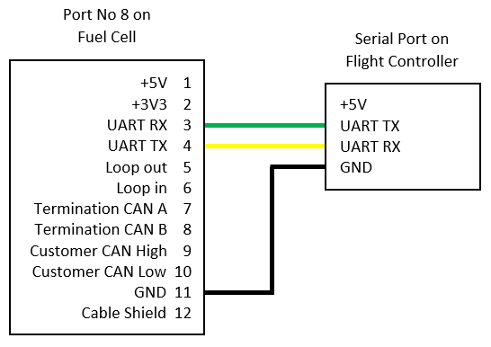

.. _common-ie24-fuelcell:

==================================
Intelligent Energy Fuel Cell 2.4kW
==================================

This page explains how to connect Intelligent Energy's 2.4 kW fuel cell to ArduPilot.  Telemetry from the fuel cell is transmitted via serial to ArduPilot.  This gives the following feedback:

- Hydrogen tank level as a percentage.
- Battery voltage.
- Battery current.
- Battery remaining.
- Fuel cell state.
- Error codes.
- Total power out (log only).
- Stack Power Module (SPM) power (log only).

Setup
-----

Connecting the Device
+++++++++++++++++++++

Connect the UART from the port No 8 on the fuel cell to any serial port on your flight controller.  `See device user manual <https://www.intelligent-energy.com/our-products/support/>`__ for details on where to find port No 8.  Only the GND, UART TX, and UART RX connections are required.  See the diagram below:

Parameter Configuration
+++++++++++++++++++++++

Enable the fuel cell driver by setting :ref:`GEN_TYPE <GEN_TYPE>` to 2.

Fuel cell telemetry is transmitted over serial.  The appropriate serial port needs to be configured to receive fuel cell data.  Set the :ref:`SERIALX_PROTOCOL <SERIAL1_PROTOCOL>` parameter to 30 for generator.

The generator library utilises the battery monitor mavlink messages to display fuel cell telemetry on the ground station.  Two battery monitor instances are required for one fuel cell.  One for the fuel tank and another for the battery.  Set :ref:`BATTX_MONITOR <BATT_MONITOR>` parameter to 17 for the fuel cells electrical data.  Set another :ref:`BATTX_MONITOR <BATT_MONITOR>` parameter to 18 for the hydrogen tank telemetry.

This fuel cell unit reports tank percentage remaining.  As such, the following parameter must be set for the tank battery monitor:

- :ref:`BATTX_CAPACITY <BATT_CAPACITY>` = 100 must be set to give a sensible readout of a percentage on the GCS.

- Tank capacity related failsafes can be set using :ref:`BATTX_LOW_MAH <BATT_LOW_MAH>`, :ref:`BATTX_CRT_MAH <BATT_CRT_MAH>`, :ref:`BATTX_ARM_MAH <BATT_ARM_MAH>`.

Reboot the flight controller after setting the parameters for the settings to take effect.

Normal battery monitor failsafes for battery capacity and battery voltage can be set on the monitor instance designated as 'Generator-Elec'.  However, keep in mind that the battery capacity on these units is small for the size of vehicle required to lift them.  Hence, if the battery voltage or capacity remaining failsafes are triggered there is not a lot of flight time left and you should land immediately.

.. tip::
    In this instance, ignore the units of the the fuel tank capacity parameter.  The tank capacity is only reported as a percentage.  As such values should be entered in the range from 1 to 100.

.. note::
    Voltage data is reported for the battery.  Because the fuel cell is constantly charging the battery, you will not see a significant change in battery voltage.  Only once the fuel cell has used all of its hydrogen and you are using the battery exclusively will you see large changes in voltage.

.. note::
    The current reported on the GCS is the battery current.  What is unusual if you are used to using a normal battery monitor, is that the current will go negative.  A negative current indicates that the battery is charging.  A positive current will indicate that the battery is being used to supplement the fuel cell's power output.  Similarly you will notice that the battery remaining percentage will increase again as the battery is recharged.

Fuel Cell Status
----------------

The fuel cell reports status over the telemetry.  The status levels are:

- Starting
- Ready
- Running
- Fault
- Battery Only

A message will be displayed on the GCS and in the flight log whenever the fuel cell status changes.  The vehicle can only be armed when the fuel cell is reporting a status of 'Running'.

Failsafes and Pre-Arm Checks
----------------------------

Failsafes and pre-arm checks are hard-coded and based on the error codes sent by the fuel cell.  Failsafes have been separated into two groups: Low and Critical.  The error code groups are listed below.  If an error code is received from the fuel cell, the resulting failsafe action will be set by the :ref:`BATTX_FS_LOW_ACT <BATT_FS_LOW_ACT>` and :ref:`BATTX_FS_CRT_ACT <BATT_FS_CRT_ACT>` respectively.

.. Note::
    Monitoring of the fuel cell's internal error codes for pre-arm checks and failsafes are only done on the battery monitor instance allocated for the electrical telemetry.  The electrical battery monitor instance must therefore be set to trigger failsafes based on error codes.

Failsafe Low Action Error Code Group
++++++++++++++++++++++++++++++++++++

.. raw:: html

   <table border="1" class="docutils">
   <tbody>

   <tr>
   <th>Error Code</th>
   <th>Definition</th>
   </tr>

   <tr>
   <td>31</td>
   <td>Start Denied</th>
   </tr>

   <tr>
   <td>30</td>
   <td>Pressure Alert</th>
   </tr>

   <tr>
   <td>21</td>
   <td>Battery Low</th>
   </tr>

   <tr>
   <td>20</td>
   <td>Pressure Low</th>
   </tr>

   <tr>
   <td>11</td>
   <td>SPM Lost</th>
   </tr>

   <tr>
   <td>10</td>
   <td>Reduced Power</th>
   </tr>

   </tbody>
   </table>

Failsafe Critical Action Error Code Group
+++++++++++++++++++++++++++++++++++++++++

.. raw:: html

   <table border="1" class="docutils">
   <tbody>

   <tr>
   <th>Error Code</th>
   <th>Definition</th>
   </tr>

   <tr>
   <td>40</td>
   <td>Battery Critical</td>
   </tr>

   <tr>
   <td>33</td>
   <td>Pressure Critical</td>
   </tr>

   <tr>
   <td>32</td>
   <td>System Critical</td>
   </tr>

   </tbody>
   </table>

Example
+++++++
This example has been provided to make it clear how the failsafe actions are set.

The battery monitors have been configured so that electrical telemetry data is on battery monitor 1 and hydrogen tank telemetry is on battery monitor 2:

- :ref:`BATT_MONITOR <BATT_MONITOR>` = 17 (electrical data)
- :ref:`BATT2_MONITOR <BATT2_MONITOR>` = 18 (tank data)

The failsafe actions that correspond to the error code groups listed above are then set on battery monitor 1 as that is the one associated with the electrical telemetry data.

- :ref:`BATT_FS_LOW_ACT <BATT_FS_LOW_ACT>` = 2 (RTL)
- :ref:`BATT_FS_CRT_ACT <BATT_FS_CRT_ACT>` = 1 (land)

A tank level failsafe has been set on battery monitor 2 so that the vehicle will return to land when the fuel level gets below 20%.  This is done by setting:

- :ref:`BATT2_FS_LOW_ACT <BATT2_FS_LOW_ACT>` = 2 (RTL)
- :ref:`BATT2_CAPACITY <BATT2_CAPACITY>` = 100
- :ref:`BATTX_LOW_MAH <BATT_LOW_MAH>` = 20

As previously mentioned, normal voltage failsafes can be used on this fuel cell model.  Hence, as a final belt-and-braces approach a critical voltage failsafe has been set on the electrical generator monitor instance to initiate an immediate landing if voltage gets to 3.3 V per cell:

- :ref:`BATT_CRT_VOLT <BATT_CRT_VOLT>` = 39.6

Driver Not Healthy
------------------

If you see the `Generator: Not Healthy` message in the GCS then ArduPilot has not received any data packets from the fuel cell for at least 5 seconds.  Check the following for common causes to this issue:

- Fuel cell is powered on
- Telemetry is connected to a flight controller serial port.
- The serial connection is wired correctly (TX->RX, RX->TX).
- The :ref:`SERIALX_PROTOCOL <SERIAL1_PROTOCOL>` parameter is set to generator for the correct telemetry port.

Flight Log Data
---------------

The telemetry data is stored across a few data groups in the flight data log.  This data can be found as follows:

- Hydrogen percent used in BAT->CurrTot for the battery monitor instance set as Generator-Fuel.
- Hydrogen remaing is also logged in IE24->FUEL as percentage remaining.
- Battery voltage in BAT->Volt for the battery monitor instance set as Generator-Elec.
- Battery current in BAT->Curr for the battery monitor instance set as Generator-Elec.
- Battery used in BAT->CurrTot for the battery monitor instance set as Generator-Elec.
- Fuel cell state logged when state changes in MSG.
- Error codes logged when error code changes in MSG and in IE24->ERR.
- Total power out is logged in IE24->POUT.
- SPM power is logged in IE24->SPMPWR
