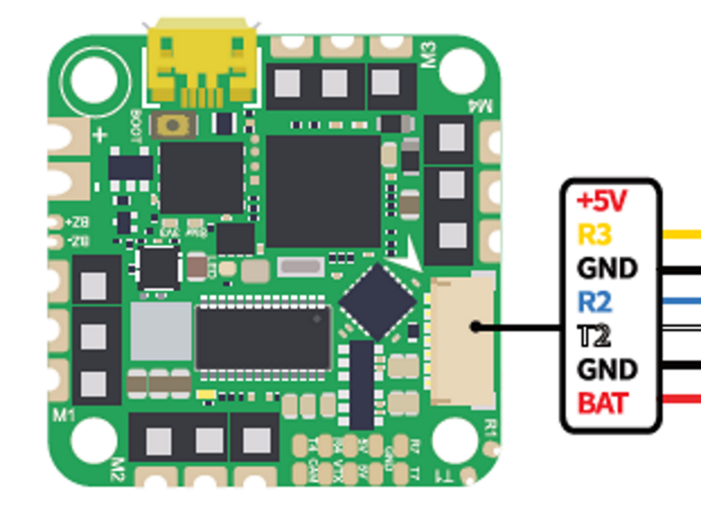

.. _common-iflight-beastf7AIO:

========================
IFlight Beast F7 45A AIO
========================

Specifications
==============

-  **Processor**

   -  STM32F745 BGA ARM (216MHz), 1MB Flash
   -  Integrated 4 output, BLHeli-S 45A ESC

-  **Sensors**

   -  InvenSense MPU6000 IMU (accel, gyro) 
   -  BMP280 barometer (not in V2 version)
   -  Voltage & 300A Current sensor

-  **Power**

   -  7.4V ~ 25V DC input power
   -  5V 2.5A BEC for peripherals

-  **Interfaces**

   -  5x UARTS
   -  5x PWM outputs, first 4 are internally connected to 4in1 45A BLHeli-S ESC, the fifth for LED
   -  I2C port for external compass, airspeed sensor, etc.
   -  USB port
   -  8MB on board Flash for logging (set :ref:`LOG_BACKEND_TYPE<LOG_BACKEND_TYPE>` = 4)
   -  Camera input/ VTX output
   -  300A current sensor
   -  Built-in OSD

-  **Size and Dimensions**

   - 32.5mm x 32.5mm (25.5 x 25.5mm mount pattern)
   - 8.5g

.. warning:: This board has no compass and no way to connect an external compass. Applications requiring accurate heading information must rely on ArduPilots :ref:`common-compassless` operation.

.. warning:: This autopilot does not have a barometer. An external barometer can be added, or operation with an alternate altitude sensor, such as GPS for outdoor use or rangefinder for indoor applications is supported (see :ref:`EK3_SRC1_POSZ<EK3_SRC1_POSZ>`), with the following caveats. In Plane, if GPS is lost, then the user should switch to MANUAL mode immediately to avoid a crash. In Copter, operation is allowed using GPS, but not recommended, due to the imprecision in altitude hold modes. Bear in mind if GPS fails and the vehicle is using it for altitude information, a crash can eventually result due to lack of accurate altitude information.See :ref:`common-gps-for-alt` for more information.

Where to Buy
============

`IFlight <https://shop.iflight-rc.com/index.php?route=product/product&product_id=1377>`__

Barometer-less Operation
========================

Depending on version, this autopilot may not include a barometer sensor for altitude information and therefore has restricted modes of operation:

Plane
-----
An altitude source must be provided for any operation. Attach a GPS and follow the instructions in :ref:`common-gps-for-alt`.

Copter
------
Arming and operation in ACRO and STABILIZE modes is possible. It is also possible to arm and fly in ALTHOLD, but altitude hold performance relies on accelerometer/gyro exclusively and could be exceptionally poor, even resulting in a crash so is not recommended. As with Plane you can use a GPS for altitude data, but Rangefinders and Beacons can also be used and the ``EK3_SCRX_POSZ`` parameters set appropriately.

Rover
-----
Rover does not require an altitude source and the ``EK3_SCRX_POSZ`` parameters can be set to "0"

Default UART order
==================

he UARTs are marked Rn and Tn in the above pinouts. The Rn pin is the receive pin for UARTn. The Tn pin is the transmit pin for UARTn.

- SERIAL0 = console = USB
- SERIAL1 = Telemetry1 = USART1 (Alternate RC input/output)
- SERIAL2 = Telemetry2 = USART2 (DJI)
- SERIAL3 = RC Input = USART3 
- SERIAL4 = GPS = USART4
- SERIAL7 = USER = UART7 

UART1 supports RX and TX DMA. UART2, UART3 and UART4 support RX DMA. UART7 supports TX DMA

RC Input
========

RC input is configured by default via the USART3 RX input. It supports all RC protocols except PPM. FPort and full duplex protocols will need to use instead,both RX1 and TX1.

.. note:: If the receiver is FPort or a full duplex protocol, then the receiver must be tied to the USART1 TX pin and :ref:`SERIAL1_OPTIONS<SERIAL1_OPTIONS>` = 7 (invert TX/RX, half duplex), :ref:`SERIAL1_PROTOCOL<SERIAL1_PROTOCOL>` set to 23, and :ref:`RSSI_TYPE<RSSI_TYPE>` =3.

Dshot Capability
================

All motor 1-4 outputs are bi-directional Dshot and PWM capable. However, mixing Dshot and normal PWM operation for outputs is restricted into groups, ie. enabling Dshot for an output in a group requires that ALL outputs in that group be configured and used as Dshot, rather than PWM outputs. The output groups that must be the same (PWM rate or Dshot, when configured as a normal servo/motor output) are: 1/4, and 2/3.

Neopixel Output
===============

The LED pin is PWM output 5 and is default setup for use with a NeoPixel 4 led string for notifications.

Battery Monitor
===============

The board has a built-in voltage and current sensors.

The correct battery monitor parameters are:

-    :ref:`BATT_MONITOR<BATT_MONITOR>` =  4
-    :ref:`BATT_VOLT_PIN<BATT_VOLT_PIN>` = 12
-    :ref:`BATT_VOLT_MULT<BATT_VOLT_MULT>` ~ 10.9
-    :ref:`BATT_CURR_PIN<BATT_CURR_PIN>` = 13
-    :ref:`BATT_AMP_PERVLT<BATT_AMP_PERVLT>` ~ 100

These are set by default in the firmware.

Flashing Firmware
=================

Usually these boards are sold pre-flashed with Betaflight firmware and require both firmware and bootloader to be updated if you want to use ArduPilot. See :ref:`common-loading-firmware-onto-chibios-only-boards`.

[copywiki destination="plane,copter,rover,blimp"]
