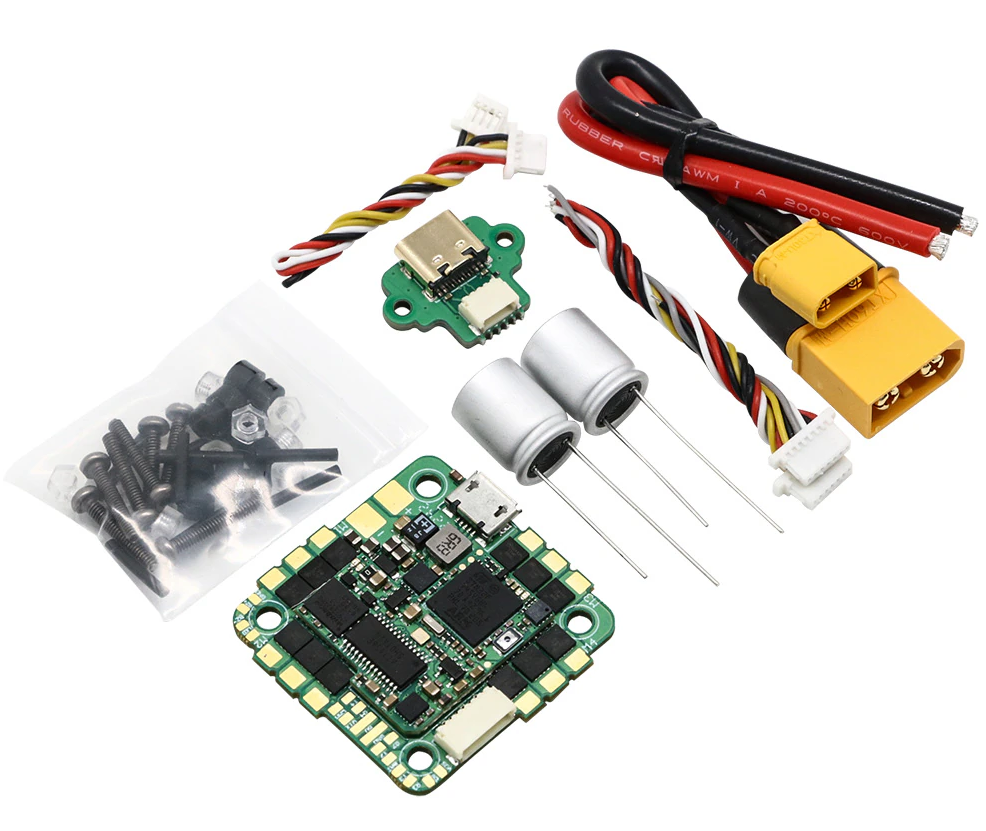
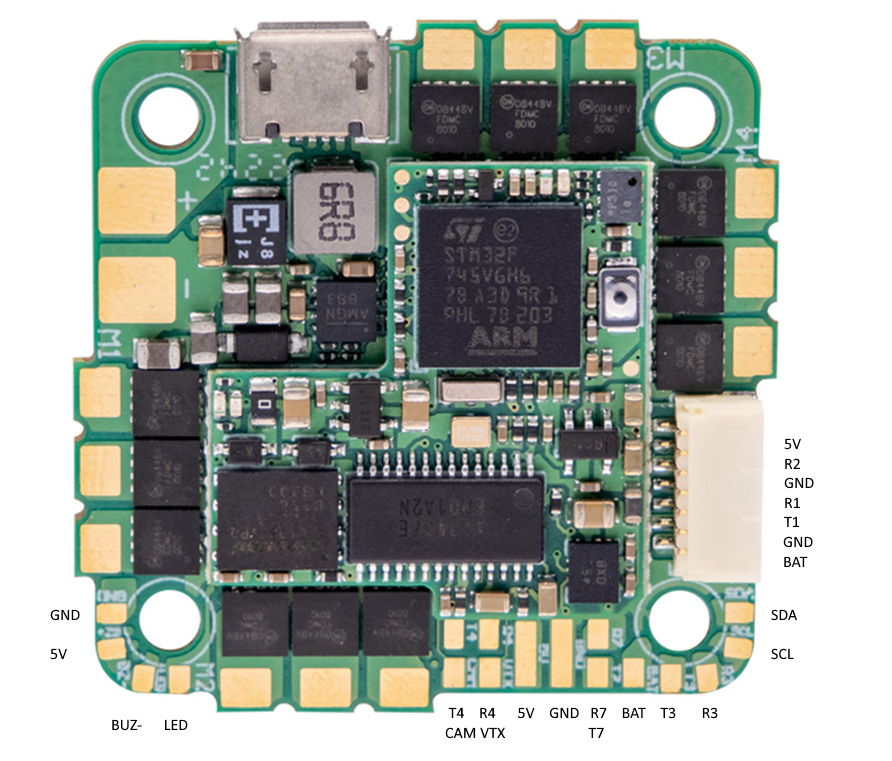

.. _common-iflight-blitzf7AIO:

==========================
IFlight Blitz Whoop F7 AIO
==========================

the above image and some content courtesy of `IFlight <https://shop.iflight-rc.com/>`__

Specifications
==============

-  **Processor**

   -  BGA-STM32F745, 216MHz
   -  AT7456E OSD
   -  16MB flash for datalogging
   -  Integrated 55A 4in1 BLHeli_S / BlueJay ESC

-  **Sensors**

   -  BMI270 IMU (accel, gyro)
   -  DPS310 barometer
   -  Voltage & 165A current sensor

-  **Power**

   -  2S - 6S LiHV input voltage with voltage monitoring
   -  55A Cont., 165A peak current monitor
   -  5V, 2A BEC for internal and peripherals

-  **Interfaces**

   -  5x PWM outputs, 4 Bi-Directiona DShot capable connected in onboard ESC + integrated NeoPixel LED on board(
   -  4x UARTs/serial for GPS and other peripherals
   -  I2C port for external compass, airspeed, etc.
   -  USB-C port

-  **Size and Dimensions**

   - 35mm x 35mm  (25.5mm mounting pattern)
   - 10.5g

Where to Buy
============

`IFlight <https://shop.iflight-rc.com/BLITZ-Whoop-F7-AIO-Pro1927>`__

User Manual
===========

`IFlight Blitz Whoop F7 AIO documentation <https://shop.iflight-rc.com/index.php?route=product/product/download&download_id=241>`__

Pinout
======

Default UART order
==================

The UARTs are marked Rn and Tn in the above pinouts. The Rn pin is the
receive pin for UARTn. The Tn pin is the transmit pin for UARTn.

 - SERIAL0 -> USB
 - SERIAL1 -> USART1 (DJI connector, DJI Goggle OSD protocol) (DMA capable)
 - SERIAL2 -> USART2 (RX2 on DJI connector, protocol is for RC input) (DMA capable)
 - SERIAL3 -> USART3 (GPS) (DMA capable)
 - SERIAL4 -> UART4 (User)
 - SERIAL7 -> UART7 (User)

Serial protocols shown are defaults, but can be adjusted to personal preferences.

Servo/Motor Outputs
===================

AThe BLITZ Whoop F7 AIO has 4 PWM outputs internally connected to its 4-in-1 ESC. The pads for motor output are M1 to M4 on the board. All 4 outputs support bi-directional DShot and DShot, as well as all PWM types. The default configuration is for bi-directional DShot using the already installed BlueJay firmware.

The PWM are in in two groups:

- PWM 1-4 in group1
- PWM 5 in group2

RC Input
========

RC input is configured by default on RX2 on the DJI connector and supports all single wire RC protocols (SBUS,DSM,etc.) except PPM. FPort, when connected in this manner, can provide RC but without telemetry. 

CRSF/ELRS and SRXL2  require a full UART connection. You should use one with DMA for CRSF/ELRS. For example you could retask UART4 for GPS by setting :ref:`SERIAL4_PROTOCOL<SERIAL4_PROTOCOL>` = "5" (GPS), then use UART3 for RC input and set :ref:`SERIAL3_PROTOCOL<SERIAL3_PROTOCOL>` = "23". Under this scenario:

- CRSF also requires a TX3 connection, in addition to RX3, and automatically provides telemetry.

- SRXL2 requires a connection to TX3 and automatically provides telemetry.  Set :ref:`SERIAL3_OPTIONS<SERIAL3_OPTIONS>` to "4".

FPORT with telemetry could use this setup also, but connects only to TX3 and :ref:`SERIAL3_OPTIONS<SERIAL3_OPTIONS>` would be set to "7".

OSD Support
===========

The Blitz Whoop F7 AIO supports analog video transmission using its internal OSD using OSD_TYPE 1 (MAX7456 driver). External OSD support such as DJI or DisplayPort is supported by default on USART1 RX/TX or any other free UART. See :ref:`common-msp-osd-overview-4.2` for more info.

Battery Monitor Configuration
=============================
These settings are set as defaults when the firmware is loaded (except :ref:`BATT_AMP_PERVLT<BATT_AMP_PERVLT>` which needs to be changed from the default value). However, if they are ever lost, you can manually set the parameters:

Enable Battery monitor.

:ref:`BATT_MONITOR<BATT_MONITOR>` =4

Then reboot.

:ref:`BATT_VOLT_PIN<BATT_VOLT_PIN>` 12

:ref:`BATT_CURR_PIN<BATT_CURR_PIN>` 13

:ref:`BATT_VOLT_MULT<BATT_VOLT_MULT>` 10.9

:ref:`BATT_AMP_PERVLT<BATT_AMP_PERVLT>` 50

Connecting a GPS/Compass module
===============================

This board does not include a Compass and/or GPS so an :ref:`external GPS/compass <common-positioning-landing-page>` can be connected in order for autonomous modes to function.

NeoPixel LED
============

The board includes a NeoPixel LED on the underside which is pre-configured to output ArduPilot sequences. This is the fifth PWM output. Its connection is also available by the LED pad.

Loading ArduPilot onto the board
================================

Initial firmware load can be done with DFU by plugging in USB with the
boot button pressed. Then you should load the "with_bl.hex"
firmware, see :ref:`common-loading-firmware-onto-chibios-only-boards`.

Once the initial firmware is loaded you can update the firmware using
any ArduPilot ground station software, see :ref:`common-loading-firmware-onto-pixhawk`.

Firmware
========

Firmware for this board can be found `here <https://firmware.ardupilot.org>`_ in  sub-folders labeled
"BlitxF745AIO" n.

[copywiki destination="plane,copter,rover,blimp"]

