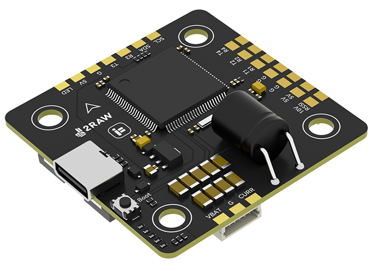
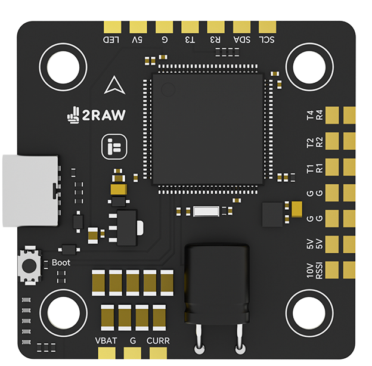
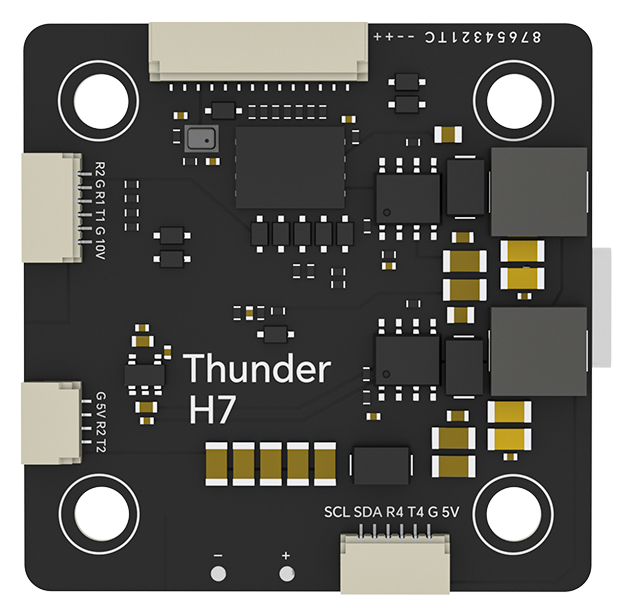

.. _common-iflight-thunder-H7:

==================
iFlight Thunder H7
==================

The iFlight Thunder H7 is a flight controller produced by `iFlight <https://shop.iflight.com/Thunder-H7-Flight-Controller-Pro2200>`_.

Specifications
==============

-  **Processor**

   - MCU - STM32H743 32-bit processor running at 480 MHz
   - Onboard Flash: 1GBit (appears a non-removeable SD card for logging)

-  **Sensors**

   - IMU - ICM42688P
   - Barometer - SPL06-001

-  **Power**

   - Battery input voltage: 2S-6S
   - BEC 5V 1.5A
   - Switchable TX power BEC 10V 1.5A

-  **Interfaces**

   - 9x PWM Outputs (8 Motor Output, 1 LED)
   - 6x UARTs/serial for GPS and other peripherals. All UARTS support hardware inversion. SBUS, SmartPort, and other inverted protocols work on any UART without “uninvert hack”
   - 2x I2C ports for external compass, airspeed, etc.
   - USB-C port and boot button on separate dongle for ease of access

-  **Size and Dimensions**

   - 42mm x 42mm
   - 30.5*30.5mm mount holes 4mm dia
   - 14g

Pinout
======

UART Mapping
============

The UARTs are marked Rn and Tn in the above pinouts. The Rn pin is the
receive pin for UARTn. The Tn pin is the transmit pin for UARTn.

* SERIAL0 -> USB
* SERIAL1 -> UART1 (DisplayPort, DMA-enabled)
* SERIAL2 -> UART2 (RC, DMA-enabled)
* SERIAL3 -> UART3 (GPS, DMA-enabled)
* SERIAL4 -> UART4 (GPS, DMA-enabled)
* SERIAL6 -> UART6 (ESC Telemetry)

RC Input
========

RC input is configured on the R2 (UART2_RX) pin. It supports all serial RC
protocols. Use T2 also for duplex protocols such as CRSF. For protocols requiring half-duplex serial to transmit
telemetry (such as FPort) you should setup SERIAL2 with half-duplex and attach input to T2.

FrSky Telemetry
===============

FrSky Telemetry could supported using the T3 pin (UART3 transmit) (or any other free UART). You need to set the following parameters to enable support for FrSky S.PORT

* SERIAL3_PROTOCOL 10
* SERIAL3_OPTIONS 7

OSD Support
===========

The iFlight Thunder H7 supports MSP DisplayPort OSDs using OSD_TYPE 5 and SERIAL1 by default (on HD VTX connector)

PWM Output
==========

The iFlight Thunder H7 supports up to 9 PWM outputs. The pads for motor output
M1 to M8 are provided in the motor connector, plus M9 on a separate pad for LED strip
or another PWM output.

The PWM is in 5 groups:

* PWM 1-2   in group1
* PWM 3-6   in group2
* PWM 7-8   in group3
* PWM 9     in group4

Channels within the same group need to use the same output rate. If
any channel in a group uses DShot then all channels in the group need
to use DShot. Channels 1-8 support bi-directional dshot.

Battery Monitoring
==================

The board has a built-in voltage senso and a current sensor input. The voltage sensor can handle up to 6S
LiPo batteries.

The correct battery setting parameters are:

* :ref:`BATT_MONITOR<BATT_MONITOR>` = 4
* :ref:`BATT_VOLT_PIN<BATT_VOLT_PIN__AP_BattMonitor_Analog>` = 11
* :ref:`BATT_CURR_PIN<BATT_CURR_PIN__AP_BattMonitor_Analog>` = 13
* :ref:`BATT_VOLT_MULT<BATT_VOLT_MULT__AP_BattMonitor_Analog>` = 11.1
* :ref:`BATT_AMP_PERVLT<BATT_AMP_PERVLT__AP_BattMonitor_Analog>` = 64 (needs to be adjusted for whatever current sensor is being used)

Compass
=======

The iFlight Thunder H7 does not have a built-in compass, but you can attach an external compass using I2C on the SDA and SCL pads.

VTX power control
=================

GPIO 81 controls the VTX BEC output to pins marked "10V". Setting this GPIO low removes voltage supply to pins.
By default RELAY2 is configured to control this pin and sets the GPIO high.

Firmware
========

Firmware for this board can be found `here <https://firmware.ardupilot.org>`_ in  sub-folders labeled "IFLIGHT_2RAW_H7".

Loading Firmware
================

Initial firmware load can be done with DFU by plugging in USB with the
bootloader button pressed. Then you should load the "with_bl.hex"
firmware, using your favourite DFU loading tool.

Once the initial firmware is loaded you can update the firmware using
any ArduPilot ground station software. Updates should be done with the
\*.apj firmware files.

[copywiki destination="plane,copter,rover,blimp"]