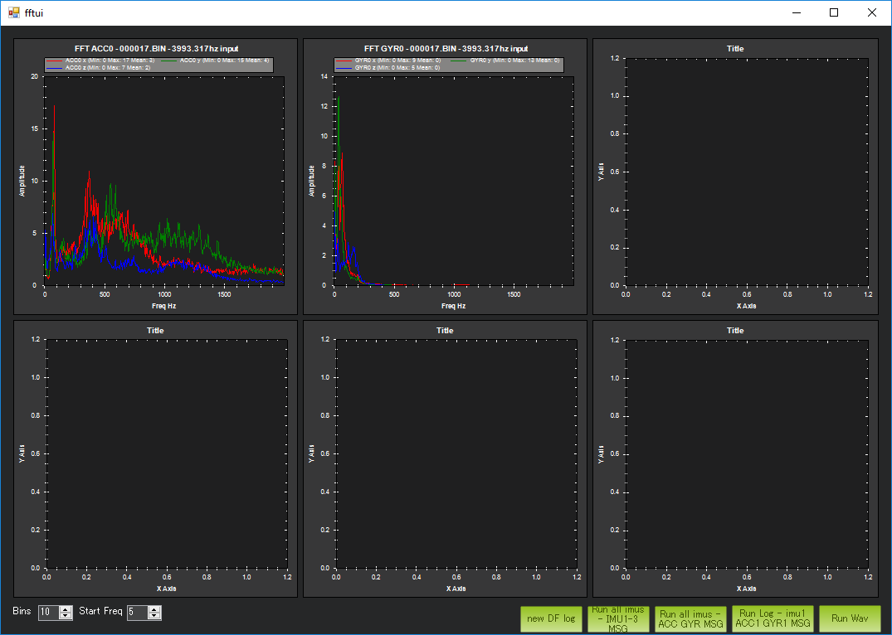

.. _common-imu-batchsampling:

==========================
Using the IMU BatchSampler
==========================

The IMU BatchSampler can be used to record high-frequency data from the IMU sensors onboard an ArduPilot vehicle.

This data can be used in post-flight analysis to characterise vibration issues, most notably through the creation of graphs created from Fast Fourier Transforms of the data.

.. note:

   This is a relatively new feature in ArduPilot.  No stable firmware has been released containing this feature

Enabling Batch Data Collection
==============================

The ``INS_BAT_MASK`` parameter specifies which IMUs in the system to log high-rate data for.  Set this to 255 to collect for all sensors.

``IMU RAW`` sampling must be enabled in your logging bitmask.  This is bit 19, so you must either use a GCS which has checkboxes for each bitmask option or add 1048576 to your current bitmask value.

.. note:

   ``IMU_FAST`` must be turned off in your LOG_BITMASK for batch sampling to work

Collecting useful Data
======================

It can take some time to transfer the FFT data to the SD card.  The data is "dribbled" out to the card to avoid unnecessary system load.  This may not combine wellwith short flights and ``LOG_DISARMED`` not being set; the log may be closed before the data reaches the card.  Fly for longer, or set ``LOG_DISARMED`` to ``1``.

Finding the Log Messages
========================

There are two types of dataflash log messages involved in batch sampling, `ISBH` and `ISBD`.

`ISBH` is a batch header; it includes a batch number and metadata about the batch.

`ISBD` messages contain the actual data for the batch, and reference a header by batch number.

Extracting Information from the log messages
============================================

Fast Fourier Analysis
---------------------

Fast Fourier Analysis transforms data from the time domain into the frequency domain.  A frequent feature of such a graph is a rotor's "blade passage frequency", the frequency at which the blade crosses the aircraft, causing an acceleration in the aircraft body.

Limitations
...........

A FFT can not show you frequencies above half your sensor's sampling rate.

The smallest frequency that can be shown is half your sample size divided by your sample rate.

Several tools can create graphs of the data after it has been FFT'd.

pymavlink
.........

::

   pbarker@bluebottle:~/rc/ardupilot(fastest-sampling)$ ~/rc/pymavlink/tools/mavfft_isb.py /tmp/000003.BIN 
   Processing log /tmp/000003.BIN
   .Skipping ISBD outside ISBH (fftnum=0)

   Skipping ISBD outside ISBH (fftnum=0)

   Skipping ISBD outside ISBH (fftnum=0)

   Skipping ISBD outside ISBH (fftnum=0)

   Skipping ISBD outside ISBH (fftnum=0)

   Skipping ISBD outside ISBH (fftnum=0)

   ...............................
   32560s messages  48433 messages/second  1904039 kB/second
   Extracted 10 fft data sets
   Sensor: Gyro[0]
   Sensor: Accel[0]

This output shows `mavfft_isb.py` extracting data from a single-IMU multicopter log.

.. image:: ../../../images/imu-batchsampling-fft-accel.png
    :target:  ../../../images/imu-batchsampling-fft-accel.png

This multicopter frame clearly shows vibrations in the 80Hz range.

.. image:: ../../../images/imu-batchsampling-fft-gyro.png
    :target:  ../../../images/imu-batchsampling-fft-gyro.png

This multicopter frame clearly shows rotational vibrations in the 80Hz range.

Mission Planner
...............

An option to create Fast Fourier Transforms of DataFlash log files containing BatchSampler data can be found under the Ctrl-f options.

Tuning Data Collection
======================

``INS_BAT_CNT`` specifies the number of samples which will be collected.  Increasing this will yield a more representative idea of problem frequencies.  When divided by the sample rate will give the smallest frequency which can be detected, so 1024 samples at 1024kHz sampling will (poorly) pick up 0.5Hz frequencies.

``INS_BAT_MSK`` can be used to sample just a single sensor.  This will increase the number of samples retrieved from a single sensor (e.g. the best on the platform), which may provide better data for analysis.
