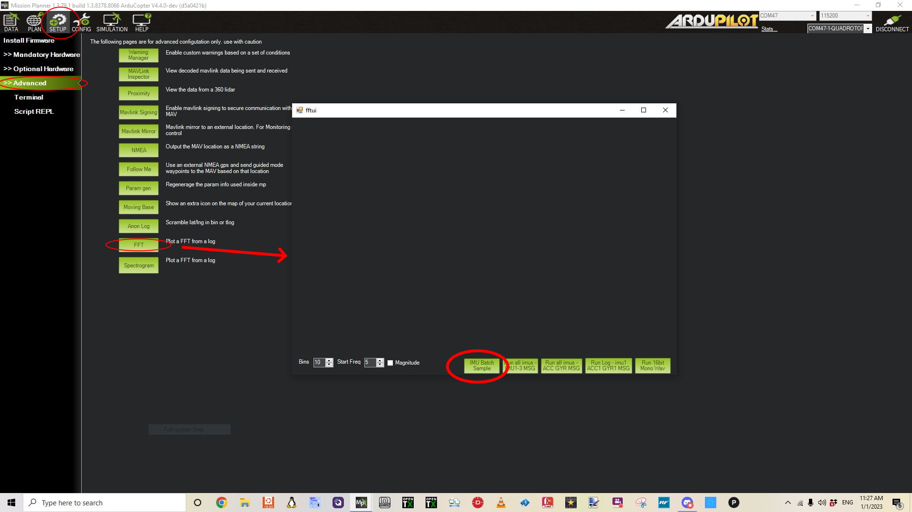
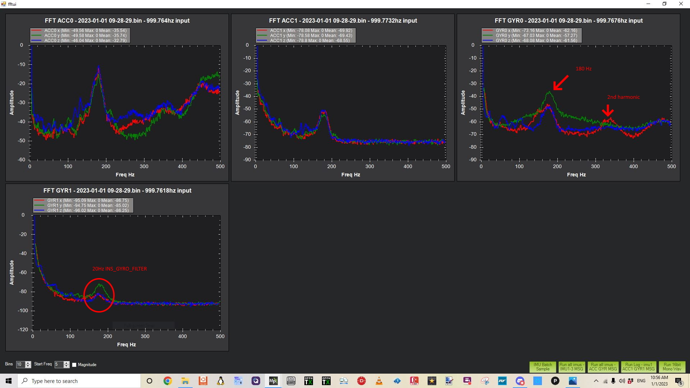
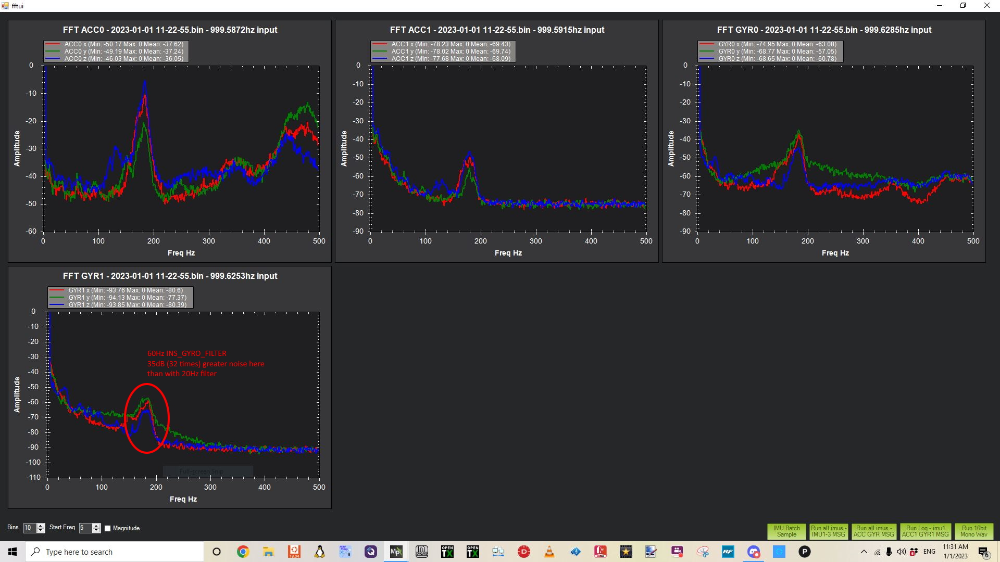
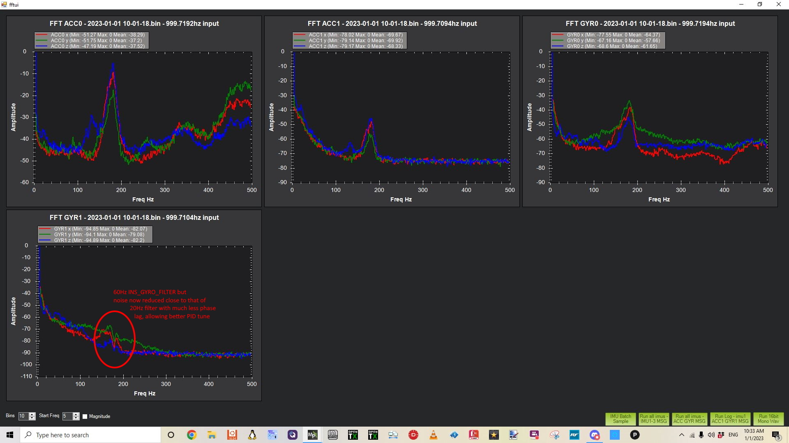
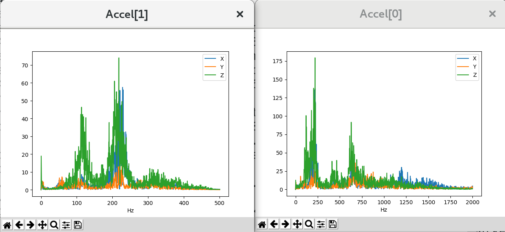
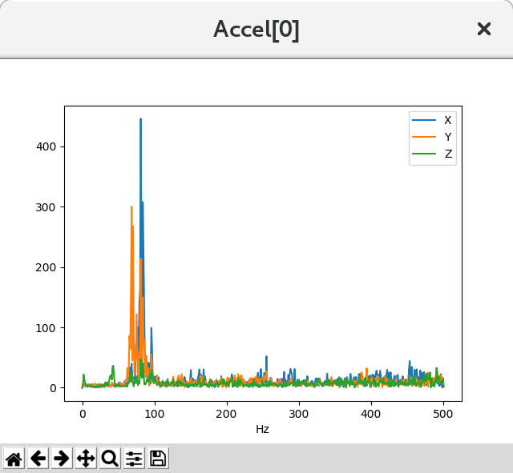
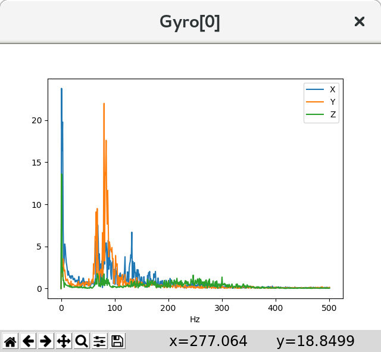

.. _common-imu-batchsampling:

==========================================
Measuring Vibration with IMU Batch Sampler
==========================================

The IMU BatchSampler can be used to record high-frequency data from the IMU sensors to the dataflash log on the autopilot.  This data can be analysed post-flight to diagnose vibration issues using graphs created from Fast Fourier Transforms (FFT) of the data.

FFT transforms data from the time domain into the frequency domain.  Put another way, accelerometer data recorded over time (i.e. a flight) can be converted into a graph showing the frequencies of the vibration.  A frequent feature of these graphs is a spike at the propeller's "blade passage frequency" (the frequency at which the blade crosses over the arms) which causes an acceleration in the aircraft body.  FFT has the following limitations:

- FFT cannot show you frequencies above half your sensor's sampling rate
- The smallest frequency that can be shown is half your sample size divided by your sample rate

Samples are typically taken at the same rate as gyro updates provided to the autopilot. For example if you are using :ref:`INS_FAST_SAMPLE <INS_FAST_SAMPLE>` on an MPU9250 sensor (fairly typical on modern Pixhawk class autopilots) then samples will be take at 8KHz, but averaged and downsampled to 1KHz. If you are not using an autopilot with fast sampling capability, then the sample rate is 1KHz

This 1KHz "backend" rate is the rate at which gyro filtering takes place, i.e. low-pass and notch filters, and on smaller copters 1Khz is not high enough to avoid aliasing from noise at higher frequencies. For example, a 3" copter might have a full throttle motor frequency of 600Hz. Since filters can only apply at half the sample frequency (the Nyquist limit)it is not possible to filter 600Hz noise when sampling at 1Khz and the noise will be aliased down to lower frequencies.

The backend rate has been made configurable for IMUs that support fast sampling (i.e. Invensense sensors) so that higher rates can be supported. The backend rate can be configured by setting :ref:`INS_GYRO_RATE<INS_GYRO_RATE>`. The default 0 gives the same behaviour as previous firmware versions. A rate of N gives a backend rate of 2^N Khz, so for instance a value of 1 gives a backend rate of 2Khz ,etc.

.. note:: This raises the rate at which all gyro filters are run and can be computationally expensive depending on the number of notches configured. Values above 0 are only recommend on F7 or H7 platforms and values above 1 should only be used with careful tuning. This is automatically done for those platforms. This allows capturing frequencies at 1KHz and below on these autopilots.

Pre-Flight Setup
================

- Set :ref:`INS_LOG_BAT_OPT<INS_LOG_BAT_OPT>` = 4 to do pre and post-filter 1KHz sampling
- Set :ref:`INS_LOG_BAT_MASK <INS_LOG_BAT_MASK>` = 1 to collect data from the first IMU
- :ref:`INS_LOG_BAT_LGIN<INS_LOG_BAT_LGIN>` is the gap between batch samples and normally does not need to be changed. It can be lowered to increase accuracy of resulting FFT, but may be ineffective depending on the systems logging speed.
- :ref:`LOG_BITMASK <copter:LOG_BITMASK>`'s IMU_RAW bit must **not** be checked.  The default :ref:`LOG_BITMASK<LOG_BITMASK>` value is fine. If it is checked the results can be confusing as you will get no samples if using post-filter or regular logging, you will however get samples if using sensor rate logging and your SD card is able to cope.

.. _common-imu-notch-filtering-flight-and-post-flight-analysis:

Flight and Post-Flight Analysis
===============================

- Perform a regular flight (not just a gentle hover) of at least 1 minute and :ref:`download the dataflash logs <common-downloading-and-analyzing-data-logs-in-mission-planner>`
- Open Mission Planner, under SETUP/ADVANCED, press the FFT button, press "IMU Batch Sample" and select the .bin log file downloaded above

On the graph it should be possible to identify a significant peak in noise that corresponds to the motor rotational frequency. On a smaller Copter this is likely to be around 200Hz and on a larger Copter/QuadPlane 100Hz or so. There will usually be harmonics of the motor rotational frequency (2x,3x that frequency) also.Here is an example from a 5" quad with no notches setup and a 20Hz lowpass setting for the gyro filter:

- Four graphs are shown: ACC0- Accelerometer spectrum before filtering, ACC1- Accelerometer spectrum after filtering, GYR0 -Gyro spectrum before filtering, and GYR1- Gyro spectrum after filtering.  Vibration at frequencies above 100Hz may lead to attitude or position control problems.
- A pronounced noise peak at 180Hz is evident from the motors in hover, with a smaller second harmonic showing.
- Notice that the noise has been dramatically reduced by the lowpass filters on the sensors, but at the cost of significant phase lag that will have reduced how tight the tune was made. It should be possible to "notch" out that 180Hz motor noise spike and increase the gyro low pass filter to 60 or 80Hz to allow a tighter tune to be done. The accelerometer path is not as critical since it forms an outer loop around the gyro based rate PID controllers. Leaving its lowpass filter at 10Hz does not affect the ability of the vehicle to reject disturbances quickly, which is the rate controller's main task.
- If we just increase the gyro lowpass filter to 60Hz from 20HZ , without adding notch filters to decrease the motor noise, this results, which is not acceptable:

Harmonic Notch Filter Setup
===========================

It is possible to filter some of this noise to increase performance and allow better tuning by activating the harmonic notch filter(s). See :ref:`common-imu-notch-filtering` for details.

For Throttle Based Dynamic Harmonic Notch(s) you will need some additional information from the logs if using a :ref:`common-throttle-based-notch`:
- With the same log, open it in the regular way in mission planner and graph the throttle value: CTUN.ThO (Copter) or QTUN.ThO (QuadPlane).
. From this identify an average hover throttle value which will be used for :ref:`INS_HNTCH_REF <INS_HNTCH_REF>`.
- It's also possible to use :ref:`MOT_HOVER_LEARN <MOT_HOVER_LEARN>` = 2 in Copter and read off the value of :ref:`MOT_THST_HOVER <MOT_THST_HOVER>`, or :ref:`Q_M_HOVER_LEARN <Q_M_HOVER_LEARN>` = 2 in QuadPlane and read off the value of :ref:`Q_M_THST_HOVER <Q_M_THST_HOVER>`
- This gives you a hover motor frequency *hover_freq* and thrust value *hover_thrust* . Note that learning of hover thrust only occurs while in an altitude controlled mode with no pitch or roll angle. Therefore, it should be done in calm wind conditions with no pilot stick input for at least 10 seconds.

.. _common-imu-notch-filtering-post-configuration-flight-and-post-flight-analysis:

Post Configuration Confirmation Flight and Post-Flight Analysis
===============================================================

- With :ref:`INS_LOG_BAT_MASK <INS_LOG_BAT_MASK>` still set to = 1 to collect data from the first IMU:
- Set :ref:`INS_LOG_BAT_OPT <INS_LOG_BAT_OPT>` = 2 to capture post-filter gyro data 

Perform a similar hover flight and analyze the dataflash logs in the same way. This time you should see significantly less noise and, more significantly, attenuation of the motor noise peak. If the peak does not seem well attenuated then you can experiment with increasing the bandwidth and attenuation of the notch. However, the wider the notch the more delay it will introduce into the control of the aircraft so doing this can be counter-productive.

Here is an example from the same 5" quad with the harmonic notch configured and 60Hz gyro lowpass filter:

.. note:: be sure to reset the :ref:`INS_LOG_BAT_MASK<INS_LOG_BAT_MASK>` to "0" when finished with analysis flights to free up the RAM consumed by this feature. In some autopilots, you cannot do other memory intensive tasks like Compass Calibration or MAVftp if this batch logging is enabled.

Advanced Configuration and Analysis
===================================

- Set :ref:`INS_LOG_BAT_OPT <INS_LOG_BAT_OPT>` = 1 to enable batch sampling at the sensor's highest rate which allows analysis above 500hz for very fast IMUs from InvenseSense
- :ref:`INS_LOG_BAT_MASK <INS_LOG_BAT_MASK>` can be used to sample just a single sensor.  This will increase the number of samples retrieved from a single sensor (e.g. the best on the platform), which may provide better data for analysis
- :ref:`INS_LOG_BAT_CNT <INS_LOG_BAT_CNT>` specifies the number of samples which will be collected.  Increasing this will yield a more representative idea of problem frequencies.  When divided by the sample rate will give the lowest frequency which can be detected, so 1024 samples at 1024kHz sampling will (poorly) pick up 0.5Hz frequencies
- :ref:`INS_LOG_BAT_LGIN <INS_LOG_BAT_LGIN>` interval between pushing samples to the dataflash log, in ms.  Increase this to reduce the time taken to flush data to the dataflash log, reducing cycle time.  This will be at the expense of increased system load and possibly choking up the dataflash log for other messages
- :ref:`INS_LOG_BAT_LGCT <INS_LOG_BAT_LGCT>` Number of samples to push to count every :ref:`INS_LOG_BAT_LGIN <INS_LOG_BAT_LGIN>` ms.  Increase this to push more samples each time they are sent to the dataflash log.  Increasing this may cause timing jitter, and possibly choke up the dataflash log for other messages

.. note:: On an H7 based autopilot such as the CubeOrange or Zealot H743, raw IMU logging can be used and will provide better data for analysis. Set :ref:`INS_LOG_BAT_MASK <INS_LOG_BAT_MASK>` = 0, set the raw IMU bit (bit 19) in :ref:`LOG_BITMASK <LOG_BITMASK>`, set :ref:`INS_LOG_BAT_OPT <INS_LOG_BAT_OPT>` = 0. Raw logging is very helpful when doing filter tuning, but will give you really large logs which generally means you don't want to leave it on. 

The web based `Notch Filter Review tool <https://firmware.ardupilot.org/Tools/WebTools/FilterReview/>`__ on the ArduPilot Firmware "Web Tools" page can be used to analyze notch filter logs generated with either batch sampling or raw IMU logging. 

The following two graphs are from the same flight on a PixRacer autopilot.  Accel[0] on the right is the InvenseSense IMU and shows higher frequencies than the slower IMU on the left

Log Message Contents
====================

There are two types of dataflash log messages involved in batch sampling, `ISBH` and `ISBD`.

- `ISBH` is a batch header; it includes a batch number and metadata about the batch.
- `ISBD` messages contain the actual data for the batch, and reference a header by batch number.

Analysis with pymavlink
=======================

**pymavlink** is a developer focussed tool which supports graph FFT'd data

::

   pbarker@bluebottle:~/rc/ardupilot(fastest-sampling)$ ~/rc/pymavlink/tools/mavfft_isb.py /tmp/000003.BIN
   Processing log /tmp/000003.BIN
   Skipping ISBD outside ISBH (fftnum=0)

   Skipping ISBD outside ISBH (fftnum=0)

   Skipping ISBD outside ISBH (fftnum=0)

   Skipping ISBD outside ISBH (fftnum=0)

   Skipping ISBD outside ISBH (fftnum=0)

   Skipping ISBD outside ISBH (fftnum=0)

   ...............................
   32560s messages  48433 messages/second  1904039 kB/second
   Extracted 10 fft data sets
   Sensor: Gyro[0]
   Sensor: Accel[0]

This output shows `mavfft_isb.py` extracting data from a single-IMU multicopter log.

This multicopter frame clearly shows vibrations in the 80Hz range.

This multicopter frame clearly shows rotational vibrations in the 80Hz range.

[copywiki destination="copter,plane,rover,dev,planner"]
