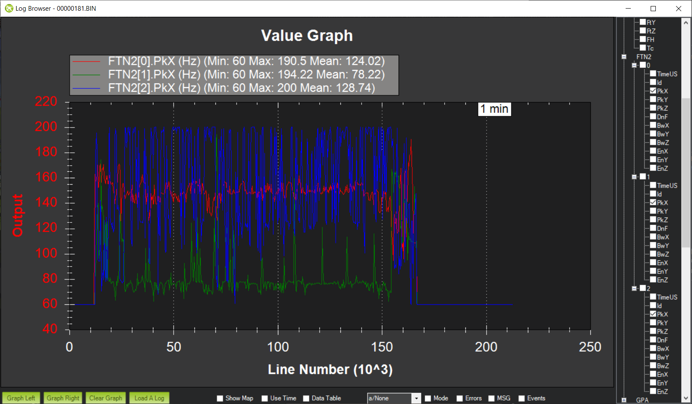

.. _common-imu-fft-advanced-setup:

[copywiki destination="copter,plane"]

============================
Advanced In-Flight FFT Setup
============================

Harmonic Notch Bandwidth Configuration
======================================

A component of the harmonic notch is the bandwidth of the notch and the in-flight FFT can be used to determine this. Download a log from a stable hover and graph FTN1.BwAvg. This is the FFT's energy-weighted estimate of the bandwidth of the noise peak. Here is a graph from the same flight above:

.. image:: ../../../images/imu-in-flight-fft-bandwidth.png
    :target:  ../_images/imu-in-flight-fft-bandwidth.png
    :width: 450px

You can see that the bandwidth estimate is roughly 125Hz. Use this as follows:

- Set :ref:`INS_HNTCH_BW <INS_HNTCH_BW>` and/or :ref:`INS_HNTC2_BW <INS_HNTC2_BW>` = *bandwidth estimate*

FFT Averaging
=============

Instantaneous FFT's can suffer from noise and one way to reduce the noise is to average a number of data frames together before performing the FFT. Theory shows that this will reduce the noise by sqrt(N), where N is the number of frames that are averaged, as long as the data is stationary. On a multirotor the data is not stationary for very long because of changes in throttle, thus usually only a small number of frames can be averaged. Setting the parameter :ref:`FFT_NUM_FRAMES<FFT_NUM_FRAMES>` to a non-zero value will average that number of frames to produce the FFT used by the center frequency setting code. Experimentation will be required to determine the optimum number of frames to be used, but is normally 2-5 frames.

Post Configuration Flight and Post-Flight Analysis
==================================================

With the dynamic harmonic notch configured perform another stable hover to check that the motor noise peak has been :ref:`eliminated <common-imu-notch-filtering-post-configuration-flight-and-post-flight-analysis>`. It is also important to check that the autopilot is not overloaded for the FFT length being used. Graph PM.Load and PM.NLon. PM.Load ideally should be below 60% and PM.NLon in the low 10's - although experimentation shows that it is possible to fly a Pixracer with an FFT length of 128 and CPU load of 90% without instability.

Other points to check:

- The FFT will only analyse frequencies between :ref:`FFT_MINHZ <FFT_MINHZ>` and :ref:`FFT_MAXHZ <FFT_MAXHZ>`. If your copter's motor rpm is outside these bounds the results can be somewhat random, so make sure that these are set appropriately for your copter. :ref:`FFT_MAXHZ <FFT_MAXHZ>` should not be set above the Nyquist frequency, so a maximum of about 495Hz for most copters using standard gyros.
- FTN1.SnX, FTN1.SnY and FTN1.SnZ give an indication of the signal-to-noise ratio of the detected frequency. This value should be above :ref:`FFT_SNR_REF <FFT_SNR_REF>`. For the example flight in :ref:`common-imu-fft-test-flight` the SNR was about 58dB.

Harmonic Notch Throttle Configuration Using Data from an In-Flight FFT Test Flight
==================================================================================

It is also possible to use the in-flight FFT in a test flight to generate a precise :ref:`INS_HNTCH_FREQ <INS_HNTCH_FREQ>` and/or :ref:`INS_HNTC2_FREQ <INS_HNTC2_FREQ>`:ref:`INS_HNTCH_FREQ <INS_HNTCH_FREQ>`. Then the In-Flight FFT would be disabled and the data used to setup a throttle-based center frequency for driving the dynamic harmonic notch. This has very low CPU cost with minimal latency and can be a good option for certain applications. To setup the harmonic notch this way:

- Set :ref:`FFT_MINHZ <FFT_MINHZ>` to the lowest value that you want the harmonic notch frequency to be set to. Typically this should be above about 50Hz to stay clear of your copter's control bandwidth.
- Set :ref:`FFT_ENABLE <FFT_ENABLE>` = 1 to enable the FFT engine.
- Perform a stable lengthy hover as you might do for learning the hover throttle with the sticks on the transmitter not being moved while in a hover or loiter. Moving the sticks while in hover or letting the vehicle loiter in wind (ie the autopilot is moving the sticks to hold position) stops hover learning until the vehicle attitude is returned to neutral VTOL stance.
- Land and disarm. The learned value for :ref:`INS_HNTCH_FREQ <INS_HNTCH_FREQ>` and/or :ref:`INS_HNTC2_FREQ <INS_HNTC2_FREQ>` at hover will be in :ref:`FFT_FREQ_HOVER <FFT_FREQ_HOVER>` and the learned value for :ref:`INS_HNTCH_REF <INS_HNTCH_REF>` to scale :ref:`FFT_MINHZ <FFT_MINHZ>` to the learned hover frequency will be in :ref:`FFT_THR_REF <FFT_THR_REF>`. The values are not transferred automatically to the harmonic notch so you should set them based on the learned values.

- Set :ref:`FFT_ENABLE <FFT_ENABLE>` = 0 to disable the FFT engine.
- Set :ref:`INS_HNTCH_MODE <INS_HNTCH_MODE>` and/or :ref:`INS_HNTC2_MODE <INS_HNTC2_MODE>` = 1 to use the throttle-based dynamic harmonic notch.
- Set :ref:`INS_HNTCH_FREQ <INS_HNTCH_FREQ>` and/or :ref:`INS_HNTC2_FREQ <INS_HNTC2_FREQ>` = :ref:`FFT_MINHZ <FFT_MINHZ>`
- Set :ref:`INS_HNTCH_REF <INS_HNTCH_REF>` and/or :ref:`INS_HNTC2_REF <INS_HNTC2_REF>` = :ref:`FFT_THR_REF <FFT_THR_REF>`

Alternatively, if you wish the hover frequency to be the lowest value for the harmonic notch:

- Set :ref:`FFT_ENABLE <FFT_ENABLE>` = 0 to disable the FFT engine.
- Set :ref:`INS_HNTCH_MODE <INS_HNTCH_MODE>` and/or :ref:`INS_HNTC2_MODE <INS_HNTC2_MODE>` = 1 to use the throttle-based dynamic harmonic notch.
- Set :ref:`INS_HNTCH_FREQ <INS_HNTCH_FREQ>` and/or :ref:`INS_HNTC2_FREQ <INS_HNTC2_FREQ>` = :ref:`FFT_FREQ_HOVER <FFT_FREQ_HOVER>`
- Set :ref:`INS_HNTCH_REF <INS_HNTCH_REF>` and/or :ref:`INS_HNTC2_REF <INS_HNTC2_REF>` = :ref:`MOT_THST_HOVER <MOT_THST_HOVER>`

Tuning
======

In addition to the options described above there are several tuning options available for the FFT which can be useful in certain circumstances

Tuning Small MultiCopters
-------------------------

Small multicopters are generally characterized by a very pronounced motor rpm frequency peak. The peak is generally the first harmonic and there are rarely other significant harmonics. For this reason it can be sufficient to target the first harmonic alone. By default, the FFT engine tracks the top three frequency peaks and these can be observed by graphing FTN2[N].PkX for each peak. PkX is the noise on the roll axis. Here is an example from a 4" quad:

As can be seen the roll and pitch axes track the main frequency peak quite closely and the secondary peaks are essentially tracking noise. Unfortunately this noise sometimes looks like the highest energy peak and can distort the primary tracked frequency. If this is the case it is possible to force the FFT engine to only track the primary peak by setting:

- Set :ref:`FFT_HMNC_PEAK <FFT_HMNC_PEAK>` = 1

It is also possible to set :ref:`FFT_HMNC_PEAK <FFT_HMNC_PEAK>` to 2 and 3 to track the second and third peaks respectively.

Another important metric for small copters is the frequency energy. This is most easily visualized by graphing the signal-to-noise ratio of the frequency energy, which is the ratio in dB of the gyro noise at startup to the gyro noise of the detected frequency peak in flight. Here is an example from the same 4" quad:

As can be seen there is a strong signal at about 50dB on roll and 40dB on pitch. The FFT engine uses the setting :ref:`FFT_SNR_REF <FFT_SNR_REF>` to determine whether a detected frequency peak is actually a signal or just noise. The default setting is 25dB and so in this example the peak is correctly detected as a signal. 

Let's look at a smaller copter. This is a 3" quad in a stable hover:

This time you can see that the signal-to-noise ratio is right around the 25dB mark and if :ref:`FFT_SNR_REF <FFT_SNR_REF>` was set to 25dB then the detected peak would be treated as noise a significant amount of the time. So for this copter I have set :ref:`FFT_SNR_REF <FFT_SNR_REF>` to 15dB in order to detect the peak correctly. Mechanically it's easy to see why this is necessary - the same MEMS gyros are used in pretty much all autopilots, but the difference in vibrational energy of 10" props versus 3" props is enormous. Thus it is likely that for smaller builds it will be necessary to reduce :ref:`FFT_SNR_REF <FFT_SNR_REF>`.

Tuning Large MultiCopters
-------------------------

Small multicopters are relatively simple from a noise perspective - the motors have nice, clean noise profiles and picking the noise frequency is algorithmically a relatively simple task. Larger multicopters are much more complex. There is much more noise energy and this noise energy can appear in unexpected places. On any copter motor noise frequencies will diverge during yaw due to the different motor rpms employed to effect a yaw manoeuvre. This divergence can also be seen as you add more motors - for instance Y6 or X8 configurations - or for any kind of imbalance - for instance Y6 with difference prop sizes in a coaxial configuration. These differences can make the fundamental harmonic frequency hard to find. Here are the detected frequency peaks for a Y6B:

As you can see the noisiest motor peak is around 150Hz, with the second noisiest around 75Hz. Then the third noisiest peak appears to be jumping between 120Hz and 225Hz. So what is going on here? Well, the frequency that the motors are turning at is indeed 75Hz, but the frequency that the FFT would target by default is 150Hz. From a control perspective this is bad. The harmonic notch targets increasing harmonics of the fundamental frequency, so if the harmonic notch is configured to target 150Hz then the 75Hz noise peak will not be notch filtered at all. 75Hz is getting down into the control frequencies of the aircraft and therefore ignoring this noise can be extremely problematic. The 150Hz signal is nice and clear, but the flip flopping between 120Hz and 225Hz seems odd. Mechanically this can be understood when you think about the configuration of my Y6B. It has larger props on the topside meaning that upper and lower props are almost certainly turning at different frequencies. It also is balanced around the centerline but slightly imbalanced front to back. This combination of factors means that there will be at least two fundamental harmonics, and this is almost certainly what the 120Hz signal is. The 225Hz signal is then the third harmonic of the 75Hz fundamental. So how do we target notches appropriately? We clearly want 75Hz to be treated as the fundamental harmonic. Fortunately, by default ArduPilot has :ref:`FFT_HMNC_PEAK <FFT_HMNC_PEAK>` set to 0, which means "auto". In auto mode the autopilot tries to detect the situation where one frequency is the harmonic of another frequency and will return the lower frequency for use by the harmonic notch filter. This works quite well on quads, but on my Y6B the relationship is too soft to be useful - probably because of the 120Hz harmonic confusing things. So in this instance setting :ref:`FFT_HMNC_PEAK <FFT_HMNC_PEAK>` to 2, will allow us to accurately target the first harmonic.

Things get more confusing when we look at the different axes. Here is roll, pitch and yaw for the highest energy peak on the same Y6B :

As you can see roll is tracking quite nicely, pitch is flipping a little between the first and second harmonics and yaw is flipping all the time. Having different peaks detected on different axes is not uncommon on larger copters and can be problematic for the harmonic notch as the frequency used is the energy-weighted average of roll and pitch axes. If roll and pitch are tracking different peaks then the energy weighted average will be somewhere in-between - totally useless for the purposes of notch filtering.

In order to address this problem it is possible to set :ref:`FFT_HMNC_PEAK <FFT_HMNC_PEAK>` to 4 to track the roll-axis only or 5 to track the pitch-axis only.

Finally, it is possible - as is clearly the case here - that the noisiest peaks are not necessarily harmonics of one another. In this case it is possible to configure the harmonic notch to track the frequency peaks directly by setting bit two of :ref:`INS_HNTCH_OPTS<INS_HNTCH_OPTS>` and/or :ref:`INS_HNTC2_OPTS<INS_HNTC2_OPTS>` - so to 2 if no other options are configured. This results in very accurate frequency tracking and lower noise. Here is the log from a Solo with :ref:`INS_HNTCH_OPTS<INS_HNTCH_OPTS>` and/or :ref:`INS_HNTC2_OPTS<INS_HNTC2_OPTS>` set to 3 - dynamic harmonics and double notch:

You can see that the dynamic notch frequency is tracking the two highest noise peaks precisely, resulting in a significant reduction in noise.

