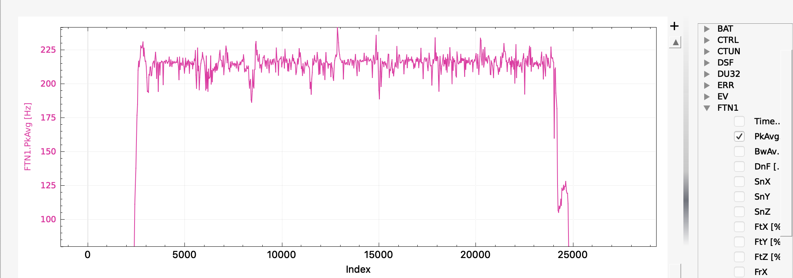
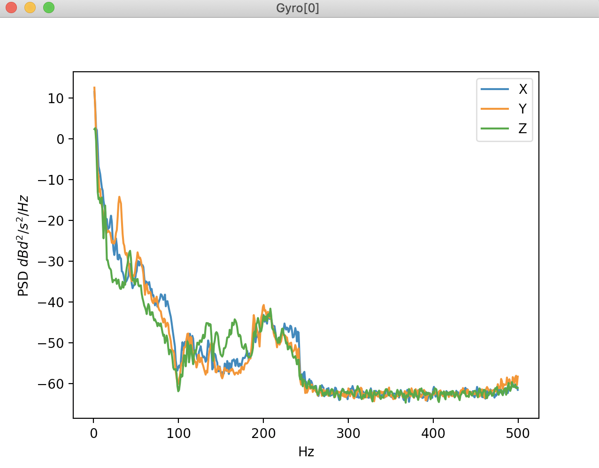

.. _common-imu-fft-test-flight:

[copywiki destination="copter,plane"]

=======================================
Initial Flight and Post-Flight Analysis
=======================================

- Perform a hover flight of at least 30s in altitude hold and :ref:`download the dataflash logs <common-downloading-and-analyzing-data-logs-in-mission-planner>` without the harmonic notch being enabled.
- Graph the log element FTN1.PkAvg which represents the FFT's energy-weighted estimate of the average noise frequency for roll and pitch.

On the graph there should be a fairly consistent estimate of the noise peak that corresponds to the motor rotational frequency. On a smaller Copter this is likely to be around 200Hz and on a larger Copter/QuadPlane 100Hz or so. Here is an example from a 5" quad running on a Pixracer. Once the pilot has throttled up there is a fairly consistent noise level at about 220Hz:

If a consistent estimate is obtained, you can then enable the harmonic notch, as described in :ref:`common-imu-fft`.

In this flight the dynamic harmonic notch was enabled and set to track the FFT determined frequency and FFT analysis of the post-filter log shows that the gyro noise has been effectively eliminated:

