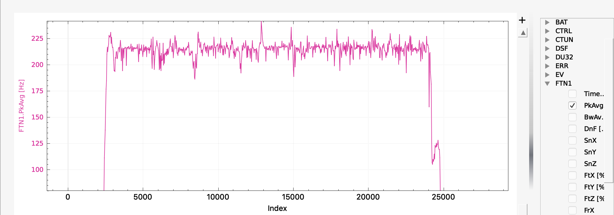
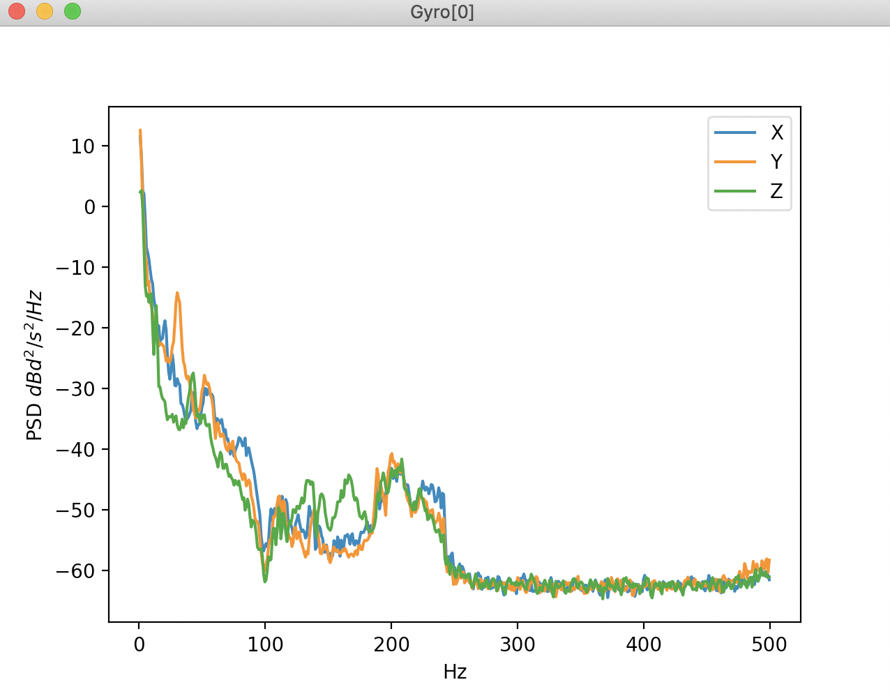
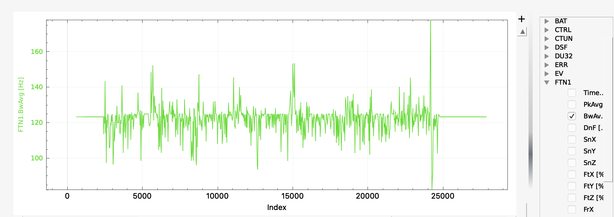

.. _common-imu-fft:

[copywiki destination="copter,plane"]

======================================
Managing Gyro Noise with In-Flight FFT
======================================

.. note:: This feature will be released in ArduPilot 4.1. Most likely, the feature will only be included in autopilots with 2MB of memory. Check your autopilot's :ref:`firmware limitations<common-limited_firmware>` after the release to determine if your autopilot has this feature.

As :ref:`discussed<common-imu-notch-filtering>`, the effect of motor vibration on gyros in ArduPilot autopilot installations can be managed effectively through the use of targeted notch filtering. Dynamic notch filtering is most effective when the dynamic notch center frequency can be driven by ESC telemetry, but not all aircraft have access to ESC telemetry or the ESC telemetry is not entirely representative of the dominant noise.
One alternative to ESC telemetry is to measure the noise peak directly through the use of digital signal processing techniques, most notably the Fast Fourier Transform or FFT.

For helicopters, use of this feature depends on how well the rotor speed is being held. Any helicopter using an ESC governor will not need this feature even if the ESC cannot provide ArduCopter with the rotor speed. ESC governors hold rotor speed very well and the harmonic notch frequency can be set to the rotor speed set in the ESC governor. If the internal rotor speed controller governor is used, which requires an RPM sensor, then it is recommended that the harmonic notch use the measured RPM to set the notch frequency. This feature would be most useful for throttle curve method for controlling rotor speed.

-----
Setup
-----

.. _common-imu-fft-pre-flight-setup:

Pre-Flight Setup
================

ArduPilot comes pre-configured with appropriate defaults for all FFT settings. The only initial setup required is:

- Set :ref:`FFT_ENABLE <FFT_ENABLE>` = 1 to enable the FFT engine. This then requires that you reboot your flight controller after which FFT support will be enabled and other FFT parameters should be visible in your GCS. With default parameter settings the FFT engine will run a self-check for frequency matching on your hardware. If you do not see any FFT errors then things are working properly.

With FFT enabled it is best to first perform a test flight to check that your aircraft's particular noise frequencies are being captured and to monitor CPU load, but if you are confident in the defaults then you can use the FFT to drive the :ref:`harmonic notch<common-imu-notch-filtering>`

- Set :ref:`INS_HNTCH_MODE <INS_HNTCH_MODE>` = 4 to use the FFT detected frequency for controlling the harmonic notch frequency.
- Set :ref:`INS_HNTCH_REF <INS_HNTCH_REF>` = 1 to set the harmonic notch reference value, which for FFT analysis generally means no scaling

.. _common-imu-fft-flight-and-post-flight-analysis:

Initial Flight and Post-Flight Analysis
=======================================

- Perform a hover flight of at least 30s in altitude hold and :ref:`download the dataflash logs <common-downloading-and-analyzing-data-logs-in-mission-planner>`
- Graph the log element FTN1.PkAvg which represents the FFT's energy-weighted estimate of the average noise frequency for roll and pitch.

On the graph there should be a fairly consistent estimate of the noise peak that corresponds to the motor rotational frequency. On a smaller Copter this is likely to be around 200Hz and on a larger Copter/Quadplane 100Hz or so. Here is an example from a 5" quad running on a Pixracer:

Once the pilot has throttled up there is a fairly consistent noise level at about 220Hz. In this flight the dynamic harmonic notch was set to track the FFT determined frequency and FFT analysis of the post-filter log shows that the gyro noise has been effectively eliminated:

Harmonic Notch Configuration
============================

As described above the harmonic notch can be simply enabled through setting:

- Set :ref:`INS_HNTCH_ENABLE <INS_HNTCH_ENABLE>` = 1 to enable the harmonic notch
- Set :ref:`INS_HNTCH_REF <INS_HNTCH_REF>` = 1

The other key component of the harmonic notch is the bandwidth of the notch and the in-flight FFT can be used to determine this. Download a log from a stable hover and graph FTN1.BwAvg. This is the FFT's energy-weighted estimate of the bandwidth of the noise peak. Here is a graph from the same flight above:

You can see that the bandwidth estimate is roughly 125Hz. Use this as follows:

- Set :ref:`INS_HNTCH_BW <INS_HNTCH_BW>` = *bandwidth estimate*

Post Configuration Flight and Post-Flight Analysis
==================================================

With the dynamic harmonic notch configured perform another stable hover to check that the motor noise peak has been :ref:`eliminated <common-imu-notch-filtering-post-configuration-flight-and-post-flight-analysis>`. It is also important to check that the flight controller is not overloaded for the FFT length being used. Graph PM.Load and PM.NLon. PM.Load ideally should be below 60% and PM.NLon in the low 10's - although experimentation shows that it is possible to fly a Pixracer with an FFT length of 128 and CPU load of 90% without instability.

Other points to check:

- The FFT will only analyse frequencies between :ref:`FFT_MINHZ <FFT_MINHZ>` and :ref:`FFT_MAXHZ <FFT_MAXHZ>`. If your copter's motor rpm is outside these bounds the results can be somewhat random, so make sure that these are set appropriately for your copter. :ref:`FFT_MAXHZ <FFT_MAXHZ>` should not be set above the Nyquist frequency, so a maximum of about 495Hz for most copters using standard gyros.
- FTN1.SnX, FTN1.SnY and FTN1.SnZ give an indication of the signal-to-noise ratio of the detected frequency. This value should be above :ref:`FFT_SNR_REF <FFT_SNR_REF>`. For the example flight above the SNR was about 58dB.

Harmonic Notch Throttle Configuration
=====================================

It is also possible to use the in-flight FFT to generate a precise estimate for :ref:`INS_HNTCH_REF <INS_HNTCH_REF>` and :ref:`INS_HNTCH_FREQ <INS_HNTCH_FREQ>`. Using a throttle estimate for driving the dynamic harmonic notch has very low CPU cost with minimal latency and can be a good option for certain applications.
To set the harmonic notch this way:

- Set :ref:`FFT_MINHZ <FFT_MINHZ>` to the lowest value that you want the harmonic notch frequency to be set to. Typically this should be above about 50Hz to stay clear of your copter's control bandwidth.
- Perform a stable lengthy hover as you might do for learning the hover throttle.
- Land and disarm. The learned value for :ref:`INS_HNTCH_FREQ <INS_HNTCH_FREQ>` at hover will be in :ref:`FFT_FREQ_HOVER <FFT_FREQ_HOVER>` and the learned value for :ref:`INS_HNTCH_REF <INS_HNTCH_REF>` to scale :ref:`FFT_MINHZ <FFT_MINHZ>` to the learned hover frequency will be in :ref:`FFT_THR_REF <FFT_THR_REF>`. The values are not transferred automatically to the harmonic notch so you should set them based on the learned values.

- Set :ref:`INS_HNTCH_MODE <INS_HNTCH_MODE>` = 1 to use the throttle-based dynamic harmonic notch.
- Set :ref:`INS_HNTCH_FREQ <INS_HNTCH_FREQ>` = :ref:`FFT_MINHZ <FFT_MINHZ>`
- Set :ref:`INS_HNTCH_REF <INS_HNTCH_REF>` = :ref:`FFT_THR_REF <FFT_THR_REF>`

Alternatively, if you wish the hover frequency to be the lowest value for the harmonic notch:

- Set :ref:`INS_HNTCH_MODE <INS_HNTCH_MODE>` = 1 to use the throttle-based dynamic harmonic notch.
- Set :ref:`INS_HNTCH_FREQ <INS_HNTCH_FREQ>` = :ref:`FFT_FREQ_HOVER <FFT_FREQ_HOVER>`
- Set :ref:`INS_HNTCH_REF <INS_HNTCH_REF>` = :ref:`MOT_THST_HOVER <MOT_THST_HOVER>`

How it works
============

The FFT takes a set of gyro samples, performs frequency analysis on that set and yields a set of frequency bins with associated energies representing how "much" of a noise signal is in that bin. For example if we take a set of samples of length 32 - referred to as the *FFT length* or *window size*, *N* - this would yield a set of frequency bins each of width *f*\ :sub:`s` / *32* where *f*\ :sub:`s` is the sampling frequency of the samples. Since these samples are from the gyros the sampling rate is most commonly 1KHz and therefore each bin is approximately 32Hz wide. FFT analysis will give an energy value for each bin representing the amount of noise energy of that frequency in the bin. So for instance if our motor noise is at 80Hz most of the energy will be in the third bin and we can thus tell from the energy values the approximate frequency of the noise. The highest frequency that can be detected by an FFT is the Nyquist frequency of *f*\ :sub:`s` / *2*

Clearly increasing the FFT length yields much higher frequency resolution and one might think therefore that we should always use long FFTs. Two facts prevent this. Firstly the calculation of an FFT costs roughly *O(N log N)* in CPU time, thus longer FFTs quickly become prohibitively expensive. Secondly FFTs have a Heisenberg-like relationship between frequency and time - you can choose high time resolution or high frequency resolution, but you cannot have both at the same time. For multicopters time resolution is important because the calculated frequency might be used to drive time-sensitive controls such as the dynamic harmonic notch. Thus the choice of FFT length should be made carefully based on how accurate the frequency calculation needs to be versus the timeliness of the result. For larger copters or helis a high frequency resolution can be beneficial, whereas for smaller copters with sensitive attitude control high time resolution is important. The default of 32 generally works well and can be run on F4 processors. Higher values such as 128 require F7 processors and anything above this should typically only be run on an H7.

An alternative to increasing the FFT length is to decrease the sample rate to yield higher frequency resolution. This has the drawback of reducing the highest frequency that can be detected, but for some lower frequency platforms (e.g. helis) this might be appropriate.

