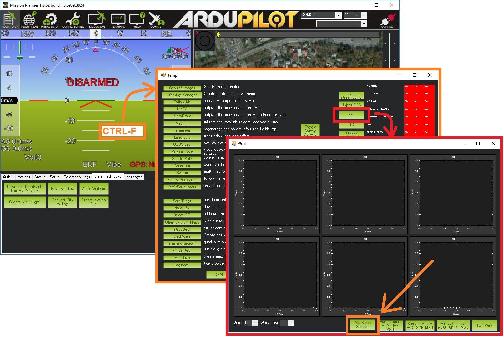
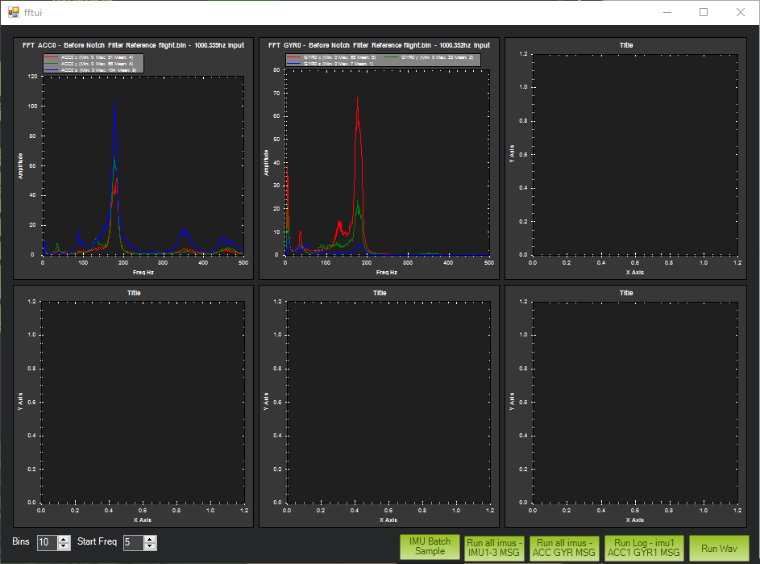
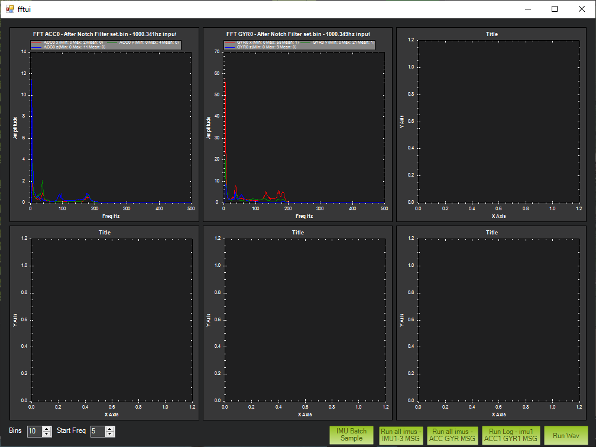
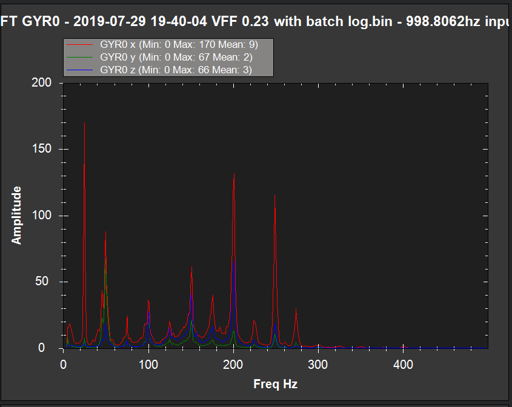

.. _common-imu-notch-filtering:

[copywiki destination="copter,plane"]

============================================================================
Managing Gyro Noise with the Static Notch and Dynamic Harmonic Notch Filters
============================================================================

As :ref:`discussed<common-vibration-damping>`, managing vibration in ArduPilot autopilot installations is extremely important in order to yield predictable control of an aircraft. Typically installations utilise mechanical vibration damping in order to remove the worst of the vibration. However, mechanical damping can only go so far and software filtering must be used to remove further noise. To the autopilot, vibration noise looks like any other disturbance (e.g. wind) that the autopilot must compensate for in order to control the aircraft. ArduPilot uses a :ref:`low-pass <INS_GYRO_FILTER>` software filter to remove much of this remaining vibration noise, however, filtering has an unwanted side-effect - it removes *everything* including attitudinal and control information about the aircraft. Thus, while aggressive filtering can eliminate noise it can also reduce the control and responsiveness of the aircraft. This problem gets particularly acute on helicopters with very high levels of vibration noise at harmonics of the rotor speed and small, high powered Copters with low-levels of natural mechanical damping that require greater control.

For multicopters, virtually all vibrations originate from the motors and, importantly, quite a lot is known about this noise source as the majority of it is linked to the motor rotational frequency.  For helicopters, the vibrations are linked to the rotor speed.  It is thus theoretically possible to construct a software filter that targets *just* this noise, leaving all of the useful gyro information alone. This is what a *notch filter* does - it targets a narrow band of frequencies.

ArduPilot has support for two different notch filters - a :ref:`static notch filter<common-imu-notch-filtering-static-notch>` that can be set at a fixed frequency and a dynamic notch filter that can be targeted at a range linked to the motor rotational frequency for multicopter motors or the rotor speed for helicopters.

With the introduction of dynamic notch filtering, the need for static notch filtering is reduced, although it can be useful in targeting particular resonant frequencies (e.g. of the frame). We will therefore look at dynamic filtering first.

-----
Setup
-----

Pre-Flight Setup
================

ArduPilot allows you to select the mechanism used for controlling the harmonic notch frequency. By default this mechanism is :ref:`throttle-based<common-imu-notch-filtering-throttle-based-setup>` since that will work on all Copters/QuadPlanes. However, for Copters with an rpm sensor or :ref:`BLHeli ESC telemetry support<common-dshot-blheli32-telemetry>`, setup can be radically simpler:

- Set :ref:`INS_HNTCH_MODE <INS_HNTCH_MODE>` = 2 to use the RPM sensor to set the harmonic notch frequency. This is primarily used in :ref:`Helicopters<common-imu-notch-filtering-helicopter-setup>`
- Set :ref:`INS_HNTCH_MODE <INS_HNTCH_MODE>` = 3 to use BLHeli ESC telemetry support to set the harmonic notch frequency. This requires that your ESCs are configured correctly to support BLHeli telemetry via :ref:`a serial port<common-dshot-blheli32-telemetry>`
- Set :ref:`INS_HNTCH_REF <INS_HNTCH_REF>` = 1 to set the harmonic notch reference value, which for ESC telemetry generally means no scaling

.. _common-imu-notch-filtering-throttle-based-setup:

Throttle-based Setup
====================

If you do not have ESC telemetry then throttle-based setup is generally the way to go.

- Set :ref:`INS_HNTCH_MODE <INS_HNTCH_MODE>` = 1 to use a throttle-based estimation to set the harmonic notch frequency.

In order to configure the throttle-based dynamic harmonic notch filter it is important to establish a baseline that identifies the motor noise at the hover throttle level. To do this we need to use the :ref:`batch sampler<common-imu-batchsampling>`

- Set :ref:`INS_LOG_BAT_MASK <INS_LOG_BAT_MASK>` = 1 to collect data from the first IMU
- :ref:`LOG_BITMASK <LOG_BITMASK>` 's IMU_RAW bit must **not** be checked.  The default value is fine
- Set :ref:`INS_LOG_BAT_OPT <INS_LOG_BAT_OPT>` = 0 to capture pre-filter gyro data

.. _common-imu-notch-filtering-flight-and-post-flight-analysis:

Flight and Post-Flight Analysis
===============================

- Perform a hover flight of at least 30s in altitude hold and :ref:`download the dataflash logs <common-downloading-and-analyzing-data-logs-in-mission-planner>`
- Open Mission Planner, press Ctrl-F, press the FFT button, press "new DF log" and select the .bin log file downloaded above

On the graph it should be possible to identify a significant peak in noise that corresponds to the motor rotational frequency. On a smaller Copter this is likely to be around 200Hz and on a larger Copter/Quadplane 100Hz or so. Here is an example from a 5" quad:

- With the same log, open it in the regular way in mission planner and graph the throttle value. From this identify an average hover throttle value.
- It's also possible to use :ref:`MOT_HOVER_LEARN <MOT_HOVER_LEARN>` = 2 in Copter and read off the value of :ref:`MOT_THST_HOVER <MOT_THST_HOVER>` , or :ref:`Q_M_HOVER_LEARN <Q_M_HOVER_LEARN>` = 2 in QuadPlane and read off the value of :ref:`Q_M_THST_HOVER <Q_M_THST_HOVER>`
- This gives you a hover motor frequency *hover_freq* and thrust value *hover_thrust*

Harmonic Notch Configuration
============================

- Set :ref:`INS_HNTCH_ENABLE <INS_HNTCH_ENABLE>` = 1 to enable the harmonic notch
- Set :ref:`INS_HNTCH_REF <INS_HNTCH_REF>` = *hover_thrust* to set the harmonic notch reference value
- Set :ref:`INS_HNTCH_FREQ <INS_HNTCH_FREQ>` = *hover_freq* to set the harmonic notch reference frequency
- Set :ref:`INS_HNTCH_BW <INS_HNTCH_BW>` = *hover_freq* / 2 to set the harmonic notch bandwidth

Post Configuration Flight and Post-Flight Analysis
==================================================

- This time set :ref:`INS_LOG_BAT_OPT <INS_LOG_BAT_OPT>` = 2 to capture post-filter gyro data

Perform a similar hover flight and analyze the dataflash logs in the same way. This time you should see significantly less noise and, more significantly, attenuation of the motor noise peak. If the peak does not seem well attenuated then you can experiment with increasing the bandwidth and attenuation of the notch. However, the wider the notch the more delay it will introduce into the control of the aircraft so doing this can be counter-productive.

Here is an example from the same 5" quad with the harmonic notch configured:

Notch Frequency Scaling
=======================

The harmonic notch is designed to match the motor noise frequency as it changes by interpreting the throttle value. The frequency is scaled up from the hover frequency and will never go below this frequency. However, in dynamic flight it is quite common to hit quite low motor frequencies during propwash. In order to address this it is possible to change the ref value in order to scale from a lower frequency.

- First perform a long dynamic flight using your current settings and post-filter batch logging. Examine the FFT and look at how far the motor noise peak extends below the hover frequency. Use this frequency - *min_freq* - as the lower bound of your scaling. Then in order to calculate an updated value of the throttle reference use:

:ref:`INS_HNTCH_REF <INS_HNTCH_REF>` = *hover_thrust* * SQUAREROOT(*min_freq / hover_freq*)

.. _common-imu-notch-filtering-helicopter-setup:

----------------------------
Traditional Helicopter Setup
----------------------------
Perform the Pre-Flight Setup and Flight and Post-Flight Analysis sections of the Multicopter Setup shown above.  However for the Post-Flight Analysis just plot the FFT.  From the FFT you should see spikes at the frequency of your rotor speed in Hz (RPM/60) and harmonics of that frequency.  In the image below, the rotor speed is 25hz.  Note that the next two biggest spikes occur at 50 Hz and 100 Hz.

In most cases, only the rotor speed frequency, the second harmonic and 4th harmonic.

Static Harmonic Notch
=====================
If there is not an RPM sensor, the harmonic notch reference frequency will be set and will not change.  If the rotor speed in RPM based on settings of the ESC governor or the internal RSC governor is known, then that value converted to Hz would be used to set the harmonic notch reference frequency.  So here are the settings for the static harmonic notch.  Note that the parameter :ref:`INS_HNTCH_REF <INS_HNTCH_REF>` is set to zero for the static harmonic notch.

- Set :ref:`INS_HNTCH_ENABLE <INS_HNTCH_ENABLE>` = 1 to enable the harmonic notch
- Set :ref:`INS_HNTCH_REF <INS_HNTCH_REF>` = 0 to set the harmonic notch reference value for the static harmonic notch
- Set :ref:`INS_HNTCH_FREQ <INS_HNTCH_FREQ>` = Rotor Speed in Hz to set the harmonic notch reference frequency
- Set :ref:`INS_HNTCH_BW <INS_HNTCH_BW>` = 10 to set the harmonic notch bandwidth
- Set :ref:`INS_HNTCH_HMNCS <INS_HNTCH_HMNCS>` = 11 to set 1st, 2nd, and 4th harmonics

Dynamic Harmonic Notch
======================
If there is an RPM sensor set up on RPM 1, the harmonic notch reference frequency can be set dynamically using the RPM 1 sensor.  The harmonic notch reference frequency parameter, :ref:`INS_HNTCH_FREQ <INS_HNTCH_FREQ>`, is used to indicate the lowest rotor speed for which the RPM sensor should be used to dynamically set the harmonic notch reference frequency.  It is recommended that this be set to half of the governed rotor speed.

First, ensure that the RPM 1 data is valid and scaled to the rotor speed using the :ref:`RPM_SCALING<RPM_SCALING>` parameter.  Then set the :ref:`INS_HNTCH_REF <INS_HNTCH_REF>` parameter to 1 which will enable the dynamic setting of the harmonic notch.  The harmonic notch feature will automatically scale the RPM sensor data to Hz.  If for some reason the RPM sensor can not be set to the rotor speed, then the :ref:`INS_HNTCH_REF <INS_HNTCH_REF>` parameter can be used to scale the RPM Sensor data.  For example, let's say the RPM sensor was measuring engine RPM which was geared at 10 to 1 to the rotor RPM.  Then the :ref:`INS_HNTCH_REF <INS_HNTCH_REF>` parameter would be set to 0.1 to scale the RPM sensor data for the rotor RPM.  So here are the settings for the dynamic harmonic notch.

- Set :ref:`INS_HNTCH_ENABLE <INS_HNTCH_ENABLE>` = 1 to enable the harmonic notch
- Set :ref:`INS_HNTCH_REF <INS_HNTCH_REF>` = 1 to set the harmonic notch reference value to the RPM sensor data.
  RPM sensor data is automatically scaled to Hz.
- Set :ref:`INS_HNTCH_FREQ <INS_HNTCH_FREQ>` = half of governed Rotor Speed in Hz to set the lower bound of the
  dynamic harmonic notch reference frequency.
- Set :ref:`INS_HNTCH_BW <INS_HNTCH_BW>` = 10 to set the harmonic notch bandwidth
- Set :ref:`INS_HNTCH_HMNCS <INS_HNTCH_HMNCS>` = 11 to set 1st, 2nd, and 4th harmonics

Checking Harmonic Notch Effectiveness
=====================================
After setting up the harmonic notch, the effect on the control signal data can be checked using the instructions for Post Configuration Flight and Post-Flight Analysis in the multicopter setup section above.

.. _common-imu-notch-filtering-static-notch:

------------
Static Notch
------------
In addition to the harmonic notch it is also possible to configure an independent static notch filter. You might want to do this where you have significant frame or propeller resonance at a particular throttle value. Analysis is identical to that for the :ref:`harmonic notch<common-imu-notch-filtering-flight-and-post-flight-analysis>`, but this time do the analysis after configuring the harmonic notch so that you can see any residual vibration.

- Set :ref:`INS_NOTCH_ENABLE <INS_NOTCH_ENABLE>` = 1 to enable the static notch
- Set :ref:`INS_NOTCH_FREQ <INS_NOTCH_FREQ>` = resonant peak in Hz to set the notch center frequency
- Set :ref:`INS_NOTCH_BW <INS_NOTCH_BW>` = the notch bandwidth, a reasonable default is half of the center frequency
- Set :ref:`INS_NOTCH_ATT <INS_NOTCH_ATT>` = the notch attenuation, higher attenuation will make the notch deeper and narrower
