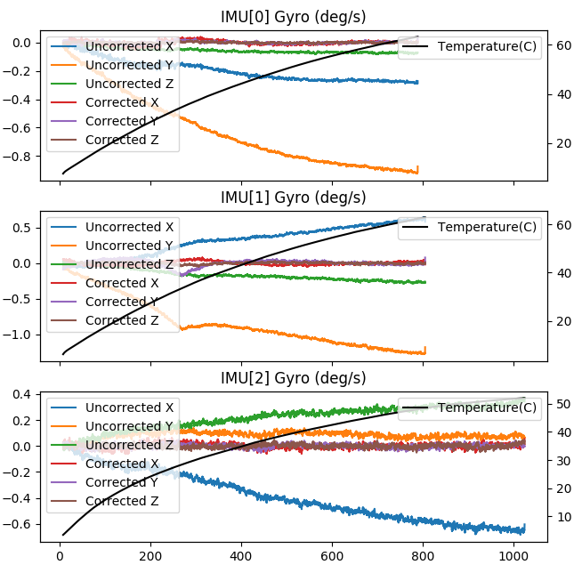
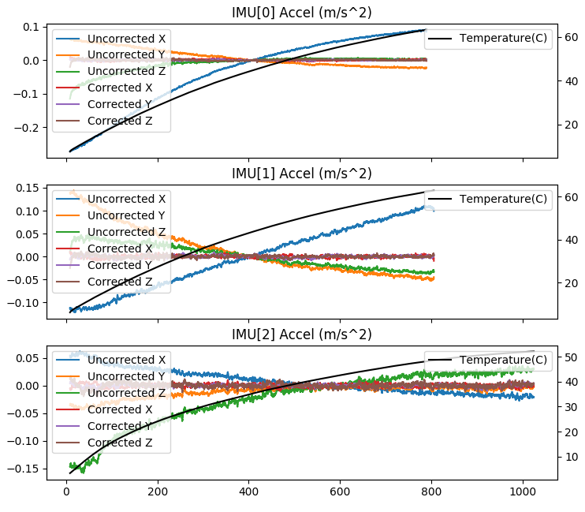

.. _common-imutempcal:

IMU Temperature Calibration
===========================

ArduPilot supports IMU temperature calibration in versions 4.1 and later. Calibrating the IMU for temperature changes can greatly reduce the amount of variation in the IMU and helps with flying in conditions where the temperature varies a lot between bootup and flight.

.. note:: this feature is only available currently on 2MB autopilots.

Temperature calibration is done by first setting up some parameters to establish the start of a calibration routine on the next boot-up, then taking the autopilot and placing it in a cold environment for several minutes to establish a lower calibration temperature. Then, quickly re-powering (and, optionally connecting to a GCS to monitor the process) in an environment at the hotter, upper calibration point.

.. warning:: You must not allow the autopilot to move, once re-powered, until the calibration is completed!

After the calibration is complete, you can also run an Offline calibration tool, to verify the calibration improvement.

The temperature calibration is stored in ArduPilot parameters, just
like other types of calibration parameters. There is also the option
to store the parameters in a way that persists across a full parameter
reset, which allows support for factory calibration for vendors
selling ArduPilot compatible autopilots.

Temperature Calibration Procedure
---------------------------------

The key factors to a good temperature calibration are:

 - letting the autopilot cool to a temperature below the
   minimum operating temperature before starting the calibration

 - ensuring the IMU temperature that is reached during the calibration
   run is high enough to cover all flight conditions

 - ensuring that there is no movement during the calibration. Note
   that the autopilot does not need to be level, but it must
   not move.

Before you start the calibration process you need to setup some key
parameters:

 - make sure the :ref:`INS_ACCn_CALTEMP <INS_ACC1_CALTEMP>` and
   :ref:`INS_GYRn_CALTEMP <INS_GYR1_CALTEMP>` parameters are already set
   (there is one parameter per IMU, make sure you set all of them). These
   are set automatically when you calibrate the accelerometers and
   gyroscopes. They record the temperature of the IMU at the time the
   offsets were calibrated, which is key information for the calibration
   process. If they are not already set (they default to -300 which is
   an invalid value) then you need to perform a 6-axis accel
   calibration.

 - set :ref:`INS_TCALn_ENABLE <INS_TCAL1_ENABLE>` to 2 for each IMU to
   enable IMU temperature calibration learning on the each IMU you
   want to calibrate. A value of 2 enables temperature calibration
   learning. The ENABLE parameter value of 2 takes effect on the next
   boot.

 - set :ref:`INS_TCALn_TMAX <INS_TCAL1_TMAX>` to the temperature in
   degrees centigrade that you want to stop the calibration. This
   should be the high temperature that you expect to reach in your
   calibration run.

 - it is recommended that you ensure a microSD card is inserted and
   you have :ref:`LOG_DISARMED <LOG_DISARMED>` set to 1 to log the IMU
   data used in the calibration process. While this is only required
   for the offline calibration check below, using it for the initial calibration is
   recommended in case you wish to inspect the raw data and to check
   for any movement that may have disturbed the calibration process.

For boards with a builtin IMU heater you may wish to raise
:ref:`BRD_HEAT_TARG<BRD_HEAT_TARG>` to a higher than usual
temperature. A value of 70 can be good for calibration. Make sure you
change it back to a normal flight value (normally 45) when the
calibration process is complete. A value is 70 is likely to be above
what can be reached, so for boards with heaters a reasonable value for
TMAX is 65 degrees C. Note that on some boards (notably the Hex
CubeBlack and CubeOrange) the 3rd IMU is not close to the heater, so
it's maximum temperature needs to be about 10 degrees below the first
two IMUs.

Once the parameters are setup, and the autopilot cooled to the minimum temperature, you should power on the flight
controller in a warm environment, ensuring that it will not move
throughout the calibration process.

The calibration process has a 10 minute timeout. If an IMU doesn't
increase it's temperature by at least 0.5 degrees C over a 10 minute
period then the calibration will complete and the parameters will be
saved up to the point the temperature reached.

The parameters are also saved for intermediate temperatures throughout
the calibration process. So if you run out of time (or patience)
waiting for the calibration then you can stop it at any time by
powering off the board. If you do this then you will need to manually
change the :ref:`INS_TCALn_ENABLE <INS_TCAL1_ENABLE>` parameters from
2 to 1 to enable the new calibration data to be used. Otherwise it will
start the calibration again on each boot. If you do interrupt the
calibration process then you should power off the vehicle with a
minimum of movement or you could invalidate the calibration. Stopping
the calibration process by using a telemetry link to change the
:ref:`INS_TCALn_ENABLE <INS_TCAL1_ENABLE>` parameters to 1 before
powering off can also be done and is a good idea.

Note that the calibration process requires a minimum of 10 degrees C
change in temperature between the starting and ending temperature. A
range of at least 25 degrees C is recommended, ie from the kitchen freezer to your desk.

Monitoring the Calibration Process
----------------------------------

If you have a buzzer connected then you will here a short periodic
beep while the calibration is in progress. When the calibration is
complete a completion tune will play. If you have a mavlink telemetry
link to the vehicle then you can also monitor the progress via that
link, graphing the IMU temperatures (which are in the RAW_IMU,
SCALED_IMU2 and SCALED_IMU3 messages if you have mavlink2 enabled).

On completion the :ref:`INS_TCALn_ENABLE <INS_TCAL1_ENABLE>`
parameters will change to 1 for "enable" for each IMU. Once all your
IMUs have completed calibration you can reboot the vehicle. You should
also:

 - reset the :ref:`BRD_HEAT_TARG<BRD_HEAT_TARG>` back to its
   normal value (usually 45) if you changed it

 - disable :ref:`LOG_DISARMED <LOG_DISARMED>` if you had enabled it
   and want it disabled for normal usage

You may also wish to refresh your parameters and save all the
parameters that start with the INS_TCAL prefix. You can restore these
parameters to avoid needing a new temperature calibration if you ever
do a complete reset of your parameters.

Offline Calibration Tool
------------------------

The procedure outlined above will have completed an automatic online
temperature calibration. If you had :ref:`LOG_DISARMED <LOG_DISARMED>`
set to 1 then the onboard log file allows you to do an offline
calibration check. Doing an offline calibration has the advantage that you
can inspect the improvements to the calibration by graphing the
uncorrected and corrected calibration for the accelerometers and
gyroscopes.

To perform an offline calibration you need to use the script in the
ArduPilot git repository in Tools/scripts/tempcal_IMU.py. When you run
this script on a log file from a calibration you will get two sets of
graphs. One set is for the gyroscopes the other is for the accelerometers.

The image below shows the results of a run on a log file for 3 IMU board:

The key features of the graphs are:

 - the first 3 lines on each graph (blue, orange and green) show the
   uncorrected IMU data. This allows you to see how much drift you
   have without temperature correction

 - the next 3 graphs show the corrected IMU data, showing how much the
   temperature calibration will help. For a good calibration these
   lines will all be close to zero

 - the IMU temperature is shown on the right hand scale

 - you should check for any sudden changes in the data, which
   indicates that the board was not kept still when calibrating

 - with multiple IMUs the graphs may span different temperature ranges
   and times. This happens as the IMUs reach their target calibration
   temperatures at different times

The calibration script will also save a copy of the new calibration
parameters to the file tcal.parm, or a filename chosen with
the --outfile command line option. You should load these parameters to
enable the new calibration on the autopilot.

Other command line options are:

 - the --no-graph option disables the graphing, allowing for batch
   processing of log files

 - the --online option changes the calibration process to use the same
   algorithm as the online calibration method used inside the flight
   controller. This is useful for debugging

 - the --tclr option enables the use of the TCLR messages from the log
   instead of the IMU log messages. The TCLR messages record the exact
   filtered data used in the online calibration process. This is
   useful for debugging

 - the --log-parm option enables an additional set of graphs showing
   the IMU data with corrections applied using existing INS_TCAL
   parameters from your log file. This allows you to compare the new
   calibration against a previous temperature calibration

Factory Temperature Calibration
-------------------------------

On autopilots based on the STM32F7 and STM32H7
microcontrollers we support storing temperature calibration parameters
in persistent storage in the boards bootloader sector. This allows the
calibration parameters to persist even with a complete parameter
reset, including changing firmware type. This allows a vendor to ship
autopilots pre-calibrated from the factory which is a great
convenience for users.

To save parameters persistently, you should set the desired bits in
:ref:`INS_TCAL_OPTIONS <INS_TCAL_OPTIONS>` to indicate persistence of
Temperature Calibration and Accel Calibrations. As a final step send a
"flash bootloader" mavlink command to the autopilot. This will
re-flash the bootloader with calibration parameters embedded in the
final part of the bootloader sector in flash. You can inspect these
parameters using the @SYS/persistent.parm sysfs file using a mavftp
client.
