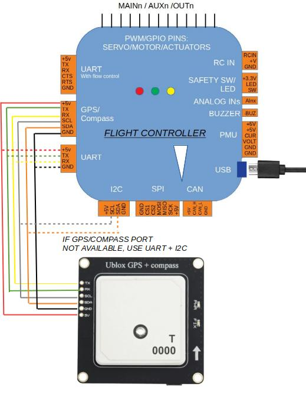
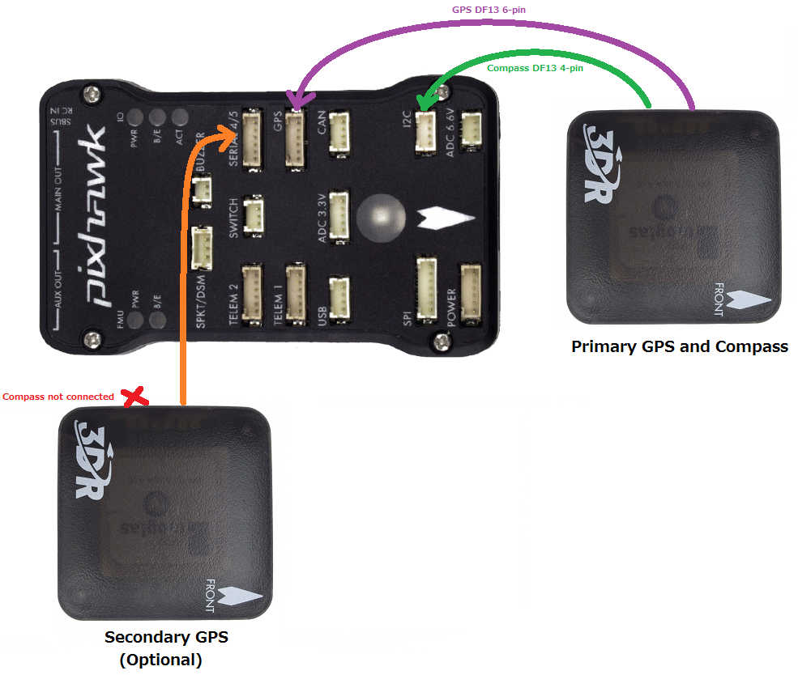
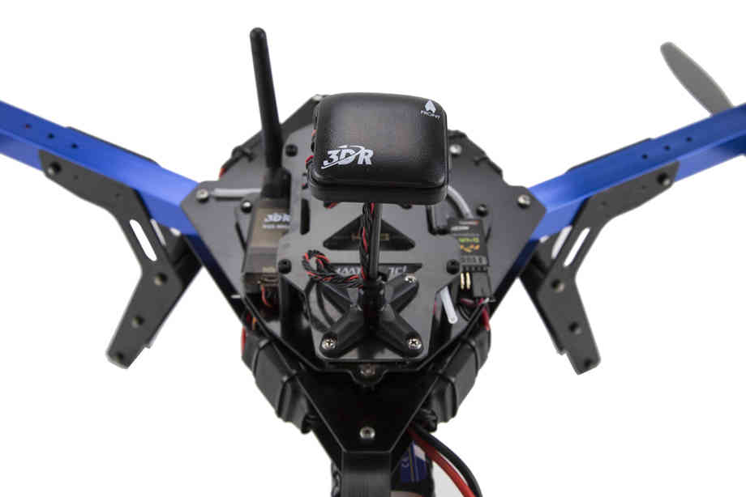

.. _common-installing-3dr-ublox-gps-compass-module:

==========================
UBlox GPS + Compass Module
==========================

A UBlox GPS + Compass module is the most commonly used GPS for ArduPilot compatible autopilots.
There are many versions of these modules available from various manufacturers, the recommended models are :ref:`here <common-positioning-landing-page>`.

ArduPilot automatically configures the GPS soon after startup so there is no need for any GPS related calibration.  The :ref:`compass must be calibrated <common-compass-calibration-in-mission-planner>` however.

.. image:: ../../../images/GPS_TopAndSide.jpg
    :target: ../_images/GPS_TopAndSide.jpg

Connecting the Autopilot
========================

.. _common-installing-3dr-ublox-gps-compass-module_connecting_to_pixhawk:

Example: Connecting to Pixhawk
------------------------------

Connect the GPS's 6-pin DF13 connector to the Pixhawk's "GPS" port and
the compass's 4-pin connector to the I2C port.  Alternatively the
compass can be first connected through an `I2C splitter <http://store.jdrones.com/Pixhawk_I2C_splitter_p/dstpx4i2c01.htm>`__
if other I2C devices are to be attached.

Details on how to setup and use a 2nd GPS can be found on the :ref:`GPS Blending page <common-gps-blending>` page.

.. note::

   The baud rate is set by the UBlox driver (setting ``SERIAL4_BAUD = 38`` is ignored).

.. note::

   ArduPilot supports many attached compasses, but only up to 3 compasses can be used during operation. See :ref:`common-compass-setup-advanced` .

Mounting the GPS Module
=======================

This module permits the GPS to be mounted separately from the flight
control module so that it can have the best clear (view) of the sky and
allows the compass to be distanced from interfering magnetic fields.

.. tip::

   The recommended orientation is to mount the module with the arrow
   facing toward the front of the vehicle and in the same direction as the
   arrow on the autopilot.

When mounting the GPS+Compass module:

-  Place the module on the outside of your vehicle (in an elevated
   position if appropriate) with a clear view of the sky, as far as
   possible from the motors and ESCs, with the arrow facing forward.
-  Distance the module from DC power wiring and the batteries by at
   least 10cm.  Use of `a GPS mast <http://store.jdrones.com/foldable_GPS_and_Compass_antenna_mast_p/mntgps01blk.htm>`__
   is highly recommended.
-  Place the module clear of nearby iron containing metallic objects.
   (Use nylon or non magnetic stainless steel hardware and nylon or
   aluminum standoffs to mount the module).
-  Twist power and ground wires where possible.

Setup in Mission Planner
========================

:ref:`Compass Calibration in Mission Planner <common-compass-calibration-in-mission-planner>` explains the
simplest way to calibrate a compass mounted in the recommended
orientation (arrows for autopilot and compass facing to front of
vehicle).

:ref:`Advanced Compass Setup <common-compass-setup-advanced>` contains more
detailed instructions for calibrating a compass if, for example, it has
been mounted at some other orientation.

LED Indicators
==============

The 3DR GPS+Compass module has two LED indicators: one for power (solid
red) and one for GPS lock (flashing blue). Most GPS have an led indicator for 3D GPS lock acquisition.

+-------------+-----------------------------------------------+
| **LEDs:**   | **Behavior:**                                 |
+-------------+-----------------------------------------------+
| Power       | Solid **red** when powered                    |
+-------------+-----------------------------------------------+
| GPS lock    | Flashing **blue** when 3D GPS lock acquired   |
+-------------+-----------------------------------------------+

Advanced Configuration
======================

Advanced configuration of the UBlox GPS's internal settings is
documented in :ref:`UBlox GPS Configuration <common-ublox-gps>`. But this is never used by the average user. Ardupilot automatically configures the gps during initialization.
