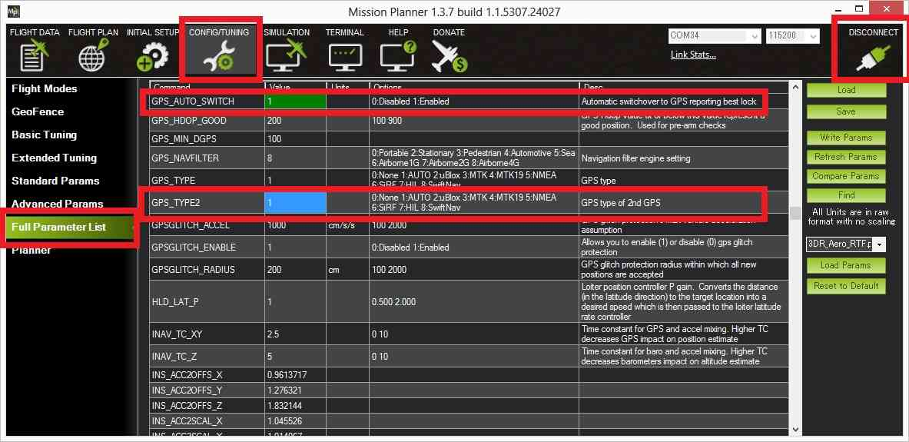
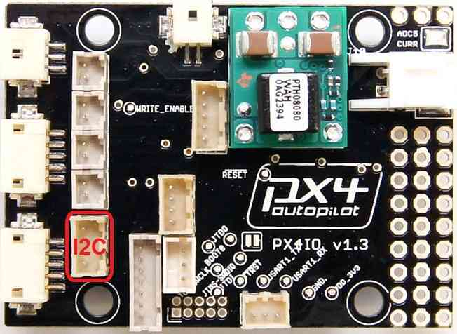

.. _common-installing-3dr-ublox-gps-compass-module:

==============================
3DR UBlox GPS + Compass Module
==============================

This page covers the installation of the `3DR UBlox GPS + Compass module <http://store.3drobotics.com/products/3dr-gps-ublox-with-compass>`__.

Overview
========

The *3DR UBlox GPS + Compass module* is the recommended GPS for Pixhawk,
PX4 and APM2.6 (and above) flight controllers using Plane, Rover and
Copter.  These come set-up with :ref:`the best known GPS configuration <common-ublox-gps>` and have been thoroughly tested by
thousands of users.

.. image:: ../../../images/GPS_TopAndSide.jpg
    :target: ../_images/GPS_TopAndSide.jpg

Connecting the Autopilot
========================

.. _common-installing-3dr-ublox-gps-compass-module_connecting_to_pixhawk:

Connecting to Pixhawk
---------------------

Connect the GPS's 6-pin DF13 connector to the Pixhawk's "GPS" port and
the compass's 4-pin connector to the I2C port.  Alternatively the
compass can be first connected through an `I2C splitter <http://store.jdrones.com/Pixhawk_I2C_splitter_p/dstpx4i2c01.htm>`__
if other I2C devices are to be attached.

.. note::

   As of Copter 3.2 and recent versions of Plane and Rover, a
   secondary GPS can be connected to the Pixhawk’s Serial 4/5 port. Limited
   testing suggests that a secondary GPS can reduce the likelihood that GPS
   glitches will affect the vehicle, but can also lead to sudden movements
   of the vehicle when the primary GPS switches.

.. tip::

   On Copter we do
   not recommend using a second compass due to these sudden vehicle
   movements.

If the parameters are set-up as shown below, the flight controller will
use the GPS with the higher number of satellites (Note: it will switch
when one GPS has at least 2 more satellites than the other).

-  GPS_AUTO_SWITCH = 1
-  GPS_TYPE2 = 1

If using Copter 3.3 or higher or recent versions of Plane/Rover then
this parameter should also be set:

-  SERIAL4_PROTOCOL = 5

.. note::

   The baud rate is set by the UBlox driver (setting
   ``SERIAL4_BAUD = 38`` is ignored).

.. note::

   ArduPilot supports up to 3 compasses. However you cannot attach a
   secondary external compass to Pixhawk because there isn't a spare
   port.

Connecting to APM 2.x
---------------------

APM 2.6 is compatible with the *3DR UBlox GPS + Compass module*.

To connect the GPS module to APM 2.6, attach the GPS port to the APM GPS
port using the included 5-position-to-6-position cable (use the
top-entry port, not the side-entry port), and attach the GPS MAG port to
the APM I\ :sup:`2`\ C port using the included 4-position cable.

APM 2.5 and APM 2.0 have an internal compass (unlike APM 2.6) which must
be disabled by cutting a trace before you can connect the *3DR UBlox GPS
+ Compass module* (the `video here <http://www.youtube.com/watch?v=niqvBmXeNjU>`__ shows how).

Other than disabling the internal compass, connecting the UBlox is the
same for APM2.0/APM2.5 as for APM2.6.

.. note::

   After connecting the external compass you will need to
   re-calibrate the compass [site wiki="copter" inline="on"] including
   :ref:`Compassmot <common-compass-setup-advanced_compassmot_compensation_for_interference_from_the_power_wires_escs_and_motors>`\ [/site]
   (if you had run this procedure for the internal compass).

Connecting to PX4
-----------------

-  To connect GPS part of the this module to PX4, connect the GPS port
   to the PX4FMU’s GPS connector.
-  Connect the compass lead on the module to the PX4IO’s I2C port.
-  The PX4IO board I2C port is the 4 pin connector located on the board
   side opposite the Servo Out connectors in the second row of
   connectors in and next to the board mounting hole.
-  When the external compass is plugged into the PX4IO boards I2C port,
   it is automatically detected and used and the internal compass
   is disabled.

Next connect with the Mission Planner and go to **INITIAL SETUP \|
Mandatory Hardware \| Compass** and set the Orientation to
``ROTATION_ROLL_180``.

Connecting to Erle-Brain2
-------------------------

-  Connect GPS 6 pin DF13 connector to the port labeled as "UART"
-  Connect Compass 4 pin DF13 connector to one of the ports labeled as
   "I2C"

An external compass is required (drivers are not yet available for the
internal compass).

If using Copter 3.3 or higher or recent versions of Plane/Rover then
this parameter should also be set:

-  SERIAL4_PROTOCOL = 5

.. note::

   The baud rate is set by the UBlox driver (setting
   ``SERIAL4_BAUD = 38`` is ignored).

Mounting the GPS Module
=======================

This module permits the GPS to be mounted separately from the flight
control module so that it can have the best clear (view) of the sky and
allows the compass to be distanced from interfering magnetic fields.

.. tip::

   The recommended orientation is to mount the module with the arrow
   facing toward the front of the vehicle and in the same direction as the
   arrow on the autopilot.

When mounting the GPS+Compass module:

-  Place the module on the outside of your vehicle (in an elevated
   position if appropriate) with a clear view of the sky, as far as
   possible from the motors and ESCs, with the arrow facing forward.
-  Distance the module from DC power wiring and the batteries by at
   least 10cm.  Use of `a GPS mast <http://store.jdrones.com/foldable_GPS_and_Compass_antenna_mast_p/mntgps01blk.htm>`__
   is highly recommended.
-  Place the module clear of nearby iron containing metallic objects.
   (Use nylon or non magnetic stainless steel hardware and nylon or
   aluminum standoffs to mount the module).
-  Twist power and ground wires where possible.

.. image:: ../../../images/GPS_sampleMoutning.jpg
    :target: ../_images/GPS_sampleMoutning.jpg

Setup in Mission Planner
========================

:ref:`Compass Calibration in Mission Planner <common-compass-calibration-in-mission-planner>` explains the
simplest way to calibrate a compass mounted in the recommended
orientation (arrows for autopilot and compass facing to front of
vehicle).

:ref:`Advanced Compass Setup <common-compass-setup-advanced>` contains more
detailed instructions for calibrating a compass if, for example, it has
been mounted at some other orientation.

LED Indicators
==============

The 3DR GPS+Compass module has two LED indicators: one for power (solid
red) and one for GPS lock (flashing blue).

+-------------+-----------------------------------------------+
| **LEDs:**   | **Behavior:**                                 |
+-------------+-----------------------------------------------+
| Power       | Solid **red** when powered                    |
+-------------+-----------------------------------------------+
| GPS lock    | Flashing **blue** when 3D GPS lock acquired   |
+-------------+-----------------------------------------------+

Advanced Configuration
======================

Advanced configuration of the UBlox GPS's internal settings is
documented in :ref:`UBlox GPS Configuration <common-ublox-gps>`.
