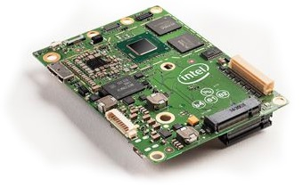

.. _common-intel-aero-overview:

===================
Intel Aero Overview
===================

The `Intel Aero <https://software.intel.com/en-us/aero/compute-board>`__ computer board is a high performance linux board that can run ArduPilot natively while still having enough compute resources to do other CPU intensive tasks including vision processing.

Specifications
==============

-  **Processor**
   -  Intel® Atom™ x7-Z8700 Processor
   -  2.4 GHz burst, quad core, 2M cache, 64 bit
   -  4GB RAM LPDDR3-1600
   -  32GB eMMC

-  **Sensors**

   -  `Bosch BMI160 6-Axis IMU <https://www.bosch-sensortec.com/bst/products/all_products/bmi160>`__
   -  `Bosch BMC150 6-axis compass <https://www.bosch-sensortec.com/bst/products/all_products/homepage_1_ohne_marginalspalte_52>`__
   -  MS5611 Barometer

-  **OS**

   -  Linux* 4.4.3-yocto-standard OS powered with Yocto Project* 2.1 (Krogoth)

-  **Interfaces**

   -  I2C x 2
   -  UART
   -  SPI
   -  CAN
   -  5 analog inputs
   -  25 programmable GPIO pins
   -  Wi-Fi (802.11ac)
   -  1 micro HDMI 1.4b
   -  1 USB 3.0 On-the-Go (OTG) connector
   -  MIPI (CSI-2) 4-lanes + 1 lane connector
   -  microSD memory card slot
   -  M.2 connector 1 lane PCIe for SSD
    
-  **Dimensions**

   -  Weight: 30g (without heatsink, 60g (with heatsink)
   -  Size: 88mm x 63mm x 20mm (including heatsink)

