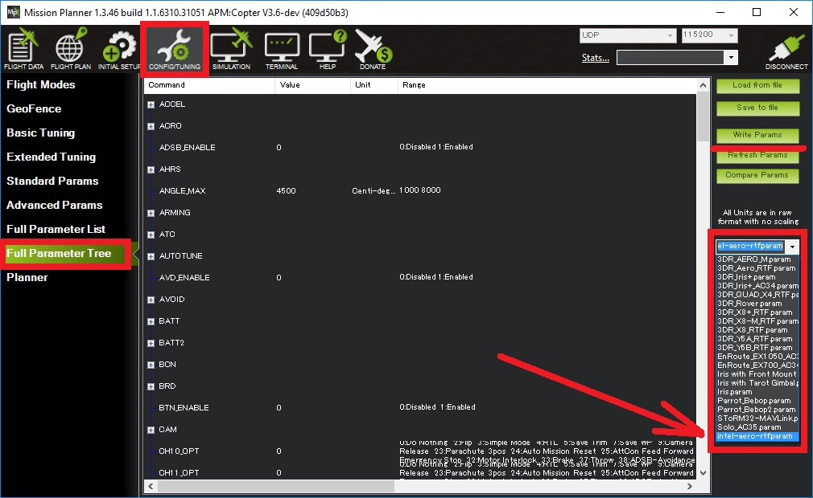

.. _common-intel-aero-rtf:

==============
Intel Aero RTF
==============

The `Intel Aero RTF vehicle <https://software.intel.com/en-us/aero/drone-kit>`__ includes the :ref:`Intel Aero compute board <common-intel-aero-overview>`,
`Vision Accessory Kit <https://software.intel.com/en-us/aero/vision-kit>`__ and a `Spektrum DXe transmitter <http://spektrumrc.com/Products/Default.aspx?ProdId=SPM1000>`__.

Within the vehicle is an STM32F427V autopilot board which can run ArduPilot (replacing the pre-loaded non-ArduPilot software).
In this way, the higher powered :ref:`Intel Aero compute board <common-intel-aero-overview>` is used as a `companion computer <https://ardupilot.org/dev/docs/companion-computers.html>`__.

..  youtube:: DZm9S0lxiEg
    :width: 100%

Additional parts to buy
=======================

Although "Ready-to-fly" some additional parts are required to complete the upgrade and fly with ArduPilot.

- LiPo battery `3S <https://hobbyking.com/en_us/multistar-high-capacity-3s-5200mah-multi-rotor-lipo-pack.html?___store=en_us>`__ or `4S <https://hobbyking.com/en_us/multistar-high-capacity-5200mah-4s-12c-multi-rotor-lipo-pack-w-xt60.html?___store=en_us>`__
- 2GB (or larger) USB thumb drive (`like this one <https://www.amazon.com/SanDisk-Cruzer-Glide-Drive-SDCZ60-008G-B35/dp/B007YX9O94/ref=sr_1_4?ie=UTF8&qid=1492397331&sr=8-4>`__) is needed for updating to the last release of the Linux distro.
- Micro USB OTG to USB cable (`like this one <https://www.amazon.com/Micro-USB-OTG-Go-Adapter/dp/B005GI2VMG>`__)
- `Spektrum USB programming cable <https://www.spektrumrc.com/Products/Default.aspx?ProdID=SPMA3065>`__ (optional)
    
Upgrading the vehicle's software
================================

The Aero RTF may not have the last BIOS and Linux operating system. The Linux distro on Aero needs to be updated to version 1.2
in order for the autopilot to be flashed with ArduPilot.

`Official Setup Instuctions from Intel <https://github.com/intel-aero/meta-intel-aero/wiki/02-Initial-setup>`__ should be followed which will ask you to:

- Download the latest OS image (aka "intel-aero-image-intel-aero.iso") and Capsule/BIOS (aka "capsule-01.00.12-r0.core2_64.rpm") from the `Intel Download Center <https://downloadcenter.intel.com/download/26500/UAV-installation-files-for-Intel-Aero-Platform>`__
- `Flash the BIOS to Aero compute board <https://github.com/intel-aero/meta-intel-aero/wiki/02-Initial-setup#flashing-the-bios>`__
- `Flash the OS image to the Aero compute board <https://github.com/intel-aero/meta-intel-aero/wiki/02-Initial-setup#flash-intel-aero-linux-distribution>`__ using a USB thumb drive
- `Upgrade the FPGA <https://github.com/intel-aero/meta-intel-aero/wiki/02-Initial-setup#flashing-the-fpga>`__ using a .jam file included on the OS image

The final step is to copy the **arducopter.px4** firmware to the Aero compute board and then flash it to the flight board:

- Download the latest aero-fc ArduPilot firmware from `firmware.ardupilot.org <https://firmware.ardupilot.org/Copter/latest/>`__ 
- Copy the above firmware to the Aero compute board in much the same way the BIOS's .rpm file was copied
- `Flash the autopilot board <https://github.com/intel-aero/meta-intel-aero/wiki/02-Initial-setup#flashing-the-flight-controller-rtf-only>`__ with the **ardupilot.px4** firmware

If you are developing ArduPilot, you can flash directly from the command line after compiling. Refer to `Build instructions <https://github.com/ArduPilot/ardupilot/blob/master/BUILD.md>`__ for more detailed instructions, but it's basically the following commands:

    ./waf configure --board aerofc-v1
    ./waf copter --upload

Connecting and configuring with a ground station
================================================

- Connect a LiPo battery to the vehicle
- Turn on the vehicle by pushing the "Power" button found between the two rear arms
- From your PC, connect to the vehicle's wifi access point (normally starts with "Aero-"), the default password is "1234567890"
- Start the ground station (i.e. mission planner), select "UDP" from the connection type and press "Connect"
- The default parameter file can be uploaded from the Mission Planner's Full Parameter Tree screen (raw parameter file is `here <https://github.com/ArduPilot/ardupilot/blob/master/Tools/Frame_params/intel-aero-rtf.param>`__)

- regular :ref:`compass <common-compass-calibration-in-mission-planner>`, :ref:`Radio <common-radio-control-calibration>`, :ref:`accelerometer calibration <common-accelerometer-calibration>` is required (:ref:`ESC calibration <esc-calibration>` is not required)

Connecting the Transmitter
==========================

The transmitter that comes with the RTF is an off the shelf DSM-X DXe and a SPM4648 receiver, which is of autobind mode. The transmitter should always be powered on before the receiver (which is normally powered together with the vehicle).  If powered on after the vehicle it won't connect.  To overcome this you can simply disconnect the cable from the receiver, or go through the binding process, which involves powering on the transmitter while holding the "BIND/PANIC/TRAINER" button pressed. More information about the binding and connectiong can be found on the `receiver documentation <https://www.horizonhobby.com/pdf/SPM4648-Manual-EN.pdf>`__.

Known Issues with the Transmitter
=================================

- the "MOTOR/THROW" switch on the back-right of the transmitter should always be left in the "ARM" position or the throttle value sent to the vehicle will be too low
- the "FLAP" switch is connected to Ch7 so it can be used as an auxiliary switch but position "0" is actually On, "2" is off.
- "AUX" and "RATE" switches are not configured to have any effect

The last three issues mentioned above could be resolved by reprogramming the transmitter using a `Spektrum TX/RX USB Programming Cable <https://www.spektrumrc.com/Products/Default.aspx?ProdID=SPMA3065>`__

Improving the vehicle's center of gravity
=========================================

In the default configuration the vehicle is tail heavy but its center of gravity can be improved by shifting the battery forward.
Either attach the battery to the underside of the vehicle (instead of between the upper and lower platforms) or remove one of the blue pillars as shown above.

More flight videos
==================
..  youtube:: 3lu9xq8Cm1E
    :width: 100%
