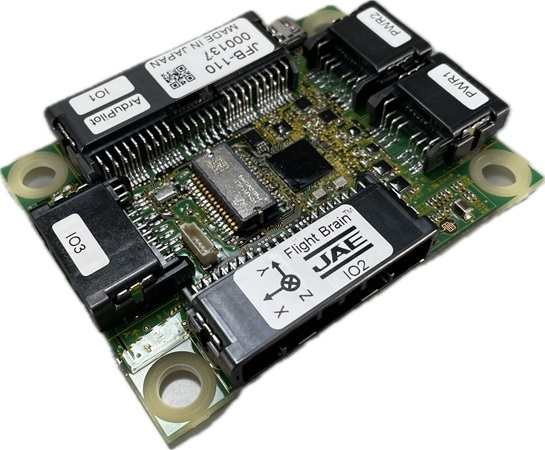
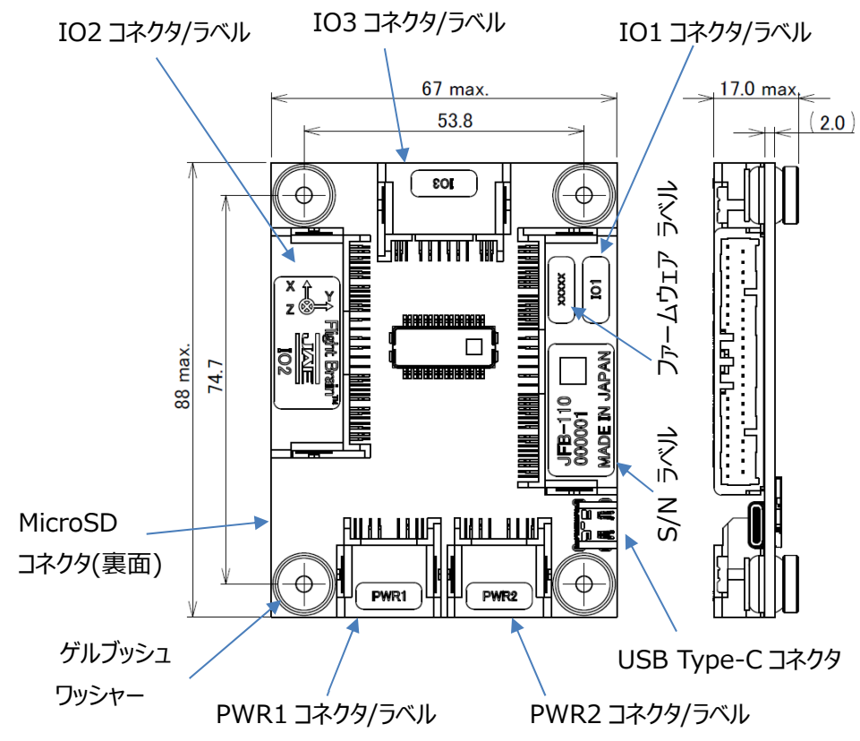
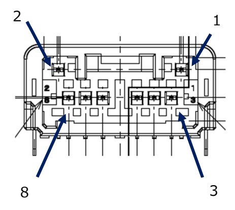
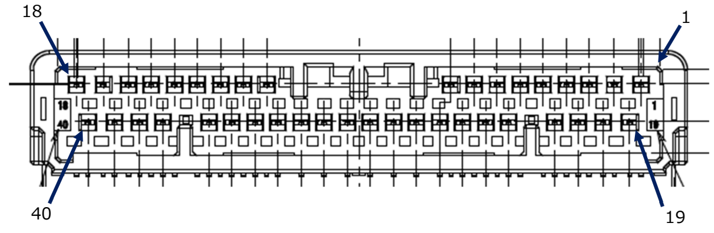
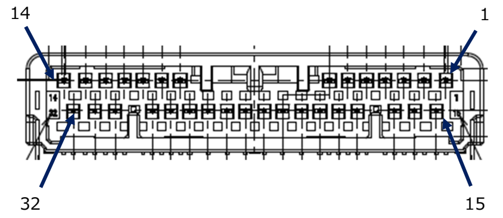
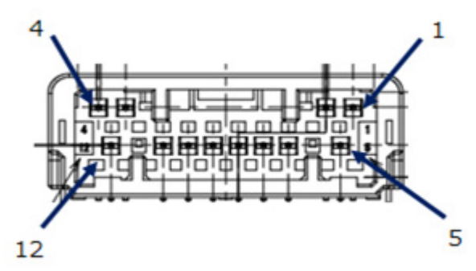

.. _common-jae-jfb110:

===========
JAE JFB-110
===========

The JAE (Japan Aviation Electronics Industry) JFB-110 autopilot is made in Japan with a focus on robustness and reliability.  Instead of the more common JST connectors, this autopilot uses automotive grade water proof connectors for most peripherals.  It also includes an automotive grade IMU and high speed TypeC USB.

Where To Buy
============

The JFB-110 can be purchased directly from `JAE <https://www.jae.com/en/>`__

Features
========

- High speed STM32H755 microcontroller
- 1x SCHA63T and 2x TDK InvenSense IIM-42652 IMUs
- 2x MS5611 barometers
- Built-in iSentek IST8310 magnetometer
- MicroSD card slot
- 5 UARTs plus USB, RCIN, SBUS_OUT
- 16 PWM outputs
- Four I2C and two CAN ports
- External buzzer (Open/Drain and 33V Out)
- External safety switch
- Voltage monitoring for servo rail and Vcc
- 2x power input ports for external power bricks

Specifications
==============

- Size: 67mm x 88mm x 17mm
- Weight: 60g
- Power consumption: under 3W
- Input voltage: 4.9V ~ 5.5V
- Temp Min/Max: -40C ~ +85C

Connectors
==========

+---------------------+---------------------+---------------+---------------+
|Port Name            |Board side connector |Socket Housing |Socket contact |
|                     |                     |               |               |
+=====================+=====================+===============+===============+
|PWR1, PWR2           |MX77A008HF1          |MX77A008SF1    |MX77S13K5F1    |
+---------------------+---------------------+---------------+---------------+
|101                  |MX77A040HF1          |MX77A040SF1    |MX77S13K5F1    |
+---------------------+---------------------+---------------+---------------+
|102                  |MX77A032HF1          |MX77A032SF1    |MX77S13K5F1    |
+---------------------+---------------------+---------------+---------------+
|103                  |MX77A012HF1          |MX77A012SF1    |MX77S13K5F1    |
+---------------------+---------------------+---------------+---------------+

PWR1, PWR2 port pin assignments
===============================

+--------+------------+------------------+
|Pin No  |Name        | Details          |
+========+============+==================+
|1       |Current     |0V~3.3V input     |
+--------+------------+------------------+
|2       |Voltage     |0V~3.3V input     |
+--------+------------+------------------+
|3 ~ 5   |VCC         |4.9V ~ 5.5V input |
+--------+------------+------------------+
|6 ~ 8   |GND         |                  |
+--------+------------+------------------+

101 port pin assignments
========================

+--------+---------------------+--------------------------+
| Pin No | Name                | Details                  |
+--------+---------------------+--------------------------+
| 1      | Serial1 TX          | Telem1                   |
+--------+---------------------+--------------------------+
| 2      | Serial1 RX          | Telem1                   |
+--------+---------------------+--------------------------+
| 3      | VCC Periph 5V       | 5V                       |
+--------+---------------------+--------------------------+
| 4      | VCC Periph 5V       | 5V                       |
+--------+---------------------+--------------------------+
| 5      | CAN H1              | CAN1 port                |
+--------+---------------------+--------------------------+
| 6      | VCC Periph 5V       | 5V                       |
+--------+---------------------+--------------------------+
| 7      | Serial3 TX          | GPS                      |
+--------+---------------------+--------------------------+
| 8      | I2C1 SCL            | I2C1 port                |
+--------+---------------------+--------------------------+
| 9      | Safety Switch       |                          |
+--------+---------------------+--------------------------+
| 10     | VCC 5V High Power   | 5V 1.5A max              |
+--------+---------------------+--------------------------+
| 11     | VCC 3.3V High Power | 3.3V 1A max              |
+--------+---------------------+--------------------------+
| 12     | SPI5 SCK            | SPI5 port                |
+--------+---------------------+--------------------------+
| 13     | SPI5 MISO           | SPI5 port                |
+--------+---------------------+--------------------------+
| 14     | SPI5 MOSI           | SPI5 port                |
+--------+---------------------+--------------------------+
| 15     | VCC Periph 5V       | 5V                       |
+--------+---------------------+--------------------------+
| 16     | VCC Periph 5V       | 5V                       |
+--------+---------------------+--------------------------+
| 17     | Serial4 TX          | GPS2                     |
+--------+---------------------+--------------------------+
| 18     | I2C2 SCL            | I2C2 port                |
+--------+---------------------+--------------------------+
| 19     | Serial1 CTS         |                          |
+--------+---------------------+--------------------------+
| 20     | Serial1 RTS         |                          |
+--------+---------------------+--------------------------+
| 21     | GND                 |                          |
+--------+---------------------+--------------------------+
| 22     | GND                 |                          |
+--------+---------------------+--------------------------+
| 23     | CANL1               | CAN1 port                |
+--------+---------------------+--------------------------+
| 24     | GND                 |                          |
+--------+---------------------+--------------------------+
| 25     | Serial3 RX          | GPS                      |
+--------+---------------------+--------------------------+
| 26     | I2C1 SDA            | I2C1 port                |
+--------+---------------------+--------------------------+
| 27     | Safety Switch LED   | Open 3.3V / Drain        |
+--------+---------------------+--------------------------+
| 28     | Buzzer              | Open/Drain               |
+--------+---------------------+--------------------------+
| 29     | VCC 3.3V High Power | 3.3V 1A max              |
+--------+---------------------+--------------------------+
| 30     | Serial5 RX          | RC input2                |
+--------+---------------------+--------------------------+
| 31     | RSSI                | Pin 10                   |
+--------+---------------------+--------------------------+
| 32     | GND                 |                          |
+--------+---------------------+--------------------------+
| 33     | Serial6             | SBUS Out                 |
+--------+---------------------+--------------------------+
| 34     | RC In               |                          |
+--------+---------------------+--------------------------+
| 35     | Buzzer              | Open , 5KOhm pull down   |
+--------+---------------------+--------------------------+
| 36     | SPI5 CS1            | SPI5 port                |
+--------+---------------------+--------------------------+
| 37     | GND                 |                          |
+--------+---------------------+--------------------------+
| 38     | GND                 |                          |
+--------+---------------------+--------------------------+
| 39     | Serial4 RX          | GPS2                     |
+--------+---------------------+--------------------------+
| 40     | I2C2 SDA            | I2C2 port                |
+--------+---------------------+--------------------------+

102 port pin assignments
========================

+--------+---------------------+--------------------------+
| Pin No | Name                | Details                  |
+--------+---------------------+--------------------------+
| 1      | VCC Periph 5V       | 5V                       |
+--------+---------------------+--------------------------+
| 2      | Serial2 TX          | Telem2                   |
+--------+---------------------+--------------------------+
| 3      | Serial2 RX          | Telem2                   |
+--------+---------------------+--------------------------+
| 4      | VCC Periph 5V       | 5V                       |
+--------+---------------------+--------------------------+
| 5      | CAN H2              | CAN2 port                |
+--------+---------------------+--------------------------+
| 6      | Chassis GND         |                          |
+--------+---------------------+--------------------------+
| 7      | FMU CAP1            | GPIO 66                  |
+--------+---------------------+--------------------------+
| 8      | VCC Periph 5V       | 5V                       |
+--------+---------------------+--------------------------+
| 9      | I2C4 SCL            | I2C4 port                |
+--------+---------------------+--------------------------+
| 10     | PWM OUT 1           | GPIO 50                  |
+--------+---------------------+--------------------------+
| 11     | PWM OUT 2           | GPIO 51                  |
+--------+---------------------+--------------------------+
| 12     | PWM OUT 3           | GPIO 52                  |
+--------+---------------------+--------------------------+
| 13     | PWM OUT 4           | GPIO 53                  |
+--------+---------------------+--------------------------+
| 14     | VCC Servo           | 5V 1.5A max              |
+--------+---------------------+--------------------------+
| 15     | GND                 |                          |
+--------+---------------------+--------------------------+
| 16     | Serial2 CTS         |                          |
+--------+---------------------+--------------------------+
| 17     | Serial2 RTS         |                          |
+--------+---------------------+--------------------------+
| 18     | GND                 |                          |
+--------+---------------------+--------------------------+
| 19     | CAN L2              | CAN2 port                |
+--------+---------------------+--------------------------+
| 20     | GND                 |                          |
+--------+---------------------+--------------------------+
| 21     | FMU CAP2            | GPIO 67                  |
+--------+---------------------+--------------------------+
| 22     | WDT FAIL            | TTL                      |
+--------+---------------------+--------------------------+
| 23     | External Reset      | TTL                      |
+--------+---------------------+--------------------------+
| 24     | ADC 3.3V            | Pin 13                   |
+--------+---------------------+--------------------------+
| 25     | ADC 3.3V            | Pin 12                   |
+--------+---------------------+--------------------------+
| 26     | GND                 |                          |
+--------+---------------------+--------------------------+
| 27     | I2C4 SDA            | I2C4 port                |
+--------+---------------------+--------------------------+
| 28     | PWM OUT 5           | GPIO 54                  |
+--------+---------------------+--------------------------+
| 29     | PWM OUT 6           | GPIO 55                  |
+--------+---------------------+--------------------------+
| 30     | PWM OUT 7           | GPIO 56                  |
+--------+---------------------+--------------------------+
| 31     | PWM OUT 8           | GPIO 57                  |
+--------+---------------------+--------------------------+
| 32     | GND                 | for PWM OUT              |
+--------+---------------------+--------------------------+

103 port pin assignments
========================

+--------+---------------------+--------------------------+
| Pin No | Name                | Details                  |
+--------+---------------------+--------------------------+
| 1      | GND                 | For PWM OUT              |
+--------+---------------------+--------------------------+
| 2      | GND                 | For USB                  |
+--------+---------------------+--------------------------+
| 3      | USB OTG FS DM       | USB port                 |
+--------+---------------------+--------------------------+
| 4      | USB OTG FS DP       | USB port                 |
+--------+---------------------+--------------------------+
| 5      | PWM OUT 9           | GPIO 58                  |
+--------+---------------------+--------------------------+
| 6      | PWM OUT 10          | GPIO 59                  |
+--------+---------------------+--------------------------+
| 7      | PWM OUT 11          | GPIO 60                  |
+--------+---------------------+--------------------------+
| 8      | PWM OUT 12          | GPIO 61                  |
+--------+---------------------+--------------------------+
| 9      | PWM OUT 13          | GPIO 62                  |
+--------+---------------------+--------------------------+
| 10     | PWM OUT 14          | GPIO 63                  |
+--------+---------------------+--------------------------+
| 11     | PWM OUT 15          | GPIO 64                  |
+--------+---------------------+--------------------------+
| 12     | PWM OUT 16          | GPIO 64                  |
+--------+---------------------+--------------------------+

UART / Serial
=============

+---------+---------------------+---------+-----+
| Port    | Default Use         | CTS/RTS | DMA |
+=========+=====================+=========+=====+
| Serial0 | USB                 | N/A     | No  |
+---------+---------------------+---------+-----+
| Serial1 | Telem1              | Yes     | Yes |
+---------+---------------------+---------+-----+
| Serial2 | Telem2              | Yes     | No  |
+---------+---------------------+---------+-----+
| Serial3 | GPS                 | No      | No  |
+---------+---------------------+---------+-----+
| Serial4 | GPS2                | No      | Yes |
+---------+---------------------+---------+-----+
| Serial5 | RCin2               | No      | Yes |
+---------+---------------------+---------+-----+
| Serial6 | SBUS Out            | No      | Yes |
+---------+---------------------+---------+-----+
| Serial7 | Unused              | No      | Yes |
+---------+---------------------+---------+-----+
| Serial8 | USB SLCAN           | N/A     | Yes |
+---------+---------------------+---------+-----+

RC Input
========

The RC In pin, is mapped to a timer input  and can be used for all ArduPilot supported receiver protocols, except CRSF/ELRS, FPort, and SRXL2 which require a true UART connection. However, FPort, when connected in this manner, can provide RC without telemetry. 

An alternate RC input is setup on SERIAL5 RX input and provides the same capabilities as above except it does not support PPM.

To allow CRSF and embedded telemetry available in FPort, CRSF, and SRXL2 receivers, any full UART with DMA can be assigned to be used as the RC connection instead of the PPM pin. For example SERIAL4 could be re-assigned as RC input.

With this option, :ref:`SERIAL4_PROTOCOL<SERIAL4_PROTOCOL>` must be set to "23", :ref:`SERIAL5_PROTOCOL<SERIAL5_PROTOCOL>` must be cahnged to some other protocol than its default of "23" (only one UART is allowed to have that protocol in a system), and:

- PPM is not supported.

- SBUS/DSM/SRXL connects to the RX  pin.

- FPort requires connection to TX. and setting :ref:`SERIAL4_OPTIONS<SERIAL4_OPTIONS>` = 7 (invert TX/RX, Half Duplex)

- CRSF also requires a TX connection, in addition to RX, and automatically provides telemetry.

- SRXL2 requires a connection to TX and automatically provides telemetry.  Set :ref:`SERIAL4_OPTIONS<SERIAL4_OPTIONS>` to "4".

PWM Output
==========

The JFB-110 supports up to 16 PWM outputs and are PWM or DShot capable

- PWM 1 and 2 in group1 (TIM15)
- PWM 3 and 4 in group2 (TIM3)
- PWM 5, 11 ,12 and 13 in group3 (TIM4)
- PWM 6 ,9 and 10 in group4 (TIM1)
- PWM 7 ,8 and 15 in group5 (TIM5)
- PWM 14 and 16 in group6 (TIM12)

Battery Monitors
================

The board has 2 dedicated power monitor ports with an 8 pin
connector and several associated parameters. These should already be set by default to match the supplied power module. However, if lost or changed:

Enable Battery monitor with these parameter settings :

:ref:`BATT_MONITOR<BATT_MONITOR>` = 4
:ref:`BATT2_MONITOR<BATT2_MONITOR>` = 4

Then reboot.

:ref:`BATT_VOLT_PIN<BATT_VOLT_PIN>` = 16

:ref:`BATT_CURR_PIN<BATT_CURR_PIN>` = 6

:ref:`BATT_VOLT_MULT<BATT_VOLT_MULT>` = 18.182

:ref:`BATT_AMP_PERVLT<BATT_AMP_PERVLT>` = 36.364

:ref:`BATT2_VOLT_PIN<BATT2_VOLT_PIN>` = 9

:ref:`BATT2_CURR_PIN<BATT2_CURR_PIN>` = 18

:ref:`BATT2_VOLT_MULT<BATT2_VOLT_MULT>` = 18.182

:ref:`BATT2_AMP_PERVLT<BATT2_AMP_PERVLT>` = 36.364

Compass
=======

The JFB-110 has a builtin IST8310 compass. Due to potential interference the board is usually used with an external I2C compass as part of a GPS/Compass unit.

Hardware Debugging
==================

The JFB-110 supports SWD debugging on the debug port

Loading Firmware
================

The board comes pre-installed with an ArduPilot compatible bootloader,
allowing the loading of xxxxxx.apj firmware files with any ArduPilot
compatible ground station.

Firmware for these boards can be found `here <https://firmware.ardupilot.org>`_ in  sub-folders labeled "JFB110".

Video
-----

..  youtube:: qA1bgznHKpY
    :width: 100%

[copywiki destination="plane,copter,rover,blimp"]
