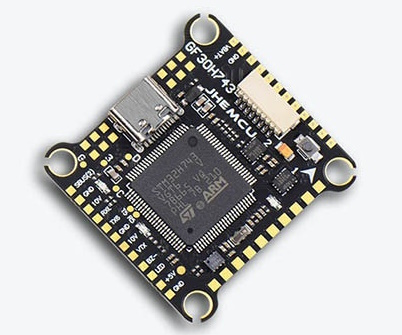
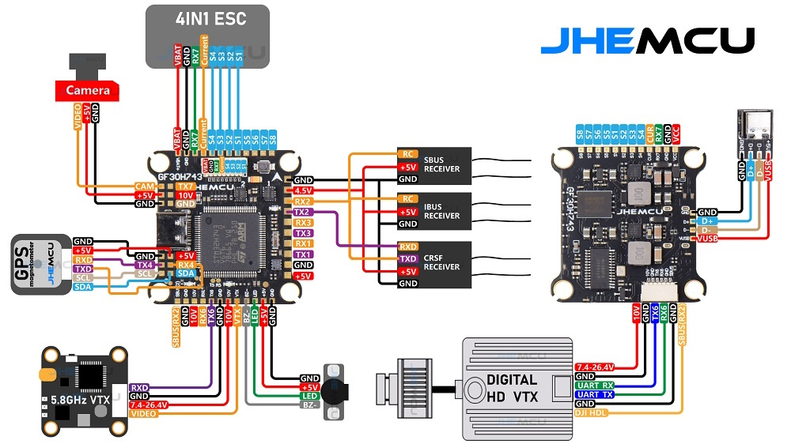
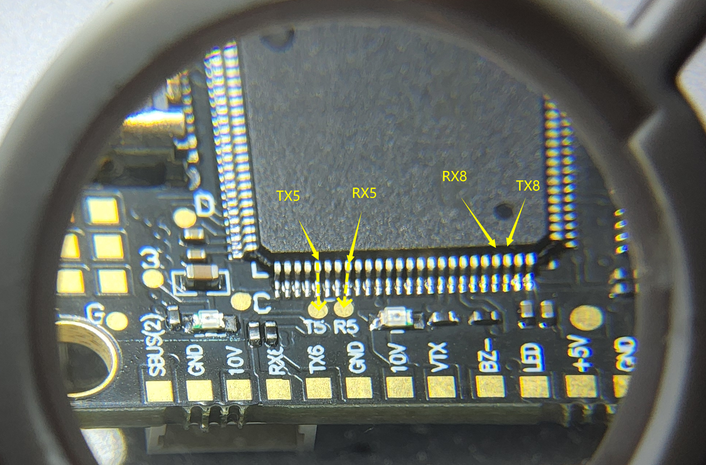

.. _common-jhmcu-h743hd:

================================
JHEMCU H743 HD Flight Controller
================================

The JHEMCU H743 HD is a flight controller produced by `JHEMCU <https://jhemcu.com/>`_.

Where to buy
============

`JHEM <https://www.jhemcu.com/e_productshow/?80-JHEMCU-GF30H743-FPV-DUAL-BEC-5V-10V-flight-controller-80.html>`__

Features
========

* MCU - STM32H743 32-bit processor running at 480 MHz
* IMU - dual ICM42688P
* Barometer - DPS310
* Voltage & current sensor inputs
* OSD - AT7456E
* Onboard Datalogging Flash: 1 Gbits (W25N01G)
* 7x UARTs (1,2,3,4,5,6,7)
* 9x PWM Outputs (8 Motor Output, 1 LED)
* Battery input voltage: 3S-6S
* BEC 5V/2.5A, 10V/2.0A

Pinout/Wiring Diagram
=====================

UART Mapping
============

The UARTs are marked RXn and TXn in the above pinouts. The RXn pin is the
receive pin for UARTn. The TXn pin is the transmit pin for UARTn.

In addition to pads, the board also has SH6P 1mm connector for DJI FPV and SH8P 1mm connector for 4 in 1 ESC.

* SERIAL0 -> USB
* SERIAL1 -> USART1 (MAVLink2,DMA-enabled)
* SERIAL2 -> USART2 (RCIN, DMA-enabled)
* SERIAL3 -> USART3 (User,DMA-enabled)
* SERIAL4 -> UART4 (GPS, DMA-enabled)
* SERIAL5 -> UART5 (Solder pads labeled R5 T5)
* SERIAL6 -> USART6 (DisplayPort, DMA-enabled)
* SERIAL7 -> UART7 (RX pin only, ESC Telemetry)
* SERIAL8 -> UART8 (Unused, not tested, no pinout, need to solder direct on processor pins to utilize if you need just one more UART)

RC Input
========

RC input is configured on the RX2/TX2 (USART2_RX/USART2_TX) pins. It supports ELRS(CSRF), TBS(CSRF), SBUS, IBUS, DSM2, and DSMX.

OSD Support
===========

JHEMCU H743 supports OSD using OSD_TYPE 1 (MAX7456 driver). HD goggle OSD is pre-configured on UART6 on the HD goggle connector. Change OSD_TYPE to "5" to use HD systems. This also enables the internal analog OSD system which can be used simultaneously.

PWM Output
==========

JHEMCU H743 supports up to 9 PWM outputs. 8 motors and 1 LED strip or 9th PWM output. PWM and DShot is supported on all outputs. Outputs 1-8 support bi-directional Dshot also.

The PWM is in 4 groups:

* PWM 1 - 4 in group1
* PWM 5, 6  in group2
* PWM 7, 8  in group3
* PWM 9     in group4

Outputs within the same group need to use the same output rate. If any output in a group uses DShot then all in the group need to use DShot.

Battery Monitoring
==================

The board has a built-in voltage sensor, but no internal current sensor. An external current sensor can be connected to the CURRENT pin. Default parameters for both internal voltage and external current monitoring are set by default to the below:

The correct battery setting parameters are:

 - :ref:`BATT_MONITOR<BATT_MONITOR>` 4
 - :ref:`BATT_VOLT_PIN<BATT_VOLT_PIN>` 11
 - :ref:`BATT_CURR_PIN<BATT_CURR_PIN>` 13
 - :ref:`BATT_VOLT_MULT<BATT_VOLT_MULT>` 11
 - :ref:`BATT_AMP_PERVLT<BATT_AMP_PERVLT>` 58.8

Compass
=======

JHEMCU H743 does not have a built-in compass, but you can attach an external compass using I2C on the SDA and SCL pads.

Firmware
========

Firmware for this board can be found `here <https://firmware.ardupilot.org>`_ in  sub-folders labeled "JHEMCU-H743HD".

Loading Firmware
================

Initial firmware load can be done with DFU by plugging in USB with the
bootloader button pressed. Then you should load the "with_bl.hex"
firmware, using your favourite DFU loading tool.

Once the initial firmware is loaded you can update the firmware using
any ArduPilot ground station software. Updates should be done with the
\*.apj firmware files.

[copywiki destination="plane,copter,rover,blimp"]