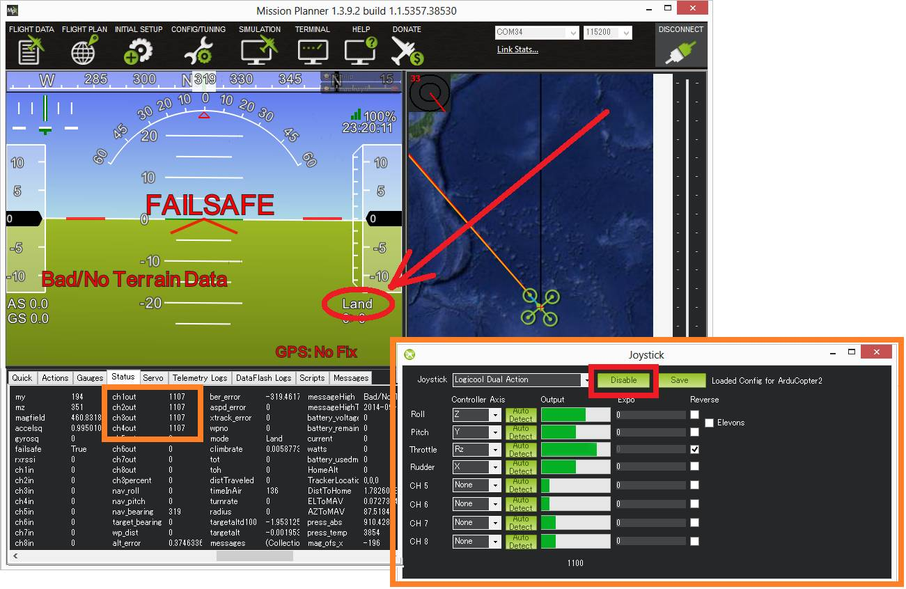

.. _common-joystick:

================
Joystick/Gamepad
================

This article explains how you can control your vehicle with a Joystick or Gamepad using the Mission Planner which sends "RC Override" messages to the vehicle.

Other GCSs may also support "RC overrides" but they are not covered in
this article.

   Logitech F310 Joystick

.. tip::

   Even if flying with a joystick, you should keep a regular
   transmitter/receiver connected and ready for use as a backup.  In future
   versions of ArduPilot, after more failsafe testing has been completed this recommendation may change.

What you will need
==================

You will need the following equipment:

-  USB joystick or Gamepad such as the `Logitech F310 <http://gaming.logitech.com/en-us/product/f310-gamepad>`__
   (shown above).
-  A :ref:`telemetry connection <common-telemetry-landingpage>`
   between your ground station and vehicle.
-  A laptop computer running *Mission Planner*.

Setup with the Mission Planner
==============================

-  Connect your USB joystick/gamepad to the laptop computer
-  Open the *Mission Planner Flight Data* screen. On the **Actions** tab
   push the **Joystick** button

   .. image:: ../../../images/joystick_MPSetup.png
       :target: ../_images/joystick_MPSetup.png
   
-  Ensure the Logitech joystick appears in the drop-down
-  The **Enable** button, once pushed, will tell the mission planner to
   start sending commands to the vehicle so for the initial setup do not
   push it.
-  On the "Roll" row, click the **Auto Detect** button and then waggle
   the control you wish to use for roll, left and right.
-  The channel can be reversed with the *Reverse* checkbox
-  The Expo number should be in the range of -100 to 100

   -  0 = no expo
   -  100 = low response around the middle, very fast response at the
      edges
   -  -100 = very fast response around the middle, less response at the
      edges (very few people use negative expo)

-  Repeat for *Pitch*, *Throttle* and *Rudder* and push the **Save** button
-  You will likely want to set-up other buttons for *Arm* and *Disarm*
-  Instead of setting up a stick or button for ch5 (the flight mode
   channel), it is better to set individual buttons to initiate a flight
   mode by selecting **Change Mode** and then push the **Settings**
   button and select the flight mode from the drop-down (see pic above)
-  When done, push the **Save** button
-  In the **CONFIG/TUNING \| Full Parameter List**, check that the
   :ref:`SYSID_MYGCS <SYSID_MYGCS>`
   parameter matches the system ID of your GCS. This parameter limits
   which GCS can send override signals to the vehicle.

   .. tip::

      For Mission Planner the default GCS system ID is 255. The
         default system ID for APM Mission Planner 2 is 252 (but the GCS will
         automatically set its ID to match *SYSID_MYGCS* for RC Override
         commands). 

.. note::

   If you get an error **PreArm: RC not calibrated** (following
   calibration) you will additionally need to manually change ``RC1_MIN``
   to 1101 and ``RC1_MAX`` to 1901 (and then repeat for RC2\_, RC3\_ and
   RC4\_ max/min parameters).

   This error is caused because *Mission Planner* maps the Joystick exactly
   to the 1100 - 1900 range, but the pre-arm checks assume that if the
   values are not at least 1 pwm off the century value, that calibration
   has not been done.

Testing the controls before flying
==================================

Before flying for the first time you should test that all features work
well.

To check the above controls move in the correct direction:

-  Click the **Enable** button on the Joystick setup screen to enable
   sending messages to the vehicle
-  Connect your flight controller to the computer with a USB cable
-  Push the Mission Planner's **Connect** button
-  Go to the **Initial Setup \| Mandatory Hardware \| Radio
   Calibration** screen and ensure the green bars all move in the
   correct direction.  Remember the bars move in the same direction as
   the sticks except for Pitch which moves in the opposite direction.
-  If any controls are reversed, check the **Reverse** checkbox on the
   Joystick setup screen.

Next test you are able to arm, disarm and switch into the various flight
modes (not need to connect the battery)

Testing the failsafes
=====================

All of these tests should be performed on the ground with the battery
disconnected or at least with the propellers off the vehicle.

**Simulate disabling the joystick in flight with transmitter off** (i.e.
no failover to regular transmitter):

#. Turn regular transmitter off
#. Connect with the mission planner, push Joystick window's **Enable**
   button and ensure RC overrides are being sent to the vehicle (use
   Radio Calibration screen) or Flight Data's status screen.
#. Arm vehicle, switch to Stabilize or Loiter mode and raise the throttle
#. Ensure the motors are spinning by checking the Flight Data screen's
   "ch1out" ~ "ch4out"
#. Push Joystick screen's **Disable** button
#. "Failsafe" should appear on the HUD and the vehicle should switch to
   "LAND" or "RTL"
#. Repeat the above test but at step #5 actually disconnect the joystick
   from the computer.  The results should be the same.

**Simulate failing over to the regular transmitter/receiver**

#. Turn the regular transmitter on and ensure you can control the
   vehicle (perhaps by checking the Radio calibration page or the Flight
   Data screen's Status tab's "ch1in" ~ "ch8in").
#. With the regular transmitter leave the vehicle in AltHold mode and
   raise the throttle to mid
#. On the Joystick screen push the **Enable** button
#. Arm the vehicle in STABILIZE mode and raise throttle to full (with
   the Joystick).
#. Check the throttle is at full in the Flight Data screen's Status tab
   by checking "ch3in" is very high (around 1900 usually)
#. On the Joystick screen push the **Disable** button and check the
   "ch3in" has dropped to a mid value (around 1500)
#. The vehicle should remain in it's current flight mode (Stabilize) but
   controls have been returned to the transmitter.  The pilot's inputs
   should be reflected in the "ch1in" ~ "ch8in" values.  Switch the
   vehicle to AltHold mode by moving the flight mode switch.

**Simulate loss of radio contact**:

If radio contact is lost, the vehicle should respond as if the Joystick
was "Disabled" or disconnected from the PC.  You can test this by
repeating the test above but instead of pushing the **Disable** button
on the Joystick screen, disconnect the radio.  In order to see the
status of the vehicle you will need to connect two Mission Planner's
separately (only possible on Pixhawk).  The Mission Planner with the
Joystick should be connected through telemetry and the 2nd Mission
Planner should be connected through a USB connection.

Reducing lag in the controls
============================

It is nearly impossible to make the Joystick as responsive as a regular
transmitter but lag can be reduced by:

-  Reducing the rate of other telemetry data being sent between the
   vehicle and GCS from the MP's **Config/Tuning \| Planner** page

   .. image:: ../../../images/joystick_ReduceLag_MPRates.png
       :target: ../_images/joystick_ReduceLag_MPRates.png
   
-  If using a SiK Radio or RFD900 Radio these can be put into 
   :ref:`Low Latency mode as described here <common-3dr-radio-advanced-configuration-and-technical-information_low_latency_mode>`.
