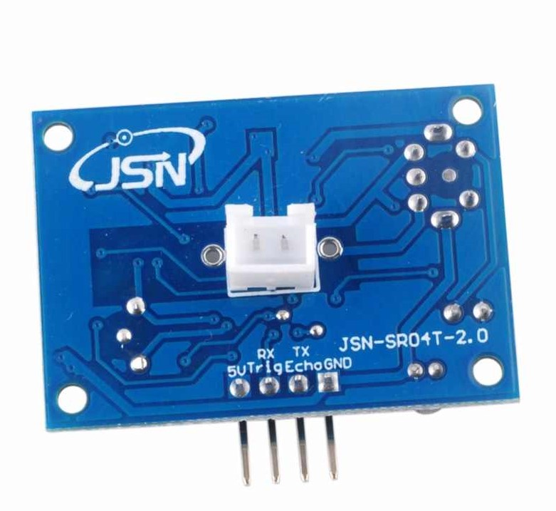
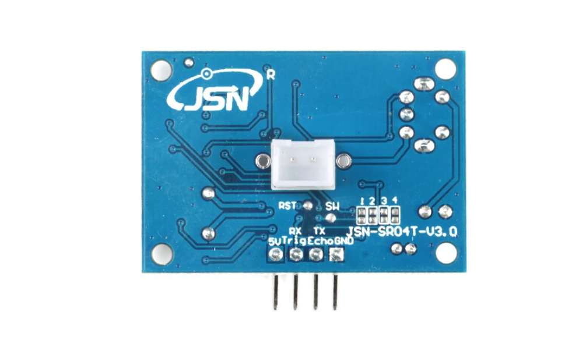
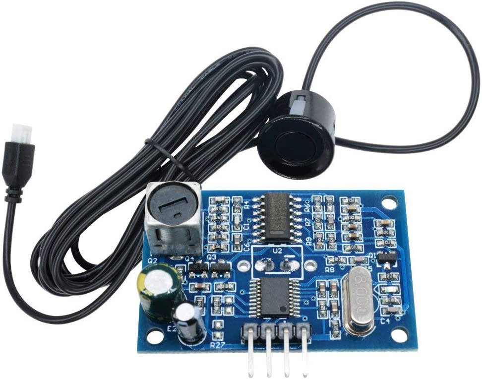

===============================================
Waterproof JSN-SR04T Ultrasonic Distance Sensor
===============================================

The JSN-SR04T is an ultrasonic distance sensor. There are two versions v2.0 and v3.0. They differ in the range of action. 
v2.0 with a range of 25 to 450 cm.
v3.0 with a range of 20 to 600 cm. Also more stable.
The very short range makes it of limited use.

Connection to the autopilot
===========================

To setup as the first rangefinder. Reboot after setting parameters:

-  :ref:`RNGFND1_MAX_CM<RNGFND1_MAX_CM>` = "450" (i.e. 4.5m max range for v2.0 ver)
-  :ref:`RNGFND1_MIN_CM<RNGFND1_MIN_CM>` = "25" (i.e. 25cm min range for v2.0 ver)
-  :ref:`RNGFND1_STOP_PIN<RNGFND1_STOP_PIN>` = Enter GPIO number for pin attached to JSN-SR04T "Trigger" pin. See :ref:`common-gpios`.
-  :ref:`RNGFND1_PIN<RNGFND1_PIN>` = Enter GPIO number for pin attached to JSN-SR04T "Echo" pin.
-  :ref:`RNGFND1_TYPE<RNGFND1_TYPE>` = “30" (HC-SR04 sonar)
-  :ref:`RNGFND1_ORIENT<RNGFND1_ORIENT>` = "25" (Downward facing) if used for altitude control.