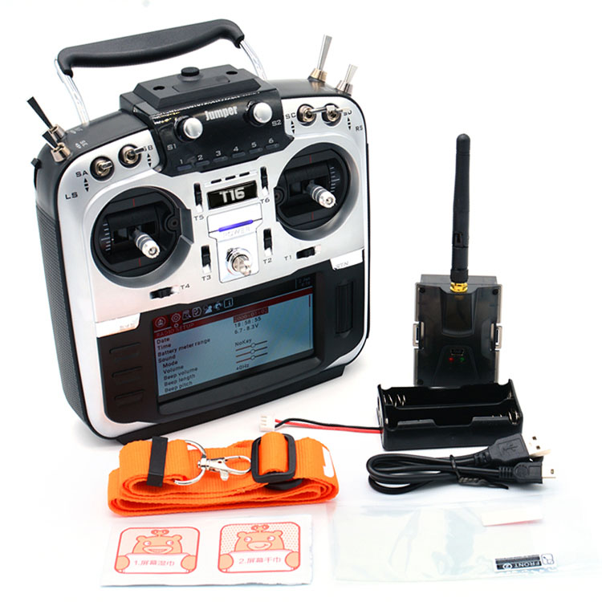

.. _common-jumperT16pro:

==========================
Jumper T16 Pro Transmitter
==========================

Jumper T16 PRO is a stand-alone transmitter compatible with many other RC systems and utilizes an OpenTX firmware branch like FrSky. This means that it has the telemetry display capabilities of the FrSky transmitters when used with FrSky D and X series receivers, but can also be used with many other receivers, for those that have multiple system types.

Protocols supported:

- FrSky 
- Spektrum DSM/DSM2/DSMX
- FLYSKY
- Walkera DEVO
- Futaba SFHSS

plus others

