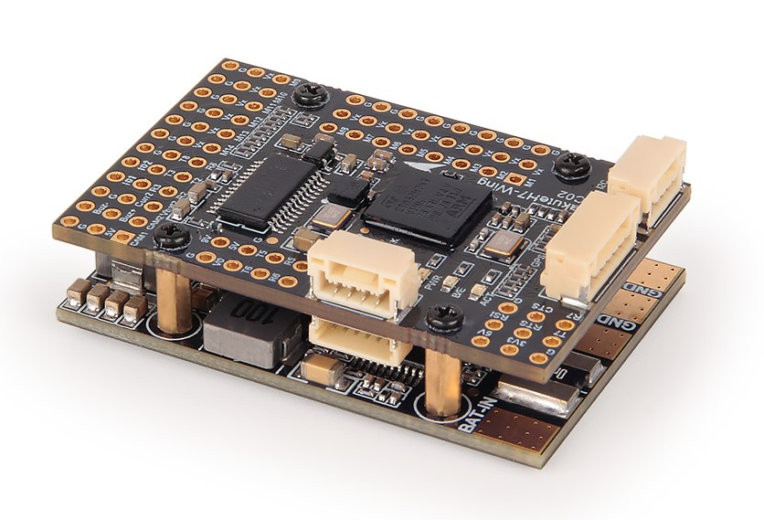
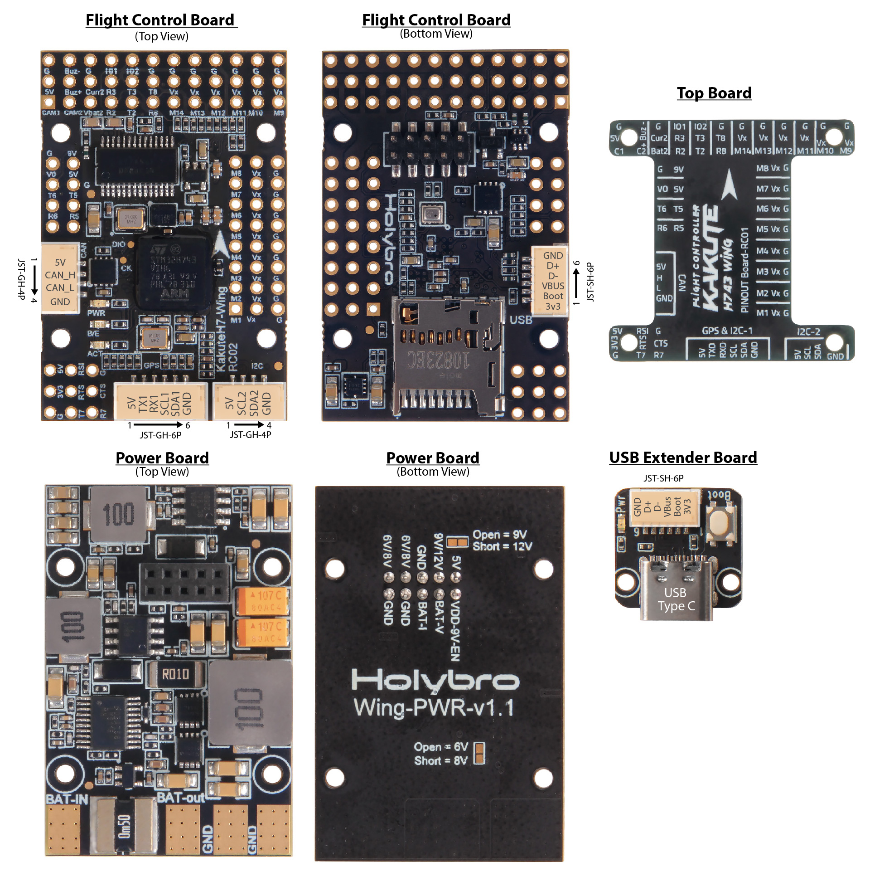

.. _common-KakuteH7-Wing:

=======================
Holybro KakuteH743-WING
=======================

Specifications
==============

-  **Processor**
    - STM32H743 32-bit processor
    - AT7456E OSD

-  **Sensors**
    - ICM42688 Acc/Gyro
    - BMP280 barometer\

-  **Power**
    - Separate stacked power supply and power monitor board for isolation
    - 2S - 8S Lipo input voltage with voltage monitoring
    - 5V, 2A (3A Peak) BEC for Receiver, OSD, Camera, 2812 LED Strip, Buzzer, GPS, Air Speed Sensor, etc.
    - 9V/12V, 2A (3A peak) BEC for powering Video Transmitter
    - 6V/7.2V, 6A (8A Peak) BEC for servos
    - 3.3V, 1A BEC

-  **Interfaces**
    - 14x PWM outputs DShot capable, 4 outputs BiDirDShot capable
    - 1x RC input
    - 6x UARTs/serial for GPS and other peripherals
    - 2x I2C ports for external compass, airspeed, etc.
    - USB-C port and boot button on separate dongle for ease of access
    - Switchable 9V/12V VTX power
    - 2 Switchable Camera inputs
    - All UARTS support hardware inversion. SBUS, SmartPort, and other inverted protocols work on any UART without “uninvert hack”
    - Integrated 6S, 120A battery monitor
    - Input for second battery monitor

-  **Size and Dimensions**

    - 45mm x 30mm x 13.5mm
    - 28g (with USB Extender Board)

Where to Buy
============

 - Order from `Holybro <https://shop.holybro.com/>`__.
 - Holybro distributors are listed `here <https://shop.holybro.com/art/distributors_a0050.html>`__.

Pinouts
==============

Default UART order
==================

The UARTs are marked Rn and Tn in the above pinouts. The Rn pin is the
receive pin for UARTn. The Tn pin is the transmit pin for UARTn.

 - SERIAL0 -> USB
 - SERIAL1 -> UART7 (TELEM1) (DMA enabled) with CTS/RTS
 - SERIAL2 -> UART2 (TELEM2) (DMA enabled)
 - SERIAL3 -> UART1 (GPS) (DMA enabled)
 - SERIAL4 -> UASRT3 (GPS2)
 - SERIAL5 -> UART5 (User) (DMA capable)
 - SERIAL6 -> USART6 (RX is normally only RC input, but can be used as normal UART RX if :ref:`BRD_ALT_CONFIG<BRD_ALT_CONFIG>` =1
 - SERIAL7 -> UART8 (User) (DMA capable)

Serial protocols shown are defaults, but can be adjusted to personal preferences.

Servo/Motor Outputs
===================
The KakuteH7 supports up to 14 PWM outputs. Outputs 1-10 support DShot. Outputs 1-8 support BiDirDshot.

The PWM is in 5 groups:

- PWM 1-4 in group1
- PWM 5,6 in group2
- PWM 7,8 in group3
- PWM 9,10 in group4
- PWM 11-13 in group5
- PWM 14 in group6

RC Input
========

The RX6 (UART6 RX), is by default is mapped to a timer input instead of the UART, and can be used for all ArduPilot supported receiver protocols, except CRSF/ELRS and SRXL2 which require a true UART connection. However, FPort, when connected in this manner, can provide RC without telemetry. 

To allow CRSF and embedded telemetry available in Fport, CRSF, and SRXL2 receivers, the RX6 pin can also be configured to be used as true UART6 RX pin for use with bi-directional systems by setting the :ref:`BRD_ALT_CONFIG<BRD_ALT_CONFIG>` to “1” so it becomes the SERIAL2 port's RX input pin.

With this option, :ref:`SERIAL6_PROTOCOL<SERIAL6_PROTOCOL>` must be set to "23", and:

- PPM is not supported.

- SBUS/DSM/SRXL connects to the RX6  pin.

- FPort requires connection to TX6 and RX6 via a bi-directional inverter. See :ref:`common-FPort-receivers`.

- CRSF also requires a TX6 connection, in addition to RX6, and automatically provides telemetry.

- SRXL2 requires a connection to TX6 and automatically provides telemetry.  Set :ref:`SERIAL6_OPTIONS<SERIAL6_OPTIONS>` to "4".

Any UART can be used for RC system connections in ArduPilot also, and is compatible with all protocols except PPM. See :ref:`common-rc-systems` for details.

USB Power
=========

When connected to USB, pins marked 5V are powered. Be careful not to overload the USB host's current capability. Powering the autopilot, and an RX and GPS is usually within most USB host's capabilities, however.

OSD Support
===========

The KakuteH7-Wing supports using its internal OSD using OSD_TYPE 1 (MAX7456 driver). External OSD support such as DJI or DisplayPort is supported using UART5 or any other free UART. See :ref:`common-msp-osd-overview-4.2` for more info.

Camera and VTX Control
======================

The pin marked 9V (can be selected by jumper on the rear of the board to be 9V or 12V).

Switching between the two camera inputs, C1 (default on) or C2, and between on (default) and off of the 9V supply pin can be implemented using the Relay function of ArduPilot and assigning the relays to an ``RCx_OPTION`` switch on the transmitter.

Set the ``RELAYx_PIN`` to "82" for on/off of 9V supply, and to "81" to control the camera switching.
Then select an RC channel for control (Chx) and set its ``RCx_OPTION`` to the appropriate Relay (1-4) that you had set its pin parameter above.

For example, use Channel 10 to control the camera switch using Relay 2:

- :ref:`RELAY2_PIN<RELAY2_PIN>` = "81"
- :ref:`RC10_OPTION<RC10_OPTION>` = "34" (Relay2 Control)

.. note:: setting Relay on/high assigned for 9V pin will turn on that supply. Likewise, setting on/high for the Relay assigned for camera, will switch from Camera 1 to Camera 2.

CAN
===

The KakuteH7-Wing has one CAN port (port 1 parameters should be used) available for connecting CAN and DroneCAN peripherals such as GPS and airspeed sensors.
See :ref:`common-canbus-setup-advanced` for more information on setup.

Battery Monitor Configuration
=============================
The board has a built-in voltage and current sensor. The current sensor can read up to 120 Amps. The voltage sensor can handle up to 6S LiPo batteries.

The correct battery setting parameters are:

Enable Battery monitor.

:ref:`BATT_MONITOR<BATT_MONITOR>` =4

Then reboot.

:ref:`BATT_VOLT_PIN<BATT_VOLT_PIN>` 8

:ref:`BATT_CURR_PIN<BATT_CURR_PIN>` 4

:ref:`BATT_VOLT_MULT<BATT_VOLT_MULT>` 18.18

:ref:`BATT_AMP_PERVLT<BATT_AMP_PERVLT>` 36.6

Connecting a GPS/Compass module
===============================

This board does not include a GPS or compass so an :ref:`external GPS/compass <common-positioning-landing-page>` should be connected to the GPS/Compass in order for autonomous modes to function. A JST-GH connector for GPS/Compass is provided.

Firmware
========
This board does not come with ArduPilot firmware pre-installed. Use instructions here to load ARduPilot the first time :ref:`common-loading-firmware-onto-chibios-only-boards`.

Firmware for this board can be found `here <https://firmware.ardupilot.org>`_ in  sub-folders labeled
"KakuteH7-Wing".

[copywiki destination="plane,copter,rover,blimp"]

