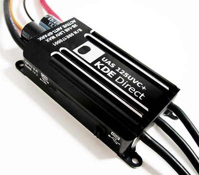
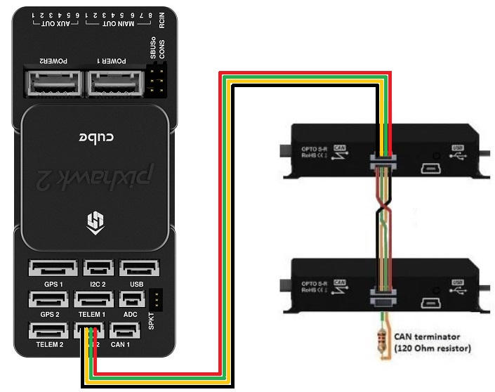

.. _common-kde-can-escs:

============
KDE CAN ESCs
============

KDECAN ESCs are high-end ESCs that allow control and feedback using a custom CAN protocol

.. note::

    Support for these ESCs is included in Copter-4.0 (and higher), Plane-3.10 (and higher) and Rover-3.5 (and higher)

Where To Buy
------------

- `KDE-UAS125UVC <https://www.kdedirect.com/collections/uas-multi-rotor-electronics/products/kde-uas125uvc>`__ and `KDE-UAS85UVC <https://www.kdedirect.com/collections/uas-multi-rotor-electronics/products/kde-uas85uvc>`__ can be purchased from `KDEDirect.com <https://www.kdedirect.com/collections/uas-multi-rotor-electronics>`__ (other KDE ESCs may also support CAN, check the images of the ESC, those with "CAN" written on the side should work).
- `KDECAN Wire Kit <https://www.kdedirect.com/collections/kdecan-bus-cables/products/kdecan-ph-kit>`__ is also required

Connection and Configuration
----------------------------

`KDE's instructions for connecting and configuring with ArduPilot are here <https://cdn.shopify.com/s/files/1/0496/8205/files/KDECAN_Pixhawk_QuickStart.pdf>`__

- ESCs should be daisy chained together using the KDECAN Wire Kit.  One 4-pin CAN cable should be connected to the autopilot's CAN port.  The CAN terminator (the 4-pin connector with a black loop) should be connected to the last ESC in the chain

.. warning::

    If using a Cube autopilot, the CAN1 and CAN2 labels are reversed.  These instructions assume the ESCs are connected to the CAN1 port which is labelled "CAN2" on Cube autopilots

- Set :ref:`CAN_D1_PROTOCOL <CAN_D1_PROTOCOL>` = 2 (KDECAN)
- Set :ref:`CAN_P1_DRIVER <CAN_P1_DRIVER>` = 1 (First driver) to specify that the ESCs are connected to the CAN1 port
[site wiki="copter,rover"]
- Set :ref:`MOT_PWM_MIN <MOT_PWM_MIN>` = 1000 and :ref:`MOT_PWM_MAX <MOT_PWM_MAX>` = 2000 so ArduPilot uses an output range that matches the ESCs input range
[/site]
- Set ``SERVOx_MIN`` = 1000 and ``SERVOx_MAX`` = 2000 for each ESC connected (``x`` corresponds to the ESC number) so ArduPilot uses an output range that matches the ESCs input range

Logging and Reporting
---------------------

KDECAN ESCs provide information back to the autopilot which is recorded in the autopilot's onboard log's ESCn messages and can be viewed in any :ref:`ArduPilot compatible log viewer <common-logs>`.  This information includes:

- RPM
- Voltage
- Current
- ESC Temperature
- Total Current

The RCOU messages are also written to the onboard logs which hold the requested output level sent to the ESCs expressed as a number from 1000 (meaning stopped) to 2000 (meaning full output).

This information can also be viewed in real-time using a ground station.  If using the Mission Planner go to the Flight Data screen's status tab and look for esc1_rpm.

.. image:: ../../../images/dshot-realtime-esc-telem-in-mp.jpg
    :target: ../_images/dshot-realtime-esc-telem-in-mp.jpg
    :width: 450px

.. note::

   Sending ESC data to the GCS requires using MAVLink2.  Please check the appropriate SERIALx_PROTOCOL parameter is 2 (where "x" is the serial port number used for the telemetry connection).
