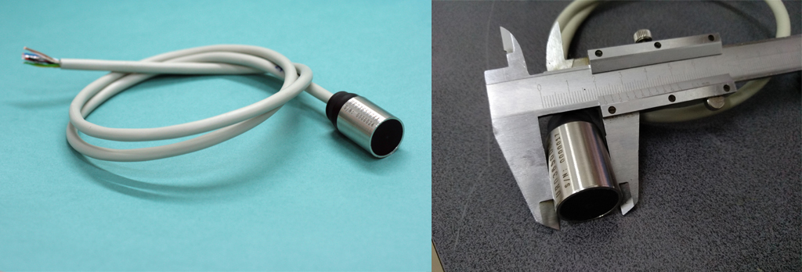
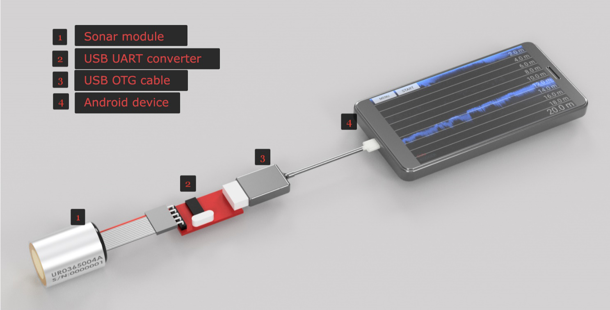
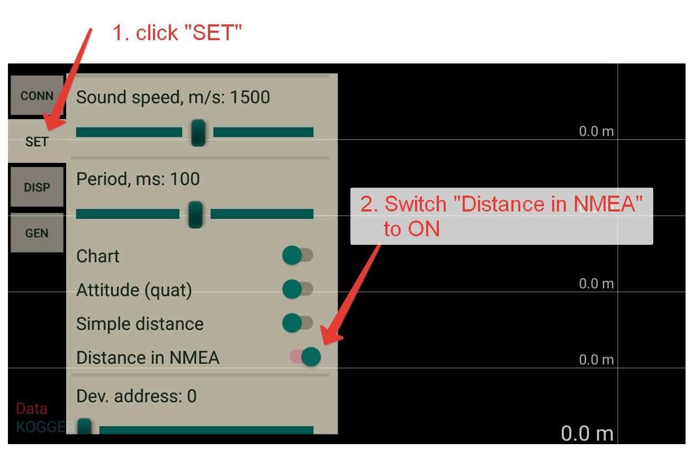
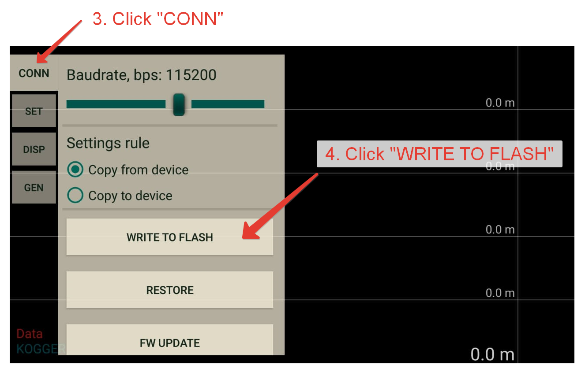
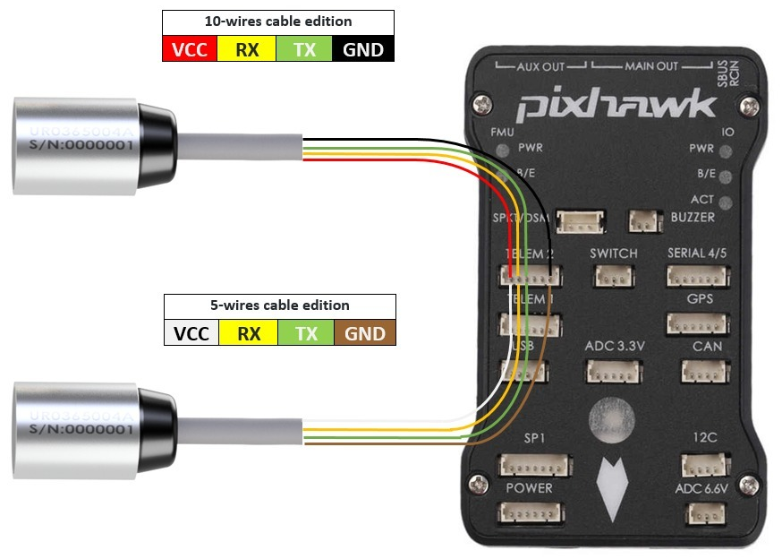

.. _common-kogger-sonar:

=======================
KOGGER Underwater Sonar
=======================

The `KOGGER Sonar <https://kogger.tech/product/sonar-2d-enhanced>`__ is a compact and low-cost underwater echosounder module with UART interface, 5-14Volts Power Supply Voltage.

   
Recommended Hardware
--------------------
- CP210x USB->UART converter and USB OTG cable to configure the module by Android smartphone.

Configuring the echosounder module
----------------------------------
The module should be configured before it is connected to the ArduPilot. You need the Android device and GUI installed for configuring the KOGGER Sonar module.
The GUI is opensource `Kogger Android <https://github.com/koggertech/Kogger-Android/>`__.
The APK can be downloaded from here: `Kogger Android Releases <https://github.com/koggertech/Kogger-Android/releases/>`__.

- The setup looks like:

- Make the following adjustment in the GUI:

That’s it. The module is ready to use with autopilot.

Connecting to the ArduPilot hardware
------------------------------------
The KOGGER Sonar provides distance measurements using the NMEA protocol over serial/uart.

If the SERIAL2 (TELEM2) is used then the following parameters should be set:

    
The sensor can be connected to any available serial/uart port on the autopilot. In the diagram below the first sensor is connected to SERIAL2 (TELEM2).

-  :ref:`SERIAL2_PROTOCOL <SERIAL2_PROTOCOL>` = 9 (Lidar)
-  :ref:`SERIAL2_BAUD <SERIAL2_BAUD>` = 115 (115200 baud)

Then the following range finder related parameters should be set:

-  :ref:`RNGFND1_TYPE <RNGFND1_TYPE>` = 17 (NMEA)
-  :ref:`RNGFND1_MIN_CM <RNGFND1_MIN_CM>` = 30
-  :ref:`RNGFND1_MAX_CM <RNGFND1_MAX_CM>` = 5000 (i.e. 50m).  *This is the distance in centimeters that the rangefinder can reliably read.*
-  :ref:`RNGFND1_ORIENT <RNGFND1_ORIENT>` = 25 (i.e. down) if mounted on a boat

Testing the sensor
==================

Distances read by the sensor can be seen in the Mission Planner's Flight
Data screen's Status tab. Look closely for "sonarrange".

.. image:: ../../../images/mp_rangefinder_lidarlite_testing.jpg
    :target: ../_images/mp_rangefinder_lidarlite_testing.jpg
