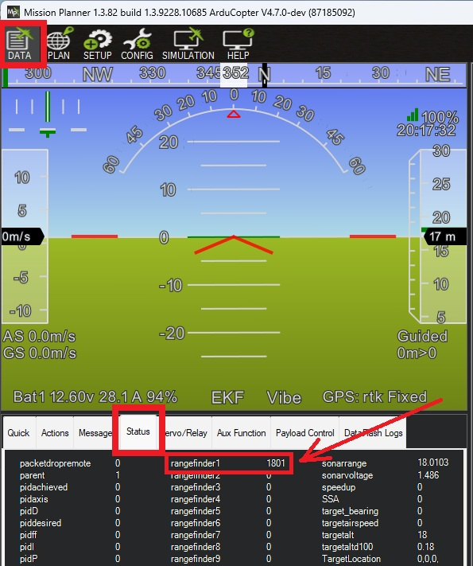

.. _common-lanbao-cm8jl65-lidar:

======================
Lanbao PSK-CM8JL65-CC5
======================

The Lanbao PSK-CM8JL65-CC5 is a small (38 x 18 x 7mm, <10g) serial (UART) infra-red time-of-flight distance sensor with a stated range of 0.17m to 8m.

.. note:: This sensor is discontinued and no longer available for purchase from `Seeed Studio <https://www.seeedstudio.com/PSK-CM8JL65-CC5-Infrared-Distance-Measuring-Sensor-p-4028.html>`__ or other usual distributors, but this page is kept for the benefit of existing owners.

.. warning:: This sensor has no way of reporting "out of range" -- it keeps reporting distances of around 7 to 8 metres even when pointed at open sky. ArduPilot's driver hard-limits accepted readings to 6 metres for this reason, so :ref:`RNGFND1_MAX <RNGFND1_MAX>` should not be set above 6.

Connecting to the Autopilot
============================

Connect the sensor to any spare Serial/UART port on the autopilot. For example, to use SERIAL4:

- :ref:`SERIAL4_PROTOCOL <SERIAL4_PROTOCOL>` = 9 (Lidar)
- :ref:`RNGFND1_TYPE <RNGFND1_TYPE>` = 26 (LanbaoPSK-CM8JL65-CC5)
- :ref:`RNGFND1_MAX <RNGFND1_MAX>` = 6 (the driver discards any reading above this)
- :ref:`RNGFND1_MIN <RNGFND1_MIN>` = 0.17 (the sensor's stated minimum range)
- :ref:`RNGFND1_GNDCLR <RNGFND1_GNDCLR>` set to the distance in metres from the sensor to the ground when the vehicle is landed. This value depends on how you have mounted the sensor.

.. note:: The sensor always communicates at 115200 baud; ArduPilot's driver sets this automatically so :ref:`SERIAL4_BAUD <SERIAL4_BAUD>` does not need to be changed.

Testing the sensor
===================

Distances read by the sensor can be seen on Mission Planner's Flight Data screen's Status tab. Look for "rangefinder1".

