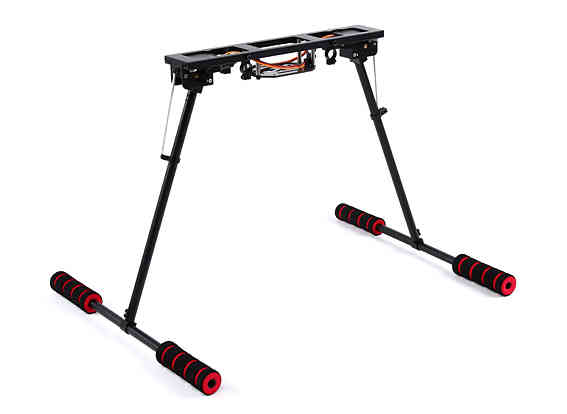

.. _common-landing-gear:

======================================
Landing Gear/ Retractable Camera Mount
======================================

Copter and Plane support retractable Landing Gear / Camera Mounts activated by a servo mechanism(like these sold by `Hobby King <https://hobbyking.com/en_us/quanum-600-class-quick-release-universal-retractable-gear-set-680uc-pro-hexa-copter.html?___store=en_us>`__ for copters).
The gear/ mount can be manually retracted or deployed with an auxiliary switch.
The gear will also automatically deploy during landing and/or retract during takeoff.
The output which controls the servo for landing gear/ camera mount is set by the SERVOx_FUNCTION =29.

During startup, the status of the landing gear/ camera mount is determined by the :ref:`LGR_STARTUP<LGR_STARTUP>`  parameter. Starting either in deployed or retracted state can be selected, or to wait for pilot input, which prevents PWM signals from being active on the outputs whose SERVOx_FUNCTION = 29 (Landing Gear). This prevents the current position of those outputs from changing until the pilot or automatic operation commands a change.

For Copter, the landing gear/ camera mount will automatically deploy when the flight mode is changed to Land, during the final landing phase of RTL mode, and when a Land command is executed in AUTO mode. For Plane, it will retract after a Takeoff is completed in AUTO mode, and deploy during the final glide phase of a LAND in AUTO mode, or final descent phase of a VTOL landing.

In addition, the landing gear/ camera mount can automatically deploy or retract based on altitude, using the :ref:`LGR_DEPLOY_ALT<LGR_DEPLOY_ALT>` for automatic deployment below this altitude, and automatic retraction if above the :ref:`LGR_RETRACT_ALT<LGR_RETRACT_ALT>`. If these are set to 0, then these functions are not active.

Connecting to the Autopilot
===================================

Most retractable landing gear will require just a single PWM cable to be
connected to one of the autopilot outputs, selected using the SERVOx_FUNCTION set to 29 for that output.

Setup through the Mission Planner
=================================

Use the Mission Planner's Full Parameter List (or equivalent) to set the
above parameters and/or set an RC channel to be a manual control using the RCx_OPTION = 29 for that channel. When the PWM for the channel is < 1200us, the gear will be deployed, > 1800us it will be retracted, other values will not change the gear's state. After the RC channel requests a deploy or retract, an automatic function can override the manual control, until the channel is moved to another state and/or returned.

Other Parameters
================

There are additional landing gear/ camera mount features in development for future releases and therefore other ``LGR_`` parameters are listed not covered in this topic, but they are only used for logging purposes at this time and do not affect operation.

[copywiki destination="plane,copter"]