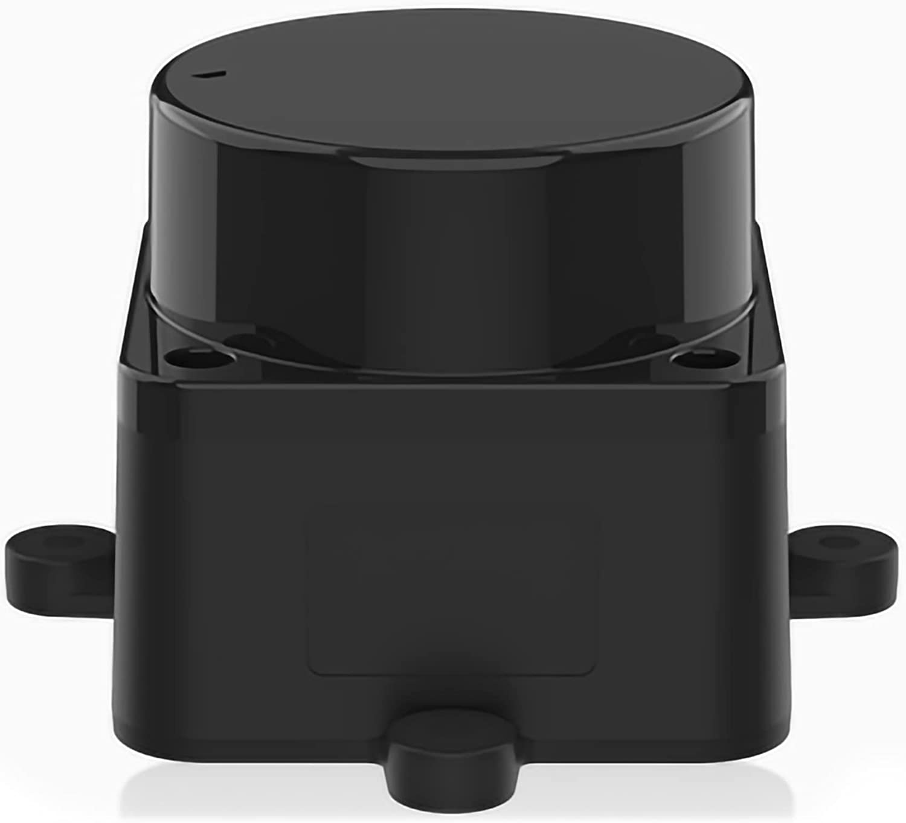

.. _common-ld06:

[copywiki destination ="plane,copter,rover,blimp"]
===========
LD-06 Lidar
===========

This Lidar is supplied by numerous sources:

- `innomaker <https://www.inno-maker.com/product/lidar-ld06/>`__
- `Yaboom <https://category.yahboom.net/products/ld06-dtof>`__
- `LDROBOT <https://www.ldrobot.com>`__

Features
========
- 12m measuring radius
- 30000lux resistance to strong light
- 4500HZ measurement frequency
- 360°scanning range
- Laser safety FDA Class I
- TOF flight time ranging
- Compact appearance
- Waterproof and dustproof-IPX4
- 10000h service life

Connecting and Configuring
==========================

   .. image:: ../../../images/ld06-wiring.jpg
       :target: ../_images/ld06-wiring.jpg
       :width: 600px

The lidar should be mounted horizontally on the top or bottom of the vehicle with the black cable pointing towards the rear of the vehicle.
Ensure the sensor's view is not obstructed by any portion of the vehicle including GPS mast, vehicle legs etc.

The lidar can be connected to the autopilot's serial input as shown above.
If using a Pixhawk/Pixhawk2 Telem1 (aka Serial1) should be used because it is more capable of providing the required power.

.. note:: only the Lidar's TX pin is used. Its pwm motor control input pin is not connected and the lidar will spin at a default rate (reported in its telemetry back to the autopilot).

Example setup below shown for first proximity sensor:

- :ref:`SERIAL1_PROTOCOL <SERIAL4_PROTOCOL>` = "11" ("Lidar360") if using Serial1
- :ref:`SERIAL1_BAUD <SERIAL1_BAUD>` =  "230" if using Serial1 as connection port
- :ref:`PRX1_TYPE <PRX1_TYPE>` = "16"
- :ref:`PRX1_ORIENT <PRX1_ORIENT>` = "0" if mounted on the top of the vehicle, "1" if mounted upside-down on the bottom of the vehicle.

It may be necessary to turn off flow control if using Telem1 (aka Serial1) or Telem2 (aka Serial2)

- :ref:`BRD_SER1_RTSCTS <BRD_SER1_RTSCTS>` =  "0" if using Serial1

More details on using this sensor for object avoidance on Copter can be found :ref:`here <common-object-avoidance-landing-page>`.

