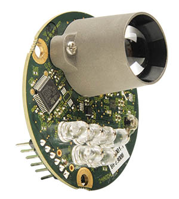
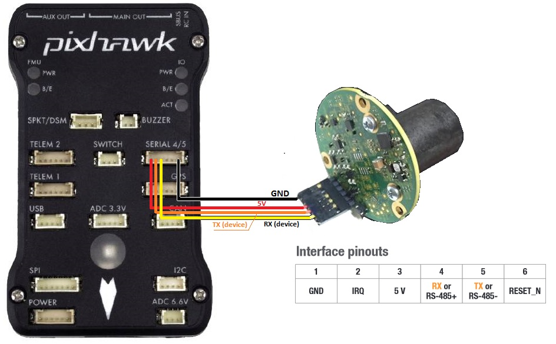

.. _common-leddar-one-lidar:

================
Leddar One Lidar
================

The `Leddar One Lidar <http://leddartech.com/modules/leddarone/>`__ is a light weight and reasonably priced lidar with 40m range, 70hz update rate and 3-degree diffuse beam.  For more details please refer to the `datasheet <http://leddartech.com/app/uploads/dlm_uploads/2016/02/Datasheet-LeddarOne.pdf>`__.

.. note::

   Support for LeddarOne is available in Copter-3.4.2 (or higher), Plane-3.8 (or higher), Rover-3.1 (or higher).

.. warning::

   Severe spikes in the reported range have been found in some Coptere-3.4.2 user's logs so we recommend careful ground testing of the distances reported or wait until Copter-3.4.3 is released by which time we hope to have the cause of these spikes identified.

Connecting to the Pixhawk
=========================

The sensor's serial connection can be connected to any spare serial port (i.e. Telem1, Teleme2, Serial4) on the flight controller.  Connect the lidar's RX line to the flight controller's UART TX line, the lidar's TX line to the UART's RX then also connect the GND and 5V lines.  The image below shows how the sensor output pins can be connected to a Pixhawk's Serial4 port.

You then need to setup the serial port and rangefinder parameters. If
you have used the SERIAL4/5 port on the Pixhawk then you would set the
following parameters (this is done on the Mission Planner's
**Config/Tuning \| Full Parameter List** page):

-  :ref:`SERIAL4_PROTOCOL <SERIAL4_PROTOCOL>` = 9 (Lidar)
-  :ref:`SERIAL4_BAUD <SERIAL4_BAUD>` = 115200
-  :ref:`RNGFND_TYPE <RNGFND_TYPE>` = 12 (LeddarOne)
-  :ref:`RNGFND_SCALING <RNGFND_SCALING>` = 1
-  :ref:`RNGFND_MIN_CM <RNGFND_MIN_CM>` = 5
-  :ref:`RNGFND_MAX_CM <RNGFND_MAX_CM>` = **4000** (40m) *This is the distance in centimeters that the rangefinder can reliably read.*
-  :ref:`RNGFND_GNDCLEAR <RNGFND_GNDCLEAR>` = 10 *or more accurately the distance in centimetres from the range finder to the ground when the vehicle is landed.  This value depends on how you have mounted the rangefinder.*

If you instead were using the Telem2 port on the Pixhawk then you would set :ref:`SERIAL2_PROTOCOL <SERIAL2_PROTOCOL>` = 9, and :ref:`SERIAL2_BAUD <SERIAL2_BAUD>` = 115200

Testing the sensor
==================

Distances read by the sensor can be seen in the Mission Planner's Flight
Data screen's Status tab. Look closely for "sonarrange".

.. image:: ../../../images/mp_rangefinder_lidarlite_testing.jpg
    :target: ../_images/mp_rangefinder_lidarlite_testing.jpg
