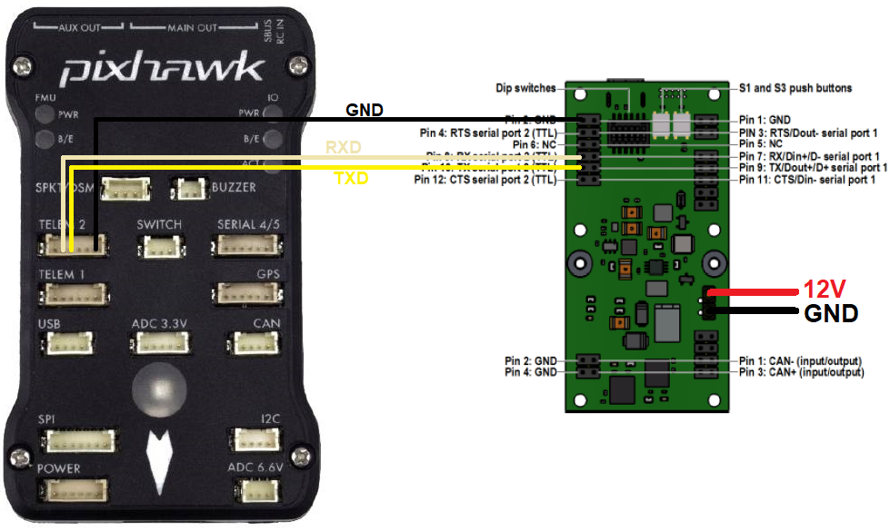

.. _common-leddartech-leddarvu8-lidar:

====================
LeddarTech LeddarVu8
====================

The `LeddarTech LeddarVu8 <https://leddartech.com/lidar/leddar-vu8-solid-state-lidar-sensor-module/>`__ is a long range (185m) lidar which provides 8 individual distances within a 16deg to 99deg field of view depending upon the model used.  ArduPilot always uses the shortest of the 8 distances provided.

..  youtube:: EnJq63ggBao
    :width: 100%

.. note::

    Support for this sensor was released with Copter-4.0.4

Connecting to the Autopilot
---------------------------

Any of the autopilot's spare serial ports may be used.  The diagram below shows how to connect the sensor's TX, RX and GND pins assuming Serial2 is used.

The lidar must be powered separately with a stable 12V source.  During testing the lidar was unable to reliably provide distances if the voltage dropped below 11V.

The following parameters should be set

-  :ref:`SERIAL2_PROTOCOL <SERIAL2_PROTOCOL>` = 9 (Lidar)
-  :ref:`SERIAL2_BAUD <SERIAL2_BAUD>` = 115 (115200 baud)
-  :ref:`RNGFND1_TYPE <RNGFND1_TYPE>` = 29 (LeddarVu8-Serial)
-  :ref:`RNGFND1_MIN_CM <RNGFND1_MIN_CM>` = 15
-  :ref:`RNGFND1_MAX_CM <RNGFND1_MAX_CM>` = 16000.  *This is the distance in centimeters that the rangefinder can reliably read.*
-  :ref:`RNGFND1_GNDCLEAR <RNGFND1_GNDCLEAR>` = 10 *or more accurately the distance in centimetres from the range finder to the ground when the vehicle is landed.  This value depends on how you have mounted the rangefinder.*

If you instead were using the Serial4 port on the autopilot then you would set :ref:`SERIAL4_PROTOCOL <SERIAL2_PROTOCOL>` = 9, and :ref:`SERIAL4_BAUD <SERIAL2_BAUD>` to 115

Testing the sensor
==================

Distances read by the sensor can be seen in the Mission Planner's Flight
Data screen's Status tab. Look closely for "sonarrange".

.. image:: ../../../images/mp_rangefinder_lidarlite_testing.jpg
    :target: ../_images/mp_rangefinder_lidarlite_testing.jpg
