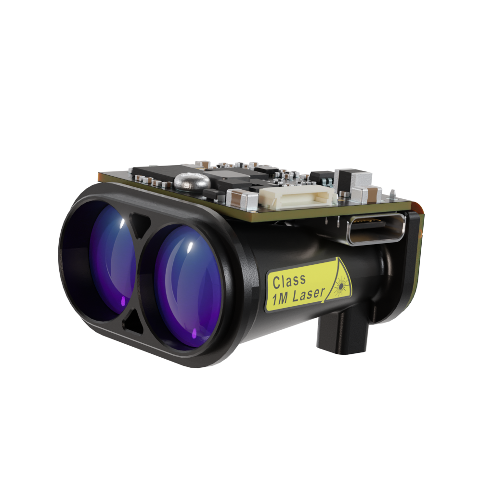
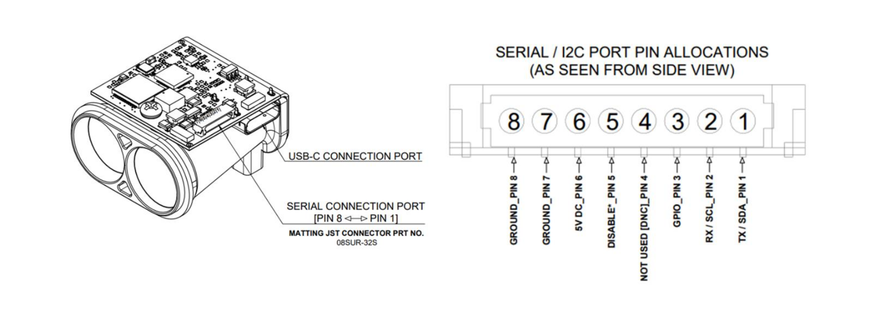

.. _common-lightware-grf250-lidar:

==========================
LightWare GRF250 / GRF500
==========================

The `LightWare GRF250 <https://lightwarelidar.com/shop/grf-250/>`__ and `GRF500 <https://lightwarelidar.com/shop/grf-500/>`__ are long-range lidar-based rangefinders.
Both models support serial (UART) communication and provide accurate distance and signal-strength data at configurable update rates.

- GRF250: 0.2 m – 250 m range
- GRF500: 0.2 m – 500 m range

.. note::

   Support for the LightWare GRF250 and GRF500 sensors was added in ArduPilot 4.7 and later.

Serial Connection
-----------------

The GRF sensors communicate via UART using 3.3 V or 5 V logic levels.
Connect the TX of the Lidar to the RX of the autopilot UART port, and the RX of the Lidar to the TX of the same port.
Also connect GND and 5 V to power the sensor.

Example (SERIAL4):
~~~~~~~~~~~~~~~~~~~~~~~~~~

If the GRF is connected to the autopilots' SERIAL4 port and it is the first rangefinder:

- :ref:`SERIAL4_PROTOCOL <SERIAL4_PROTOCOL>` = 9 (Lidar)
- :ref:`SERIAL4_BAUD <SERIAL4_BAUD>` = 115 (115200 baud)
- :ref:`RNGFND1_TYPE <RNGFND1_TYPE>` = 45 (LightWareGRF)
- :ref:`RNGFND1_SCALING <RNGFND1_SCALING>` = 1
- :ref:`RNGFND1_MIN <RNGFND1_MIN>` = 0.2
- :ref:`RNGFND1_MAX <RNGFND1_MAX>` = 250 *(for GRF250)* or 500 *(for GRF500)*

If instead you are using the SERIAL2 port, set :ref:`SERIAL2_PROTOCOL <SERIAL2_PROTOCOL>` = 9 and :ref:`SERIAL2_BAUD <SERIAL2_BAUD>` = 115.

Power note:
The GRF sensors can draw higher current than typical serial peripherals.
Check your flight controller’s 5 V peripheral rail limits — an external 5 V supply may be required.

Additional GRF-specific Parameters
----------------------------------

When :ref:`RNGFNDx_TYPE <RNGFND1_TYPE>` is set to 45 (LightWareGRF), the Serial port protocol is set to 9, and the autopilot is rebooted, the following additional parameters become available:

- :ref:`RNGFNDx_GRF_RET <RNGFND1_GRF_RET>`: Selects which return type to use (0: FirstRaw, 1: FirstFiltered, 2: LastRaw, 3: LastFiltered).
- :ref:`RNGFNDx_GRF_ST <RNGFND1_GRF_ST>`: Sets the minimum acceptable return signal strength in dB. Returns weaker than this value are ignored (0 disables filtering).
- :ref:`RNGFNDx_GRF_RATE <RNGFND1_GRF_RATE>`: Sets the sensor update rate in Hz. GRF250 supports 1–50 readings per second, while GRF500 supports 0.5–10 readings per second.

Testing the Sensor
------------------

You can view the live distance readings in Mission Planner → Flight Data → Status tab, under the field named “rangefinder1” (or `rangefinder2` / 3 for additional sensors).

.. image:: ../../../images/mp_rangefinder_lidarlite_testing.jpg
   :target: ../_images/mp_rangefinder_lidarlite_testing.jpg

If values remain at zero, verify serial wiring, baud rate, and power supply.

