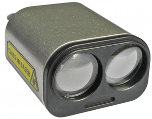
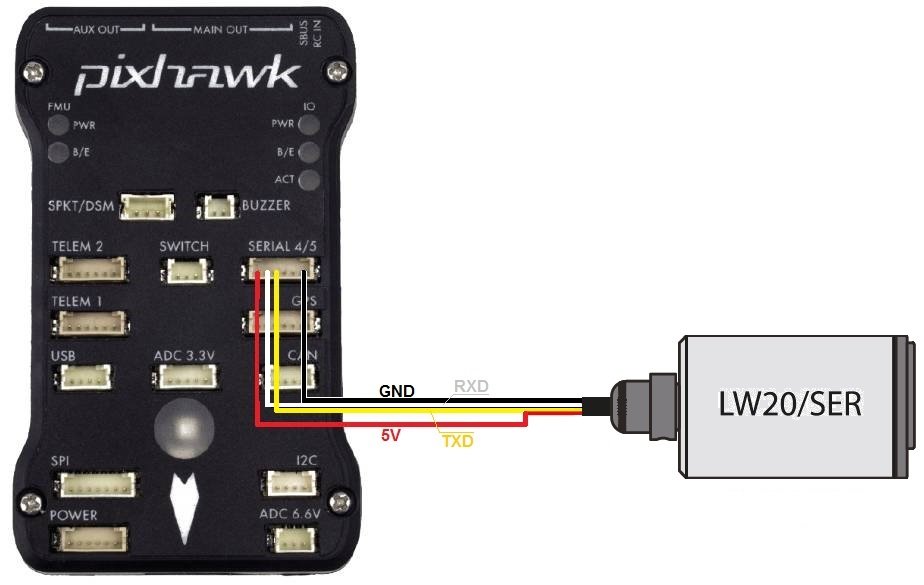
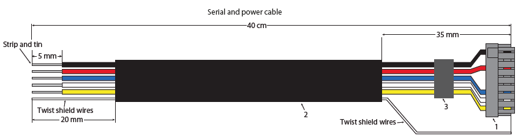
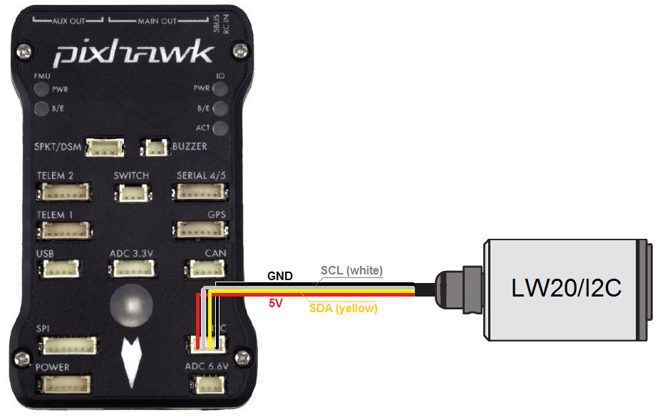
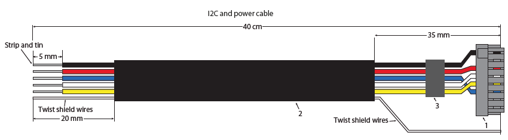

.. _common-lightware-lw20-lidar:

=====================
LightWare SF20 / LW20
=====================

The `Lightware SF20 <https://lightware.co.za/collections/frontpage/products/sf20-c-100-m>`__ and `LW20 <https://lightware.co.za/collections/frontpage/products/lw20-c-100-m>`__ are small but long range (100m) and accurate range finders.
There are two models, the LW20/Ser which uses a serial interface and LW20/I2C which uses an I2C interface.

Serial connection
-----------------

For a serial connection you can use any spare UART. Connect the RX line
of the UART to the TX line of the Lidar, and the TX line of the UART to
the RX line of the Lidar. Also connect the GND and 5V lines. You do not
need flow control pins.

The diagram below shows how to connect to SERIAL4.

If using the caseless SF20 ensure the cable looks like below:

You then need to setup the serial port and rangefinder parameters. If
you have used the SERIAL4/5 port on the Pixhawk then you would set the
following parameters if its the first rangefinder in the system (this can be done using the *Mission Planner*
**Config/Tuning \| Full Parameter List** page):

-  :ref:`SERIAL4_PROTOCOL <SERIAL4_PROTOCOL>` = 9 (Lidar)
-  :ref:`SERIAL4_BAUD <SERIAL4_BAUD>` = 115 (115200 baud) for newer sensors, 19 (19200 baud) for sensors manufactured before mid 2018
-  :ref:`RNGFND1_TYPE <RNGFND1_TYPE>` = 8 (LightWareSerial)
-  :ref:`RNGFND1_SCALING <RNGFND1_SCALING>` = 1
-  :ref:`RNGFND1_MIN_CM <RNGFND1_MIN_CM>` = 5
-  :ref:`RNGFND1_MAX_CM <RNGFND1_MAX_CM>` = **9500**.  *This is the distance in centimeters that the rangefinder can reliably read.*
-  :ref:`RNGFND1_GNDCLEAR <RNGFND1_GNDCLEAR>` = 10 *or more accurately the distance in centimetres from the range finder to the ground when the vehicle is landed.  This value depends on how you have mounted the rangefinder.*

If you instead were using the Telem2 port on the Pixhawk then you would set :ref:`SERIAL2_PROTOCOL <SERIAL2_PROTOCOL>` = 9, and :ref:`SERIAL2_BAUD <SERIAL2_BAUD>` to 115 (115200 baud) or 19 (19200 baud)

Note that you may need to use a separate 5V power supply for the Lidar on some flight boards. Refer to the power consumption in the manual for the Lidar and the limits for peripheral power on your autopilot.

I2C connection
--------------

Connect the SDA line of the Lidar to the SDA line of the I2C port on the Pixhawk, and the SCL line of the Lidar to the SCL line of the I2C port. Also connect the GND and 5V lines.

If using the caseless SF20 ensure the cable looks like below:

You then need to configure the rangefinder parameters as shown below
(this cn be done suing the *Mission Planner* **Config/Tuning \| Full Parameter List** page):

-  :ref:`RNGFND1_TYPE <RNGFND1_TYPE>` = 7 (LightWareI2C)
-  :ref:`RNGFND1_ADDR <RNGFND1_ADDR>` = 102 (I2C Address of lidar in decimal).  *Note that this setting is in decimal. The default address is 0x66 hexademical which is 102 in decimal.*
-  :ref:`RNGFND1_SCALING <RNGFND1_SCALING>` = 1
-  :ref:`RNGFND1_MIN_CM <RNGFND1_MIN_CM>` = 5
-  :ref:`RNGFND1_MAX_CM <RNGFND1_MAX_CM>` = **9500**.  *This is the distance in centimeters that the rangefinder can reliably read.*
-  :ref:`RNGFND1_GNDCLEAR <RNGFND1_GNDCLEAR>` = 10 *or more accurately the distance in centimetres from the range finder to the ground when the vehicle is landed.  This value depends on how you have mounted the rangefinder.*

Testing the sensor
==================

Distances read by the sensor can be seen in the Mission Planner's Flight
Data screen's Status tab. Look closely for "sonarrange".

.. image:: ../../../images/mp_rangefinder_lidarlite_testing.jpg
    :target: ../_images/mp_rangefinder_lidarlite_testing.jpg
