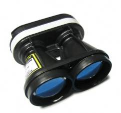

.. _common-lightware-sf10-lidar:

=============================
LightWare SF10 and SF11 Lidar
=============================

The `Lightware SF10 and SF11 <https://lightware.co.za/collections/lidar-rangefinders>`__ series of laser rangefinders are particularly lightweight, and provide fast and accurate distance measurements.
Although slightly more expensive than other rangefinders, members of the dev team have had good success with them.
The series includes a number of models:
`SF10/A <http://pixhawkstore.com.au/sf10-a-lightware-25m-laser-altimeter/>`__ (25m),
`SF10/B <http://pixhawkstore.com.au/sf10-b-lightware-50m-laser-altimeter/>`__ (50m),
SF10/C (100m) and 
`SF11/C <https://lightware.co.za/collections/lidar-rangefinders/products/sf11-c-120-m>`__ (120m)

\ |SF10-B|

Connecting to the AutoPilot
===========================

The diagram below shows the sensor output pins and a conveniently colour-coded cable (normally included or `see spec here <http://documents.lightware.co.za/LW%20000_135%20-%20Main%20cable%20type%201%20assembly%20-%20Rev%200.pdf>`__) which is used to connect to the autopilot. :ref:`Serial <sf10-serial-connection>`, :ref:`I2C <sf10-i2c-connection>` and :ref:`Analog <sf10-analog-connection>` connections are possible but we recommended using :ref:`Serial <sf10-serial-connection>` if possible especially if using cables that are 30cm or longer.

.. tip::

   The serial connection is recommended when using longer cables

.. figure:: ../../../images/RangeFinder_SF10_Output_Pins.png

   SF10 Rangefinder: Output Pins

.. figure:: ../../../images/SF10_Rangefinder_main-cable-type-1-35-cm.jpg
   :target: http://documents.lightware.co.za/LW%20000_135%20-%20Main%20cable%20type%201%20assembly%20-%20Rev%200.pdf

   Main cable for SF10 Rangefinder

.. _sf10-serial-connection:

Serial connection
-----------------

For a serial connection you can use any spare UART. Connect the RX line
of the UART to the TX line of the Lidar, and the TX line of the UART to
the RX line of the Lidar. Also connect the GND and 5V lines. You do not
need flow control pins.

The diagram below shows how to connect to SERIAL4.

.. figure:: ../../../images/Pixhawk_Rangefinder_SF10_Serial.jpg
   :target: ../_images/Pixhawk_Rangefinder_SF10_Serial.jpg

   Pixhawk and SF10Rangefinder: Serial Connection (SERIAL4)

You then need to setup the serial port and rangefinder parameters. If
you have used the SERIAL4/5 port on the Pixhawk then you would set the
following parameters in the case of the first rangefinder(this is done in the *Mission Planner*
**Config/Tuning \| Full Parameter List** page):

-  :ref:`SERIAL4_PROTOCOL <SERIAL4_PROTOCOL>` = 9 (Lidar)
-  :ref:`SERIAL4_BAUD <SERIAL4_BAUD>` = 115 (115200 baud) 
-  :ref:`RNGFND1_TYPE <RNGFND1_TYPE>` = 8 (LightWareSerial)
-  :ref:`RNGFND1_SCALING <RNGFND1_SCALING>` = 1
-  :ref:`RNGFND1_MIN_CM <RNGFND1_MIN_CM>` = 5
-  :ref:`RNGFND1_MAX_CM <RNGFND1_MAX_CM>` = **2500** (for SF10A), **5000** (for SF10B), **10000** (for SF10C) or **12000** (for SF11C).  *This is the distance in centimeters that the rangefinder can reliably read. The value depends on the model of the lidar.*
-  :ref:`RNGFND1_GNDCLEAR <RNGFND1_GNDCLEAR>` = 10 *or more accurately the distance in centimetres from the range finder to the ground when the vehicle is landed.  This value depends on how you have mounted the rangefinder.*

If you instead were using the Telem2 port on the Pixhawk then you would set :ref:`SERIAL2_PROTOCOL <SERIAL2_PROTOCOL>` = 9, and :ref:`SERIAL2_BAUD <SERIAL2_BAUD>` = 115

Lightware lidars manufactured before May 2018 shipped with a default baud rate of 19200. If your device was produced before this date, you will need to set the baud rate to 19200 (Parameter value 19). Alternatively, you may reconfigure your lightware device to use a baudrate of 115200 using the Lightware Terminal application and use the settings above.

.. _sf10-i2c-connection:

I2C connection
--------------

Connect the SDA line of the Lidar to the SDA line of the I2C port on the Pixhawk, and the SCL line of the Lidar to the SCL line of the I2C port. Also connect the GND and 5V lines.

.. figure:: ../../../images/Pixhawk_Rangefinder_SF10_I2C.jpg
   :target: ../_images/Pixhawk_Rangefinder_SF10_I2C.jpg

   Pixhawk and SF10 Rangefinder: I2CConnection

You then need to configure the rangefinder parameters as shown below
(this is done in the *Mission Planner* **Config/Tuning \| Full Parameter
List** page):

-  :ref:`RNGFND1_TYPE <RNGFND1_TYPE>` = 7 (LightWareI2C)
-  :ref:`RNGFND1_ADDR <RNGFND1_ADDR>` = 102 (I2C Address of lidar in decimal).  *Please note that this setting is in decimal and not hexadecimal as shown in the lidar settings screen. The default address is 0x66 which is 102 in decimal.*
-  :ref:`RNGFND1_SCALING <RNGFND1_SCALING>` = 1
-  :ref:`RNGFND1_MIN_CM <RNGFND1_MIN_CM>` = 5
-  :ref:`RNGFND1_MAX_CM <RNGFND1_MAX_CM>` = **2500** (for SF10A), **5000** (for SF10B), **10000** (for SF10C) or **12000** (for SF11C).  *This is the distance in centimeters that the rangefinder can reliably read. The value depends on the model of the lidar.*
-  :ref:`RNGFND1_GNDCLEAR <RNGFND1_GNDCLEAR>` = 10 *or more accurately the distance in centimetres from the range finder to the ground when the vehicle is landed.  This value depends on how you have mounted the rangefinder.*

It may be necessary to enable the sensor's "I2C compatibility mode (Pixhawk)".  This can be done by connecting the lidar to your PC using a USB cable, then download `Lightware Studio <https://lightwarelidar.com/pages/lightware-studio>`__, connect and check the checkbox shown below

.. warning::

    The default I2C address was 85 (0x55 in hexadecimal) on older LightWare rangefinders.
    This was changed to prevent conflict with another device on ArduPilot.
    Please check your rangefinder system settings to determine what your I2C address is.

.. _sf10-analog-connection:

Analog connection
-----------------

The SF10's Analog Out pin (5) should be connected to the Pixhawk's 3.3V
ADC (analog to digital converter).  The Pixhawk will provide the
regulated 5V power supply needed by the sensor using the 5V and GND pins
of the ADC connector.

   Pixhawk and SF10 Rangefinder:Analog Connection

You then need to setup the ADC and rangefinder parameters as shown below
(this is done in the *Mission Planner* **Config/Tuning \| Full Parameter
List** page):

-  :ref:`RNGFND1_TYPE <RNGFND1_TYPE>` = 1 (Analog)
-  :ref:`RNGFND1_PIN <RNGFND1_PIN>` = 14 (2nd pin of 3.3V ADC connector)
-  :ref:`RNGFND1_SCALING <RNGFND1_SCALING>` = **9.76** (for SF10A), **19.531** (for SF10B), **39.06** (for SF10C), **46.87** (for SF11C)
-  :ref:`RNGFND1_MIN_CM <RNGFND1_MIN_CM>` = 5
-  :ref:`RNGFND1_MAX_CM <RNGFND1_MAX_CM>` = **2000** (for SF10A), **4500** (for SF10B), **9500** (for SF10C) or **11500** (for SF11C).  *This is the distance in centimeters that the rangefinder can reliably read. The value depends on the model of the lidar.  Note the range is 5m less than using Serial or I2C protocols so that out-of-range can be reliably detected*
-  :ref:`RNGFND1_GNDCLEAR <RNGFND1_GNDCLEAR>` = 10 *or more accurately the distance in centimetres from the range finder to the ground when the vehicle is landed.  This value depends on how you have mounted the rangefinder.*

The :ref:`RNGFND1_SCALING <RNGFND1_SCALING>` value depends on the voltage on the rangefinders output pin at the maximum range. By default the SF10/B will output 2.56V at 50m, so the scaling factor is 50m / 2.56v ≈ 19.53 (the analog
distance range for each of the rangefinder variants can be found in the `SF10 Manual <http://documents.lightware.co.za/SF10%20-%20Laser%20Altimeter%20Manual%20-%20Rev%2011.pdf>`__).
The manual explains how you can confirm and change the maximum output range/voltage.

.. tip::

   We highly recommend that you tune the ``RNGFND1_SCALING`` value by
   comparing the output against a known distance.

Testing the sensor
==================

Distances read by the sensor can be seen in the Mission Planner's Flight
Data screen's Status tab. Look closely for "sonarrange".

.. image:: ../../../images/mp_rangefinder_lidarlite_testing.jpg
    :target: ../_images/mp_rangefinder_lidarlite_testing.jpg

