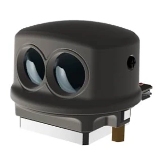
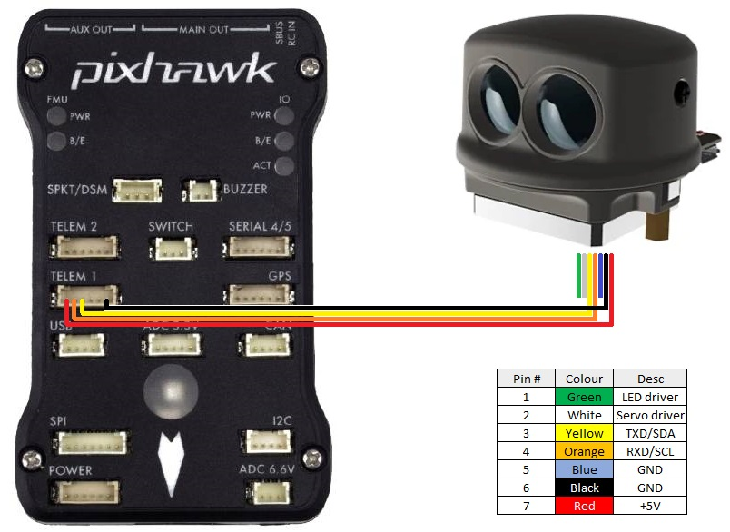

.. _common-lightware-sf45b:

==========================
LightWare SF45/B 350 Lidar
==========================

The `Lightware SF45/B lidar <https://lightwarelidar.com/products/sf45-b>`__ is a small (about 50g) scanning lidar (up to 350 deg) with a 50m range

Mounting the SF45/B
-------------------

The SF45/B should be mounted on the top or bottom of the vehicle so that the lidar scans horizontally.  Ideally the number of vehicle parts (GPS mast, vehicle legs, etc) that obstruct the lidar's view should be reduced to a minimum
    
Connecting to the Autopilot
---------------------------

The lidar can be connected to any serial port but if powering the sensor directly from the autopilot (i.e without a BEC) ensure the port can provide the required 300mW of current.  Many Pixhawk compatible autopilots can provide more power to Serial1 than other ports meaning this may be the best choice.

Configuration through the Ground Station
----------------------------------------

- :ref:`SERIAL1_PROTOCOL <SERIAL1_PROTOCOL>` = "11" ("Lidar360") if using Serial1
- :ref:`SERIAL1_BAUD <SERIAL4_BAUD>` =  "115" if using Serial1
- :ref:`PRX_TYPE <PRX_TYPE>` = "8" (LightwareSF45B)
- :ref:`PRX_ORIENT <PRX_ORIENT>` = "0" if mounted on the top of the vehicle, "1" if mounted upside-down on the bottom of the vehicle
- :ref:`PRX_YAW_CORR <PRX_YAW_CORR>` allows adjusting for the forward direction of the lidar.  For example, if the lidar is facing forward this parameter can be left as 0.  If facing backwards it should be set to 180.
- :ref:`PRX_IGN_ANG1 <PRX_IGN_ANG1>` and :ref:`PRX_IGN_WID1 <PRX_IGN_WID1>` parameters allow defining zones around the vehicle that should be ignored.  For example to avoid a 20deg area to the right, set :ref:`PRX_IGN_ANG1 <PRX_IGN_ANG1>` to 90 and :ref:`PRX_IGN_WID1 <PRX_IGN_WID1>` to 20.

More details on using this sensor for object avoidance on Copter can be found :ref:`here <common-object-avoidance-landing-page>`.

Video
-----

..  youtube:: ztGovDXdZLM
    :width: 100%
