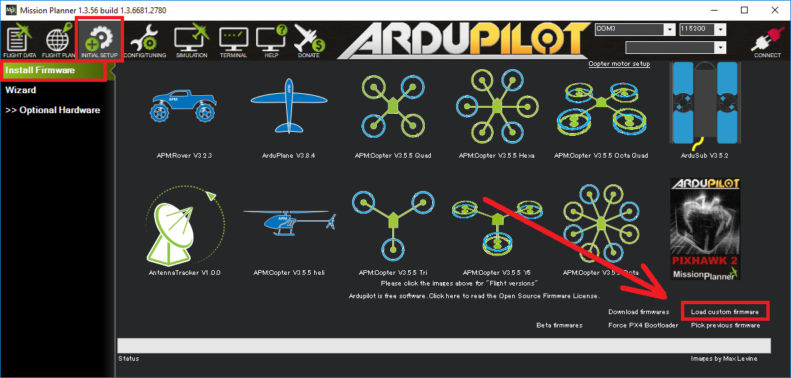

.. _common-loading-chibios-firmware-onto-pixhawk:

=====================================
Loading ChibiOS firmware onto Pixhawk
=====================================

These instructions explain how to download and install the beta ArduPilot with ChibiOS firmware onto a pixhawk flight controller.

In tests the development team has found using ChibiOS (in place of NuttX) results in a smaller firmware with faster loop rates and less timing jitter.
ChibiOS builds have less testing and a few `missing features <https://github.com/ArduPilot/ardupilot/issues/8109>`__ however.

Parameters are preserved when moving between ChibiOS and NuttX firmwares and no re-tuning of the vehicle should be required.

Downloading the beta firmware
=============================

Download the appropriate beta firmware from `firmware.ardupilot.org <http://firmware.ardupilot.org/>`__ using the links below and save the resulting .apj file somewhere on your PC:

 - `Copter-3.6-beta for Pixhawks including Cube/Pixhawk2 <http://firmware.ardupilot.org/Copter/beta/fmuv3/arducopter.apj>`__
 - `Copter-3.6-beta for Pixracers boards <http://firmware.ardupilot.org/Copter/beta/fmuv4/arducopter.apj>`__

 - `TradHeli-3.6-beta for Pixhawks including Cube/Pixhawk2 <http://firmware.ardupilot.org/Copter/beta/fmuv3-heli/arducopter.apj>`__
 - `TradHeli-3.6-beta for Pixracers boards <http://firmware.ardupilot.org/Copter/beta/fmuv4-heli/arducopter.apj>`__
 
 - `Rover-3.3-beta for Pixhawks including Cube/Pixhawk2 <http://firmware.ardupilot.org/Rover/beta/fmuv3/ardurover.apj>`__
 - `Rover-3.6-beta for Pixracers boards <http://firmware.ardupilot.org/Rover/beta/fmuv4/ardurover.apj>`__

Uploading as Custom Firmware
============================
 
- connect the ground station PC to the flight controller using a USB cable
- select the COM port and baud rate (normally 115200) for the board.  If using the Mission Planner these are selected on the top right of the screen.  Do **not** press the Connect button
- go to the GCS's firmware install screen.  If using the Mission Planner select "Initial Setup >> Install Firmware"
- click the "Load custom firmware" link and select the .apj file downloaded above.  If using the Mission Planner and the "Load custom firmware" link is not visible select "Config/Tuning >> Planner" and set the "Layout" drop-down to "Advanced".

- following any instructions displayed regarding plugging/unplugging the board
- if all goes well some status should be displayed at the bottom of the screen.  i.e. "erase...", "program...", "verify.." and "Upload Done".

Testing
=======

- open the ground stations's flight data screen
- select the COM port (which will have changed compared to the NuttX versions) and baud (normally 115200)
- press the **Connect** button
- after parameters are downloaded, the HUD should update as you tilt the board

More details on connecting a GCS to the flight controller are described :ref:`here <common-connect-mission-planner-autopilot>`.

[copywiki destination="copter,plane,rover,planner"]