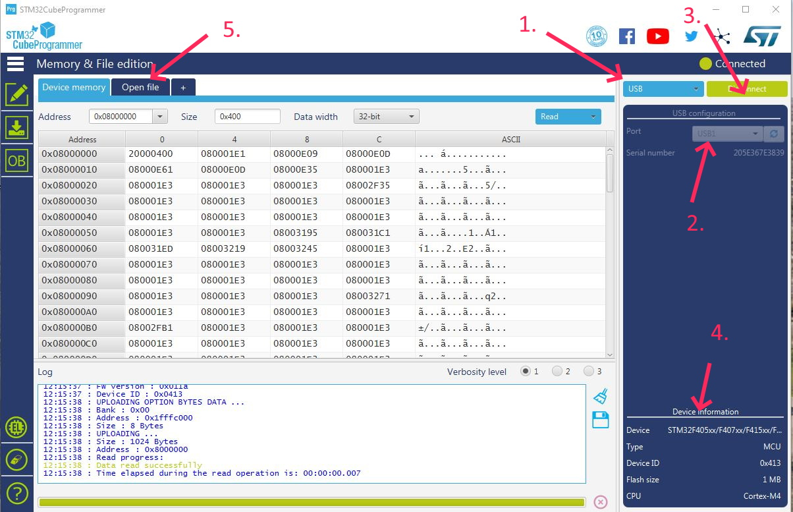
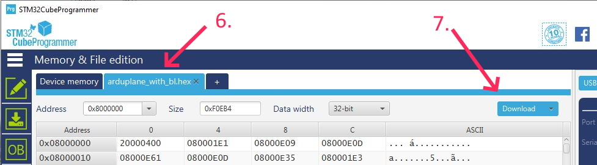

.. _common-loading-firmware-onto-chibios-only-boards:

================================================================
Loading Firmware onto boards without existing ArduPilot firmware
================================================================

Recent versions of ArduPilot (Copter-3.6, Plane-3.9, Rover-3.5) run on relatively small, non-Pixhawk, autopilots using the ChibiOS operating system.
Examples of these boards include the :ref:`OpenPilot RevoMini <common-openpilot-revo-mini>`, :ref:`Mateksys F405-Wing <common-matekf405-wing>` and :ref:`Omnibus F4 Pro <common-omnibusf4pro>`.

Most often, these boards have another flight controller software pre-installed. (If the board has ArduPilot already installed, see :ref:`common-loading-firmware-onto-pixhawk` for firmware loading instructions.

Installing ArduPilot to these autopilot involves:

- Installing the required driver and flashing tool
- Downloading the appropriate ArduPilot firmware
- Loading ArduPilot to the board

.. note::

   Instructions for ArduPilot using ChibiOS to Pixhawk autopilots can be found :ref:`here <common-loading-chibios-firmware-onto-pixhawk>`.

[copywiki destination="copter,plane,rover,planner"]

Download driver and flashing tool
=================================

The `STM32CubeProgrammer <https://www.st.com/en/development-tools/stm32cubeprog.html>`__ will install the required DFU (direct firmware upload) drivers and can be used to flash the firmware to autopilots in DFU mode. This is available for Windows, Linux, and MacOS systems. Download and install this program. You may be required to also install `JAVA <https://java.com/en/download/>`__ in order to setup this program.

Download the ArduPilot firmware
===============================

- Download the ArduPilot firmware for your board from `firmware.ardupilot.org <https://firmware.ardupilot.org/>`__.  You can normally find the appropriate firmware by doing the following:

  - open `firmware.ardupilot.org <https://firmware.ardupilot.org/>`__
  - select click on the link for your vehicle type (i.e. `Plane <https://firmware.ardupilot.org/Plane/>`__, `Copter <https://firmware.ardupilot.org/Copter/>`__, `Rover <https://firmware.ardupilot.org/Rover/>`__, `Sub <https://firmware.ardupilot.org/Sub/>`__ or `Antenna Tracker <https://firmware.ardupilot.org/AntennaTracker/>`__)
  - select "beta" or "stable"
  - look for the directory with the name that most closely matches the autopilot
  - download the "arduXXX_with_bl.hex" file clicking on it. It will usually be saved in your Downloads folder.

Using Beta and Developer Versions
=================================

Beta
----

Prior to ``Stable`` releases, a ``Beta`` version or versions get released. These may be used if you wish to try newer features or help the developers further flight test the code. Since they are "beta" versions, there possibly still may be bugs (although this is possible even in Stable firmware). However, it has been tested by the development team, and already flight tested. This release allows a wider user base to final test the firmware before its release as ``Stable``. Experienced ArduPilot users are encouraged to test fly this firmware and provide feedback.

Latest Developer Version
------------------------

This reflects the current state of the development branch of the ArduPilot code. It has been reviewed by the development team, passed all automated test suites,  and in most cases, if significant changes have been made, test flown. This code gets built daily and is available for testing by experienced users. This corresponds to an "alpha" release, and may have bugs, although very rarely "crash inducing". Very shortly after an addition that changes or introduces a feature is added, the :ref:`Upcoming Features <common-master-features>` section of the Wiki is updated with information about the addition or change.

Upload the firmware to autopilot
================================

- Hold down the board's DFU button or temporarily bridge its "BOOT" pins, and plug in a USB cable (attached to your PC). Release button or unbridge once powered.
- Open the windows device manager and look under "Universal Serial Bus devices" for "STM32 BOOTLOADER" to confirm that the board is in DFU mode.

  .. image:: ../../../images/loading-firmware-device-manager.png
      :target: ../_images/loading-firmware-device-manager.png
      :width: 450px

- Start the STM32CubeProgrammer

#. Select the connection method: USB
#. Make sure a USB port shows...that means the board is detected in DFU mode.
#. Press "Connect"
#. Then the boards cpu specifics will appear here.
#. Press "Open file" to select the "arduXXX_with_bl.hex" file you downloaded.
#. The file name will appear in the tab.

7. Press "Download" to flash the file to the board.

You may now reboot the board and :ref:`connect with your favourite ground station <common-connect-mission-planner-autopilot>` (Mission Planner, QGC, etc) and future firmware uploads should also be possible using the normal method for Pixhawk boards.

Alternate method
================

Download and Install Zadig (Windows only)
-----------------------------------------

- Download and run `Zadig <https://zadig.akeo.ie/>`__ (search for "Zadig 2.3" just below "Download") to allow accessing the board using USB.
- Choose "List all devices" option from options menu
- Select "STM32 BOOTLOADER" from the drop-down and press the "Replace Driver" button

  .. image:: ../../../images/loading-firmware-zadig.png
      :target: ../_images/loading-firmware-zadig.png
      :width: 450px

- Optionally, you may wish to check the board is visible as a USB port:

  - Hold down the board's DFU button and plug in a USB cable (attached to your PC)
  - Open the windows device manager and look under "Universal Serial Bus devices" for "STM32 BOOTLOADER" to confirm that the board is in DFU mode.

  .. image:: ../../../images/loading-firmware-device-manager.png
      :target: ../_images/loading-firmware-device-manager.png
      :width: 450px

Download the ArduPilot firmware
-------------------------------

- Download the ArduPilot firmware for your board from `firmware.ardupilot.org <https://firmware.ardupilot.org/>`__.  You can normally find the appropriate firmware by doing the following:

  - open `firmware.ardupilot.org <https://firmware.ardupilot.org/>`__
  - select click on the link for your vehicle type (i.e. `Plane <https://firmware.ardupilot.org/Plane/>`__, `Copter <https://firmware.ardupilot.org/Copter/>`__, `Rover <https://firmware.ardupilot.org/Rover/>`__, `Sub <https://firmware.ardupilot.org/Sub/>`__ or `Antenna Tracker <https://firmware.ardupilot.org/AntennaTracker/>`__)
  - select "beta" or "stable"
  - look for the directory with the name that most closely matches the autopilot
  - download the "arduXXX_with_bl.hex" file clicking on it. It will usually be saved in your Downloads folder.

Upload ArduPilot to the board
-----------------------------

- Download, install and run the `Betaflight Configurator <https://github.com/betaflight/betaflight-configurator/releases>`__.

  - Select "Firmware Flasher" on the left side of the screen
  - Select DFU from the top right
  - Push "Load Firmware [Local]" from the bottom right and select the arduXXX_with_bl.hex file you downloaded above.
  - Push "Flash Firmware" and after a few minutes the firmware should be loaded

  .. image:: ../../../images/loading-firmware-betaflight-configurator.png
      :target: ../_images/loading-firmware-betaflight-configurator.png
      :width: 450px

You may now reboot the board and :ref:`connect with your favourite ground station <common-connect-mission-planner-autopilot>` (Mission Planner, QGC, etc) and future firmware uploads should also be possible using the normal method for Pixhawk boards.
