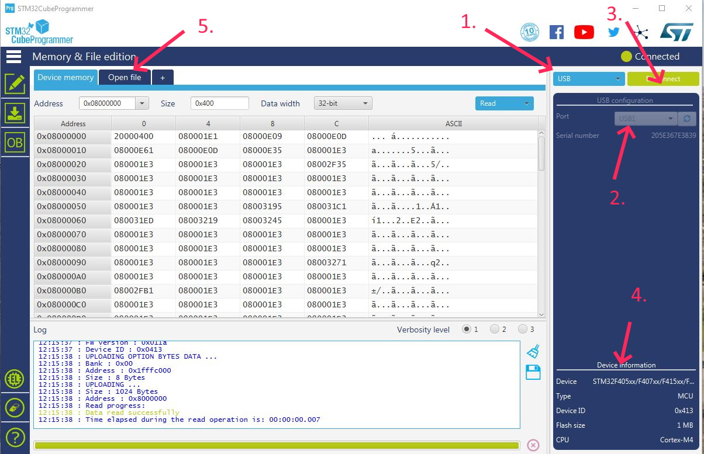
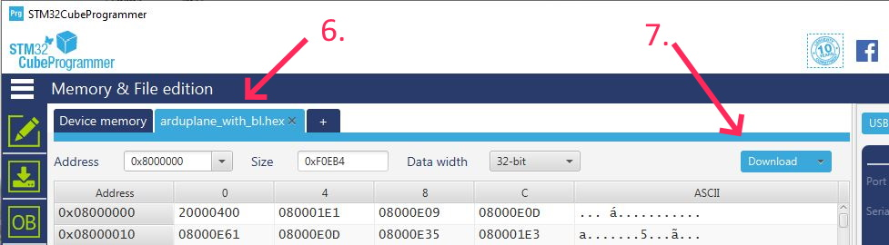

.. _common-loading-firmware-onto-chibios-only-boards:

[copywiki destination="copter,plane,rover,planner,blimp,sub"]

=====================================================================
Loading Firmware to Boards without an ArduPilot Compatible Bootloader
=====================================================================

These instructions cover loading ArduPilot onto an autopilot which does not yet have an :ref:`ArduPilot compatible bootloader <loading-firmware-bootloader-check>`, which is usually a board supplied with Betaflight, INAV, or similar firmware pre-installed. The ArduPilot bootloader and firmware are loaded together over USB in DFU (direct firmware upload) mode.

This is a one-time operation. Once it has succeeded, the board has an ArduPilot bootloader, and all subsequent updates use the normal ground station method described in :ref:`common-loading-firmware-onto-pixhawk`.

If the board already runs ArduPilot or PX4 firmware, use that page instead - you do not need DFU.

Installing ArduPilot on these autopilots involves:

- installing the required driver and flashing tool
- downloading the appropriate ``arduXXX_with_bl.hex`` firmware file
- loading it to the board over DFU

Download driver and flashing tool
=================================

The `STM32CubeProgrammer <https://www.st.com/en/development-tools/stm32cubeprog.html>`__ will install the required DFU drivers and can be used to flash the firmware to autopilots in DFU mode. This is available for Windows, Linux, and MacOS systems. Download and install this program. You may be required to also install `JAVA <https://java.com/en/download/>`__ in order to setup this program.

Download the ArduPilot firmware
===============================

Follow :ref:`Download the Firmware <loading-firmware-download>` to obtain the firmware for your board, selecting the ``arduXXX_with_bl.hex`` file. This file contains both the ArduPilot bootloader and the firmware, which is what DFU loading requires; the ``.apj`` files cannot be used here.

Upload the firmware to autopilot
================================

- Hold down the board's DFU button or temporarily bridge its "BOOT" pins, and plug in a USB cable (attached to your PC). Release button or unbridge once powered.
- Open the windows device manager and look under "Universal Serial Bus devices" for "STM32 BOOTLOADER" to confirm that the board is in DFU mode.

  .. image:: ../../../images/loading-firmware-device-manager.png
      :target: ../_images/loading-firmware-device-manager.png
      :width: 450px

- Start the STM32CubeProgrammer

#. Select the connection method: USB
#. Make sure a USB port shows...that means the board is detected in DFU mode.
#. Press "Connect"
#. Then the boards cpu specifics will appear here.
#. Press "Open file" to select the "arduXXX_with_bl.hex" file you downloaded.
#. The file name will appear in the tab.

7. Press "Download" to flash the file to the board.

You may now reboot the board and :ref:`confirm the firmware is running <loading-firmware-testing>`. Future firmware uploads can be done with the normal ground station method, see :ref:`common-loading-firmware-onto-pixhawk`.

Loading firmware onto Boards with external flash
================================================

Some recent boards, most notably those from Seriously Pro Racing (http://www.seriouslypro.com/), use MCUs with small amounts of internal flash but with much larger externally connected flash chips. These boards require extra steps to load ArduPilot firmware. Typically some kind of bootloader resides on the internal flash and then the main firmware resides on the external flash.

Loading firmware using SSBL
---------------------------

The SPRacing series of boards come pre-installed with a proprietary bootloader on the internal flash and require the use of a second stage bootloader to load further firmware. There are a couple of options to load firmware with these boards, but whichever option you choose you will need to initially load ArduPilot using SSBL. Please follow the "INSTALLATION" instructions at https://github.com/spracing/ssbl in order to load SSBL onto your board. Once SSBL is loaded please follow the PX4 instructions to load ArduPilot onto the board https://github.com/spracing/ssbl#px4-installation-to-external-flash but instead of using PX4 firmware please use the arducopter.bin firmware image. A summary of the steps follows:

- Download https://github.com/spracing/ssbl/releases and install SSBL to external flash following https://github.com/spracing/ssbl#installation-to-external-flash
- Download the latest ArduPilot external flash binary, for instance https://firmware.ardupilot.org/Copter/latest/SPRacingH7/arducopter.bin
- Use dd to pad the binary to 2MB:

.. code-block:: none

   dd if=/dev/zero ibs=1k count=2048 of=AP_2MB.bin
   dd conv=notrunc if=arducopter.bin of=AP_2MB.bin

- Put the board into SSBL dfu mode - power off, hold BIND (not BOOT), power on - LED flashes fast, release BIND, LED flashed slow - DFU mode enabled
- Flash the binary using

.. code-block:: none

   dfu-util -D AP_2MB.bin -s 0x90100000:0x200000

- Verify the flash. The dfu-util command below copies the contents of the flash back to the computer, the diff command will tell you if the contents are identical or different. Do not attempt to fly if diff doesn't say the files are identical - retry.

.. code-block:: none

   dfu-util -U AP_2MB-VERIFY.bin -s 0x90100000:0x200000
   diff -sb AP_2MB.bin AP_2MB-VERIFY.bin

- Power off, install an SD card (.note: you *must* install an SD card, the firmware will not boot without it), power on
- Configure the board as normal using Mission Planner

At this point you should have working firmware on the board. If you want to load new firmware you will need to follow steps 2-7 again (you cannot use Mission Planner to load firmware). If you are certain that you will never want to load betaflight on the board then you can install the ArduPilot bootloader.

Installing the ArduPilot bootloader
-----------------------------------

.. warning:: installing the ArduPilot bootloader is a one-way operation. You cannot restore the board to factory configuration or load betaflight after this step - you would have to return the board to Seriously Pro to be re-flashed with factory firmware, assuming that is possible

**If you are certain that you only want to use ArduPilot on the board**, then flashing the ardupilot bootloader enables much simpler subsequent upgrades.

- You must initially have a working version of ArduPilot installed on the board - follow the steps above.
- You now must remove the copy protection on the internal flash. This is a destructive operation requiring complete erasure of the flash. ArduPilot provides support to make this easy. Set :ref:`BRD_OPTIONS<BRD_OPTIONS>` = 16.
- Power off and power on the board. The board will not appear to boot but the flash sector is being erased. Wait a few seconds and then power off the board.
- Hold down the ``boot`` button (boot *not* bind this time) and power on the autopilot. This will put the board in dfu mode.
- Download the ArduPilot bootloader, e.g. https://github.com/ArduPilot/ardupilot/blob/master/Tools/bootloaders/SPRacingH7_bl.bin
- Install the bootloader via dfu:

.. code-block:: none

   dfu-util -a 0 --dfuse-address 0x08000000 -D SPRacingH7_bl.bin

- Reboot the board.
- You can now use your favorite tool to upload the ArduPilot firmware
