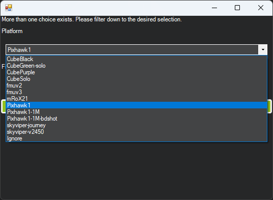

.. _common-loading-firmware-onto-pixhawk:

[copywiki destination="copter,plane,rover,planner,blimp"]

================
Loading Firmware
================

These instructions will show you how to download the latest firmware onto the autopilot hardware that already has ArduPilot firmware installed. This process will use the Mission Planner ground control station. See :ref:`common-loading-firmware-onto-chibios-only-boards`.

.. note:: for some autopilots, it may be possible to update the firmware by :ref:`flashing from SD card <common-install-sdcard>`

Installation Steps
==================
Connect autopilot to computer
-----------------------------

Once you have :ref:`installed a ground station <common-install-gcs>` on your computer, connect
the autopilot using a USB cable as shown
below. Use a direct USB port on your computer (not a USB hub).

.. figure:: ../../../images/pixhawk_usb_connection.jpg
   :target: ../_images/pixhawk_usb_connection.jpg
   :width: 450px

   Pixhawk USB Connection

Windows should automatically detect and install the correct driver
software.

Select the COM port
-------------------

If using *Mission Planner* as the GCS, select the COM port drop-down in the upper-right corner of the window near the **Connect** button. Select **AUTO** or the specific port for your board. Set the Baud rate to **115200** as shown. Do not hit **Connect** just yet.

.. image:: ../../../images/Pixhawk_ConnectWithMP.png
    :target: ../_images/Pixhawk_ConnectWithMP.png

Install firmware
----------------

In Mission Planner's **SETUP \| Install Firmware** screen
select the appropriate icon that matches your vehicle or frame type(i.e. Quad, Hexa). 
Answer **Yes** when it asks you "Are you sure?".

.. figure:: ../../../images/Pixhawk_InstallFirmware.jpg
   :target: ../_images/Pixhawk_InstallFirmware.jpg

   Mission Planner: Install FirmwareScreen

.. note:: some boards are specifically targeted to a particular vehicle type and firmware is not automatically built for other vehicles. However, ArduPilot could still be built for those other vehicles using the `Custom Firmware Server <https://custom.ardupilot.org/>`__.

Mission Planner will try to detect which board you are using. It may ask you to unplug the board, press OK, and plug it back in to detect the board type.

.. figure:: ../../../images/Pixhawk_InstallFirmware2.png
   :target: ../_images/Pixhawk_InstallFirmware2.png

   Mission Planner: Install Firmware Prompt

Often you will be presented with a dropdown box of firmware variants for the board, which you can select from (such as bi-directional DShot variants, if available). For boards which share the Pixhawk board id, the list will be extensive, as shown below:

Select the appropriate firmware for your board. For boards marked "Pixhawk", Pixhawk1 firmware is usually the best choice.

.. warning:: some boards labeled as Pixhawk 2.4.x may have sensor substitutions which may lead to pre-arm checks or no secondary IMU. Please see the BARO_OPTIONS parameter for a workaround for a known sensor substitution on some boards of a MS5607 barometer where a MS5611 should be used. IMUs may also be substituted. Where possible, please source autopilots from ArduPilot partners.

If all goes well, you will see a status appear on the bottom right including the words: "erase...", "program...", "verify..", and "Upload Done". The firmware has been successfully uploaded to the board.

It usually takes a few seconds for the bootloader to exit and enter the main code after programming or a power-up. Wait to press CONNECT until this occurs.

.. note:: Updating the firmware to a newer version does not alter existing parameters unless the firmware is for a different vehicle, in which case parameters are reset to their default values for that vehicle. However, it is always a good idea to save your parameters to a file using the "Save to File" button on the Mission Planner's **CONFIG/Full Parameter Tree** tab before any firmware updates, just in case of any issues while updating. Do not apply all parameters after upgrading to a new version as some parameters might have a different meaning.

Using Beta, Developer, and Customized Versions
==============================================

Beta
----

Prior to ``Stable`` releases, ``Beta`` versions are released. These may be used if you wish to try newer features or help the developers flight test new code. Since these are "beta" versions, there may still be bugs. This is possible even in Stable release firmware. However, a Beta release has been tested by the development team, and already flight tested. This release allows a wider user base to final test the firmware before releasing as ``Stable``. Experienced ArduPilot users are encouraged to test fly this firmware and provide feedback.

Mission Planner has an option on the **Install Firmware** page to upload this release, but later ``Stable`` releases may already be available. Be sure to check the normal vehicle upload option first.

Latest Developer Version
------------------------

This reflects the current state of the development branch of the ArduPilot code. It has been reviewed by the development team, passed all automated test suites, and in most cases test flown. This code gets built daily and is available for testing by experienced users. This corresponds to an "alpha" release, and may have bugs, although very rarely "crash inducing". Very shortly after an addition that changes or introduces a feature is added, the :ref:`Upcoming Features <common-master-features>` section of the Wiki is updated with information about the addition or change.

This code must be manually downloaded from the `Firmware Downloads <https://firmware.ardupilot.org>`__ page as ``latest`` for your particular board, and then uploaded using Mission Planner's "Load Custom Firmware" option on its **Install Firmware Page**

Custom Firmware Build Server
----------------------------

ArduPilot is currently experimentally testing a custom firmware build server that will allow users to generate firmware builds for their autopilots with selectable features. Since all 1MB flash sized boards now have feature restrictions to allow the code to fit, this will give a path to enable a user to select which features will or will not be included, giving some flexibility to users of 1MB autopilots.

The server is located `here <https://custom.ardupilot.org>`__

It allows creating a custom build, which can be downloaded, and flashed to the autopilot using Mission Planner's "Load Custom Firmware" option on its **Install Firmware Page**.

- connect the ground station PC to the autopilot using a USB cable
- select the COM port and baud rate (normally 115200, but you can choose higher if your hardware allows) for the board. These are selected on the top right of the screen.  Do **not** press the Connect button
- go to MP firmware install screen (select "Setup >> Install Firmware")
- click the "Load custom firmware" link and select the .apj file you downloaded (do not select the .hex files, which are only meant to be used with DFU/JTAG/SWD methods). If the "Load custom firmware" link is not visible select "Config >> Planner" and set the "Layout" drop-down to "Advanced".
- you may need to click on "Force bootloader" before the step above (assuming the board has been previously flashed with Ardupilot's bootloader)

.. figure:: ../../../images/mission-planner-load-custom-firmware.png
   :target: ../_images/mission-planner-load-custom-firmware.png
   :width: 450px

- follow any instructions displayed regarding plugging/unplugging the board
- if all goes well some status should be displayed at the bottom of the screen.  i.e. "erase...", "program...", "verify.." and "Upload Done".

Firmware Limitations
====================

- For a list of what features are **not** included in the current "latest" firmware for any given autopilot, see :ref:`this page<binary-features>`.
- All the feature options currently **not** included in the 1MB autopilots, by default, are on the list of options on the Custom Firmware Build Server. There are also many features still included in the 1MB autopilots that may not be required for your application. So it is possible to create a build that includes some of the currently excluded features while removing some of the unneeded features. The list of feature options will be continuously expanded, allowing other large features to be dropped and more restricted features added to the custom build. For example, not including QuadPlane features will save space for Planes not requiring it. Drivers and peripheral support may be individually selected, allowing only those used to be in the code thus allowing other features to be included in the custom firmware.
- Current build is from the daily master branch only ("latest"). In the future, Stable and Beta branches will be selectable.

Testing
=======

You can test the firmware is working on a basic level by switching to the *Mission Planner Flight Data* screen and pressing the **Connect** button. The HUD should update as you tilt the board.

:ref:`Connect Mission Planner to AutoPilot <common-connect-mission-planner-autopilot>` has more
information on connecting to Mission Planner.

.. toctree::
   :hidden:

   common-install-sdcard
