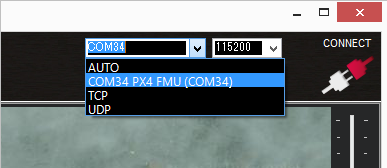
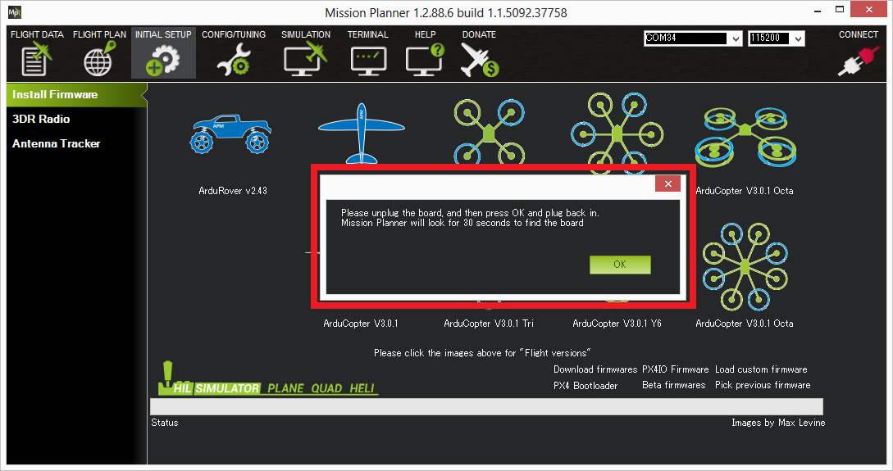

.. _common-loading-firmware-onto-pixhawk:

================
Loading Firmware
================

These instructions will show you how to download the latest firmware onto the autopilot using the Mission Planner ground station,which already has ArduPilot firmware installed . See :ref:`common-loading-firmware-onto-chibios-only-boards` .

[copywiki destination="copter,plane,rover,planner"]

Connect autopilot to computer
=============================

Once you've :ref:`installed a ground station <common-install-gcs>` on your computer, connect
the autopilot using the micro USB cable as shown
below. Use a direct USB port on your computer (not a USB hub).

.. figure:: ../../../images/pixhawk_usb_connection.jpg
   :target: ../_images/pixhawk_usb_connection.jpg
   :width: 450px

   Pixhawk USB Connection

Windows should automatically detect and install the correct driver
software.

Select the COM port
===================

If using the *Mission Planner* select the COM port drop-down on the
upper-right corner of the screen (near the **Connect** button).  Select
**AUTO** or the specific port for your board. 
Set the Baud rate to **115200** as shown. Don't hit **Connect** just yet.

Install firmware
================

On the Mission Planner's **SETUP \| Install Firmware** screen
select the appropriate icon that matches your frame (i.e. Quad, Hexa). 
Answer **Yes** when it asks you "Are you sure?".

.. figure:: ../../../images/Pixhawk_InstallFirmware.jpg
   :target: ../_images/Pixhawk_InstallFirmware.jpg

   Mission Planner: Install FirmwareScreen

Next it will try to detect which board you are using and it may ask you to unplug the board, press OK, and  plug it back in to detect the board type.

   Mission Planner: Install FirmwarePrompt

If all goes well you will see some status appear on the bottom right
including the words, "erase...", "program...", "verify.." and "Upload
Done".  The firmware has been successfully uploaded to the board.

It usually takes a few seconds for the bootloader to exit and enter the main code after programming or a power-up. Wait to press CONNECT until this occurs.

Using Beta and Developer Versions
=================================

Beta
----

Prior to ``Stable`` releases, a ``Beta`` version or versions get released. These may be used if you wish to try newer features or help the developers further flight test the code. Since they are "beta" versions, there possibly still may be bugs (although this is possible even in Stable firmware). However, it has been tested by the development team, and already flight tested. This release allows a wider user base to final test the firmware before its release as ``Stable``. Experienced ArduPilot users are encouraged to test fly this firmware and provide feedback.

Mission Planner has an option on its **Install Firmware** page to upload this release, but its later ``Stable`` release may already be available, so be sure to check the normal vehicle upload option first.

Latest Developer Version
------------------------

This reflects the current state of the development branch of the ArduPilot code. It has been reviewed by the development team, passed all automated test suites,  and in most cases, if significant changes have been made, test flown. This code gets built daily and is available for testing by experienced users. This corresponds to an "alpha" release, and may have bugs, although very rarely "crash inducing". Very shortly after an addition that changes or introduces a feature is added, the :ref:`Upcoming Features <common-master-features>` section of the Wiki is updated with information about the addition or change.

This code must be manually downloaded from the `Firmware Downloads <firmware.ardupilot.org>`__ page as ``latest`` for your particular board, and then uploaded using Mission Planner's "Load Custom Firmware" option on its **Install Firmware Page**

Testing
=======

You can test the firmware is basically working by switching to the
*Mission Planner Flight Data* screen and pressing the **Connect**
button.  The HUD should update as you tilt the board.

:ref:`Connect Mission Planner to AutoPilot <common-connect-mission-planner-autopilot>` has more
information on connecting to Mission Planner.
