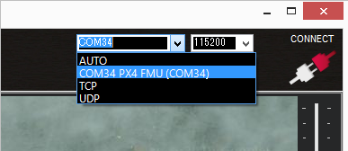
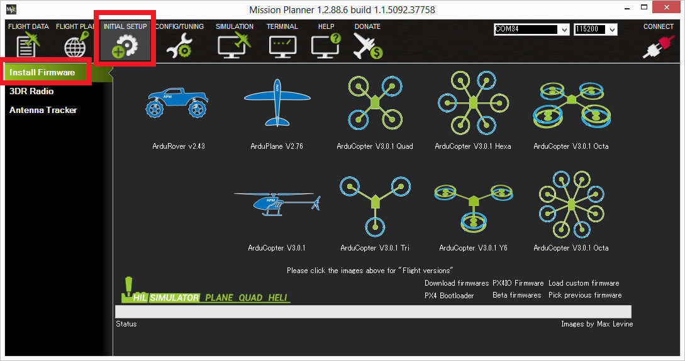
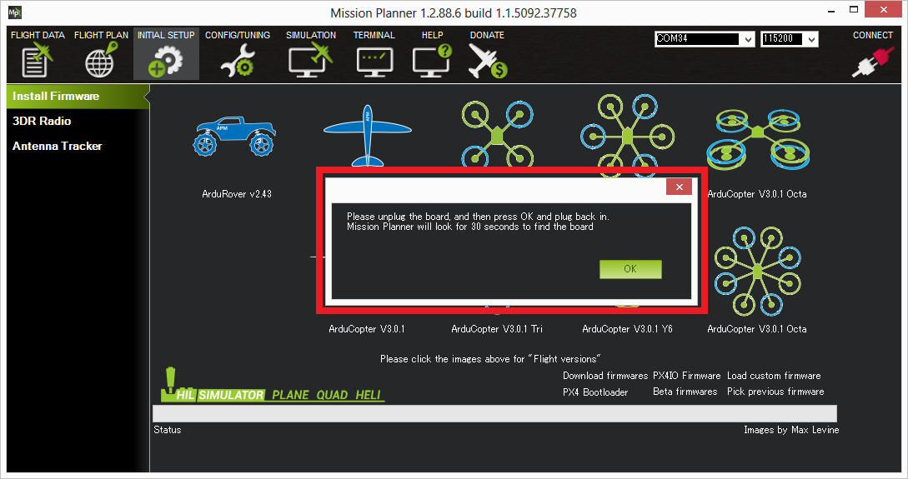
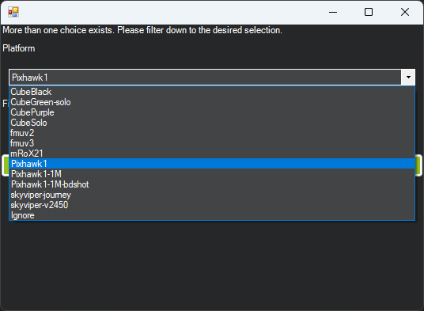
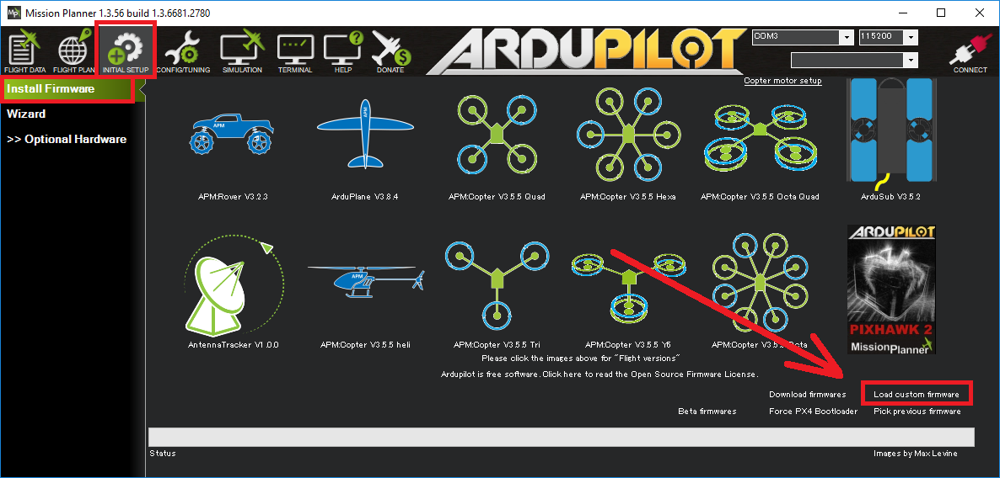

.. _common-loading-firmware-onto-pixhawk:

[copywiki destination="copter,plane,rover,planner,blimp,sub"]

==================================================================
Loading Firmware to Boards with an ArduPilot Compatible Bootloader
==================================================================

These instructions show how to load firmware onto an autopilot which already has an :ref:`ArduPilot compatible bootloader <loading-firmware-bootloader-check>` installed, using the Mission Planner ground control station. This is the normal method for every firmware update once ArduPilot is installed.

If the autopilot has never run ArduPilot or PX4 firmware, see :ref:`common-loading-firmware-onto-chibios-only-boards` instead.

.. note:: for some autopilots, it may be possible to update the firmware by :ref:`flashing from SD card <common-install-sdcard>` instead.

Select the COM port
===================

With the autopilot :ref:`connected to the computer by USB <common-loading-firmware>`, and if using *Mission Planner* as the GCS, select the COM port drop-down in the upper-right corner of the window near the **Connect** button. Select **AUTO** or the specific port for your board. Set the Baud rate to **115200** as shown. Do not hit **Connect** just yet.

Install firmware
================

In Mission Planner's **SETUP \| Install Firmware** screen
select the appropriate icon that matches your vehicle or frame type(i.e. Quad, Hexa).
Answer **Yes** when it asks you "Are you sure?".

   Mission Planner: Install FirmwareScreen

.. note:: some boards are specifically targeted to a particular vehicle type and firmware is not automatically built for other vehicles. However, ArduPilot could still be built for those other vehicles using the `Custom Firmware Server <https://custom.ardupilot.org/>`__.

Mission Planner will try to detect which board you are using. It may ask you to unplug the board, press OK, and plug it back in to detect the board type.

   Mission Planner: Install Firmware Prompt

Often you will be presented with a dropdown box of firmware variants for the board, which you can select from (such as bi-directional DShot variants, if available). For boards which share the Pixhawk board id, the list will be extensive, as shown below:

Select the appropriate firmware for your board. For boards marked "Pixhawk", Pixhawk1 firmware is usually the best choice.

.. warning:: some boards labeled as Pixhawk 2.4.x may have sensor substitutions which may lead to pre-arm checks or no secondary IMU. Please see the BARO_OPTIONS parameter for a workaround for a known sensor substitution on some boards of a MS5607 barometer where a MS5611 should be used. IMUs may also be substituted. Where possible, please source autopilots from ArduPilot partners.

If all goes well, you will see a status appear on the bottom right including the words: "erase...", "program...", "verify..", and "Upload Done". The firmware has been successfully uploaded to the board.

It usually takes a few seconds for the bootloader to exit and enter the main code after programming or a power-up. Wait to press CONNECT until this occurs. See :ref:`Testing that it Worked <loading-firmware-testing>` for how to confirm the result.

Installing a Beta, Development, or Custom Build
===============================================

The firmware icons above install the current ``Stable`` release. To install a ``Beta``, ``latest``, or custom build, :ref:`download the .apj file <loading-firmware-download>` for your board first, then load it with Mission Planner's "Load custom firmware" option:

- connect the ground station PC to the autopilot using a USB cable
- select the COM port and baud rate (normally 115200, but you can choose higher if your hardware allows) for the board. These are selected on the top right of the screen.  Do **not** press the Connect button
- go to MP firmware install screen (select "Setup >> Install Firmware")
- click the "Load custom firmware" link and select the .apj file you downloaded (do not select the .hex files, which are only meant to be used with DFU/JTAG/SWD methods). If the "Load custom firmware" link is not visible select "Config >> Planner" and set the "Layout" drop-down to "Advanced".
- you may need to click on "Force bootloader" before the step above (assuming the board has been previously flashed with Ardupilot's bootloader)

- follow any instructions displayed regarding plugging/unplugging the board
- if all goes well some status should be displayed at the bottom of the screen.  i.e. "erase...", "program...", "verify.." and "Upload Done".

.. note:: Mission Planner also offers a **Beta firmware** option on its Install Firmware page, which does not require a manual download. A later ``Stable`` release may already be newer than the ``Beta`` on offer, so check the normal vehicle upload option first.
