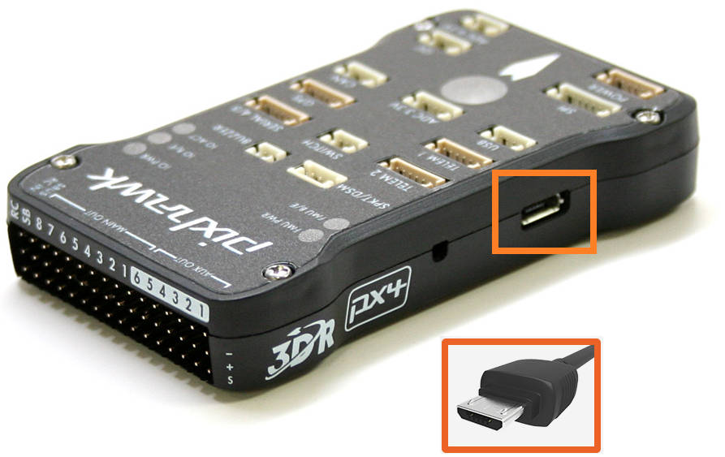

.. _common-loading-firmware-onto-pixhawk:

================
Loading Firmware
================

These instructions will show you how to download the latest firmware onto the flight controller using the Mission Planner ground station.

[copywiki destination="copter,plane,rover,planner"]

Connect flight controller to computer
=====================================

Once you've :ref:`installed a ground station <common-install-gcs>` on your computer, connect
the flight controller using the micro USB cable as shown
below. Use a direct USB port on your computer (not a USB hub).

   Pixhawk USB Connection

Windows should automatically detect and install the correct driver
software.

Select the COM port
===================

If using the *Mission Planner* select the COM port drop-down on the
upper-right corner of the screen (near the **Connect** button).  Select
**AUTO** or the specific port for your board (**PX4FMU** or **Arduino Mega 2560**). 
Set the Baud rate to **115200** as shown. Don't hit **Connect** just yet.

.. image:: ../../../images/Pixhawk_ConnectWithMP.png
    :target: ../_images/Pixhawk_ConnectWithMP.png

Install firmware
================

On the Mission Planner's **Initial Setup \| Install Firmware** screen
select the appropriate icon that matches your frame (i.e. Quad, Hexa). 
Answer **Yes** when it asks you "Are you sure?".

.. figure:: ../../../images/Pixhawk_InstallFirmware.jpg
   :target: ../_images/Pixhawk_InstallFirmware.jpg

   Mission Planner: Install FirmwareScreen

After the GCS detects which board you are using it will ask you to unplug the board, plug it back in and then
press **OK** within a few seconds (during this brief period the
bootloader accepts requests to upload new firmware).

.. figure:: ../../../images/Pixhawk_InstallFirmware2.png
   :target: ../_images/Pixhawk_InstallFirmware2.png

   Mission Planner: Install FirmwarePrompt

Next you may be asked "Upload ChibiOS?".  Most users will not notice a significant difference regardless of how this is answered.

  - "Yes" will load ArduPilot using the newer ChibiOS operating system which results in a smaller and more efficient firmware but has a few `missing features <https://github.com/ArduPilot/ardupilot/issues/8109>`__
  - "No" will load ArduPilot using the older NuttX operating system.

If all goes well you will see some status appear on the bottom right
including the words, "erase...", "program...", "verify.." and "Upload
Done".  The firmware has been succesfully uploaded to the board.

Testing
=======

You can test the firmware is basically working by switching to the
*Mission Planner Flight Data* screen and pressing the **Connect**
button.  The HUD should update as you tilt the board.

:ref:`Connect Mission Planner to AutoPilot <common-connect-mission-planner-autopilot>` has more
information on connecting to Mission Planner.
