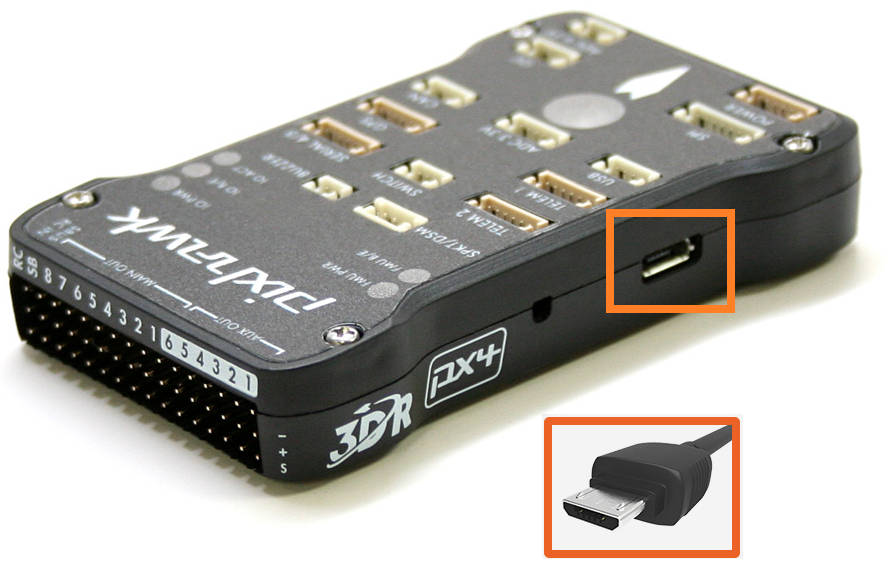

.. _common-loading-firmware:

[copywiki destination="copter,plane,rover,planner,blimp,sub"]

================
Loading Firmware
================

This page explains how to get ArduPilot firmware onto an autopilot: how to tell what is already on the board, which loading method it therefore needs, and how to confirm the result.

.. tip:: if your autopilot already runs ArduPilot and you simply want to update it to a newer version, you can skip straight to :ref:`common-loading-firmware-onto-pixhawk`.

Step 1: Connect the Autopilot to the Computer
=============================================

:ref:`Install a ground station <common-install-gcs>` on your computer, then connect the autopilot with a USB cable as shown below. Use a USB port directly on the computer, not a USB hub.

   Pixhawk USB Connection

For this first step, plug the board in normally: do **not** hold a DFU/BOOT button and do not bridge the BOOT pins. The next step depends on seeing how the board presents itself when it starts up on its own.

Windows should automatically detect and install the correct driver software.

.. note:: if nothing at all appears in the next step, suspect the cable before the board. Many USB cables sold with consumer electronics are charge-only and have no data wires.

.. _loading-firmware-bootloader-check:

Step 2: Check What is Already on the Autopilot
==============================================

ArduPilot firmware is loaded by a small program which permanently resides in the autopilot's flash, called the bootloader. ArduPilot's own bootloader, and the PX4 bootloader it descends from, both accept firmware from a ground station over USB. Bootloaders belonging to other firmware, such as the one shipped on most Betaflight flight controllers, do not, and must be replaced before ArduPilot can be loaded the first time.

An ArduPilot compatible bootloader is normally already present if the autopilot was purchased from an `ArduPilot partner <https://ardupilot.org/about/Partners>`__, or if it has previously run ArduPilot or PX4 firmware. It is normally **not** present if the board was supplied running Betaflight, INAV, or similar, or if the board's page in :ref:`common-autopilots` says that ArduPilot must be loaded for the first time via DFU.

If you are unsure, look at how the board appears to the computer with it plugged in as above.

.. tabs::

   .. group-tab:: Windows

      Press **Windows+X** and choose **Device Manager**, then expand **Ports (COM & LPT)**. A board with an ArduPilot compatible bootloader normally appears there as a COM port named after the autopilot, i.e. ``CubeOrange+ (COM3)``.

      Depending on which driver Windows has attached, the entry may instead read simply ``USB Serial Device (COM3)``. In that case right click it, choose **Properties \| Details**, and select **Bus reported device description** to see the name the board itself reports.

      Also expand **Universal Serial Bus devices**. A board which is in DFU mode appears there as ``STM32 BOOTLOADER``:

      .. image:: ../../../images/loading-firmware-device-manager.png
          :target: ../_images/loading-firmware-device-manager.png
          :width: 450px

   .. group-tab:: Linux

      In a terminal, list the connected serial devices:

      .. code-block:: bash

         ls /dev/serial/by-id/

      A board with an ArduPilot compatible bootloader appears there under its own name, i.e.:

      .. code-block:: none

         usb-CubePilot_CubeOrange+_1F0033000A51333031333230-if00

      The name is built from the manufacturer string, the board name, and the board's serial number. The manufacturer is ``ArduPilot`` unless the board's vendor has set their own, so ``CubePilot``, ``Holybro``, ``Hex``, ``mRo``, ``Qiotek``, ``Swift-Flyer`` and ``3D_Robotics`` are all names to expect here as well.

      If nothing is listed, check whether the board enumerated at all:

      .. code-block:: bash

         lsusb

      A board in DFU mode shows there as ``ID 0483:df11 STMicroelectronics STM Device in DFU Mode``.

   .. group-tab:: macOS

      In a terminal, list the connected serial devices:

      .. code-block:: bash

         ls /dev/cu.usbmodem*

      A board with an ArduPilot compatible bootloader appears there as a ``/dev/cu.usbmodem`` device followed by an identifier derived from the board's serial number and USB interface.

      To see the board's name rather than just that identifier, hold **Option** and choose **Apple menu \| System Information**, then select **USB** in the sidebar. The autopilot is listed in the device tree by name, with its manufacturer beneath. A board in DFU mode is listed there as ``STM32 BOOTLOADER``.

What you find means:

- **an ArduPilot compatible bootloader is present** if the board appears as a serial device named after the autopilot, i.e. ``CubeOrange+`` or ``Pixhawk6C``. The same name with ``-BL`` or ``-Secure-BL-v10`` appended means the board is currently sitting in the ArduPilot bootloader rather than in the main firmware, which is also fine, although not every board changes its name in the bootloader. Older PX4 era boards appear as ``PX4 FMU`` or ``PX4 BL FMU``. As a final confirmation, Mission Planner's **SETUP \| Install Firmware** screen will detect the board.
- **an ArduPilot compatible bootloader is not present** if the serial device is named for other firmware, i.e. ``Betaflight``, ``INAV``, or a generic ``STM32 Virtual ComPort``, or if the board is only ever visible as a DFU device, appearing after holding the DFU/BOOT button or bridging the BOOT pins while plugging it in.

Step 3: Load the Firmware
=========================

**If an ArduPilot compatible bootloader is present**, follow :ref:`common-loading-firmware-onto-pixhawk`. The ground station installs the firmware over the USB connection you already have. This is also the method used for every subsequent firmware update.

**If it is not**, follow :ref:`common-loading-firmware-onto-chibios-only-boards`. The ArduPilot bootloader and firmware are downloaded as a single file and loaded together over USB in DFU mode using STM32CubeProgrammer. This is a one time operation: once it has succeeded the board has an ArduPilot bootloader, and all later updates use the ground station method above. That page also covers the boards which run from external flash, such as the SPRacing series, which need a different procedure again.

.. note:: some autopilots with 1MB of flash do not include a copy of the bootloader in their firmware in order to save flash space. Those boards have a compatible bootloader installed, but it cannot be updated from within ArduPilot; see :ref:`common-bootloader-update`.

.. _loading-firmware-testing:

Step 4: Test that it Worked
===========================

Once the firmware has been loaded:

- wait a few seconds after the upload completes. It usually takes a moment for the bootloader to exit and start the main firmware, and connecting before then will fail.
- press **Connect** in your ground station. :ref:`Connect Mission Planner to AutoPilot <common-connect-mission-planner-autopilot>` has more information.
- confirm the firmware version and vehicle type reported on connection. In Mission Planner these appear in the **Messages** tab, and in the HUD, as the autopilot boots.
- switch to the *Mission Planner Flight Data* screen and tilt the board. The HUD attitude should follow it, which confirms the firmware is running and reading the IMU.

Any pre-arm messages at this point are expected on a freshly loaded autopilot: the vehicle still needs its :ref:`accelerometer <common-accelerometer-calibration>`, :ref:`compass <common-compass-calibration-in-mission-planner>`, and :ref:`radio <common-radio-control-calibration>` calibrations before it can be armed.

Additional Information
======================

.. _loading-firmware-download:

Downloading the Firmware
------------------------

Ground stations such as *Mission Planner* download and install ``Stable`` firmware for you, so a manual download is only needed when you want a ``Beta``, development, or custom build, or when the autopilot requires DFU loading.

Firmware for every supported autopilot is published on the `ArduPilot firmware server <https://firmware.ardupilot.org/>`__. To find the right file:

- open `firmware.ardupilot.org <https://firmware.ardupilot.org/>`__
- click the link for your vehicle type (i.e. `Plane <https://firmware.ardupilot.org/Plane/>`__, `Copter <https://firmware.ardupilot.org/Copter/>`__, `Rover <https://firmware.ardupilot.org/Rover/>`__, `Sub <https://firmware.ardupilot.org/Sub/>`__ or `Antenna Tracker <https://firmware.ardupilot.org/AntennaTracker/>`__)
- select the release you want: ``stable``, ``beta``, or ``latest`` (see the sections below)
- look for the directory whose name most closely matches your autopilot
- download the file appropriate to the loading method you will be using:

  - ``arduXXX.apj`` - the firmware alone, for loading through a ground station onto a board which already has an ArduPilot compatible bootloader
  - ``arduXXX_with_bl.hex`` - the bootloader and firmware combined, for loading via DFU onto a board without an ArduPilot compatible bootloader
  - ``arduXXX.abin`` - for :ref:`loading from an SD card <common-install-sdcard>`, on the autopilots which support it
  - ``arduXXX.bin`` - the raw binary, used by ``dfu-util`` and by boards which run from external flash

.. note:: some autopilots are targeted at a particular vehicle type, and firmware is not automatically built for the other vehicles. ArduPilot can still be built for those vehicles using the `Custom Firmware Build Server <https://custom.ardupilot.org/>`__.

Stable
^^^^^^

``Stable`` is the current release, and is the right choice for almost everyone. It is what a ground station installs by default from its firmware install screen. Each vehicle's ``stable`` directory always holds the newest release; specific past releases are kept in the numbered ``stable-x.y.z`` directories beside it.

Beta
^^^^

Prior to ``Stable`` releases, ``Beta`` versions are released. These may be used if you wish to try newer features or help the developers flight test new code. Since these are "beta" versions, there may still be bugs. This is possible even in Stable release firmware. However, a Beta release has been tested by the development team, and already flight tested. This release allows a wider user base to final test the firmware before releasing as ``Stable``. Experienced ArduPilot users are encouraged to test fly this firmware and provide feedback.

Mission Planner has an option on the **Install Firmware** page to upload this release, but later ``Stable`` releases may already be available. Be sure to check the normal vehicle upload option first.

Latest Developer Version
^^^^^^^^^^^^^^^^^^^^^^^^

This reflects the current state of the development branch of the ArduPilot code. It has been reviewed by the development team, passed all automated test suites, and in most cases test flown. This code gets built daily and is available for testing by experienced users. This corresponds to an "alpha" release, and may have bugs, although very rarely "crash inducing". Very shortly after an addition that changes or introduces a feature is added, the :ref:`Upcoming Features <common-master-features>` section of the Wiki is updated with information about the addition or change.

This code must be manually downloaded from the `Firmware Downloads <https://firmware.ardupilot.org>`__ page as ``latest`` for your particular board, and then uploaded using your ground station's custom firmware option, or via DFU.

Custom Builds
^^^^^^^^^^^^^

The `Custom Firmware Build Server <https://custom.ardupilot.org>`__ builds firmware with a feature set you select, from the ``stable``, ``beta``, or ``latest`` branches. This is how features which are not present in the released firmware for a flash-limited autopilot can be enabled, at the expense of features you do not need. See :ref:`common-custom-firmware` for instructions, and :ref:`Firmware Feature Limitations <loading-firmware-feature-limitations>` below for background.

Parameter Conversion
--------------------

Updating the firmware to a newer version does not alter existing parameters, unless the firmware is for a different vehicle type, in which case parameters are reset to the defaults for that vehicle.

When upgrading you should take a copy of your parameters, and save them with a filename corresponding to the version you are moving from (use the "Save to File" button on Mission Planner's **CONFIG/Full Parameter Tree** tab).  If you decide you must return to an earlier firmware these will be invaluable in restoring your vehicle.  However - *do not* ever apply those saved parameter files to newer versions of the firmware!

ArduPilot goes to some effort to make firmware upgrades seamless.  From time to time we need to move parameters around, change their scaling or simply remove them.  We do this automatically on first boot after the firmware is updated.

We can't retain this parameter migration code forever, so there are limits to which versions we guarantee upgrades from and to.  You can still upgrade from older versions to newer versions, but you may find that some functionality changes unexpectedly as you are now using default parameter values rather than your customised values.

If your autopilot falls far behind the modern stable versions you can still get the parameter conversions - you just need to flash intermediate versions - making it a multi-step process.

+--------------+--------------------------+
| New version  | Oldest Migration version |
+==============+==========================+
| 4.8(latest)  | 4.3                      |
+--------------+--------------------------+
| 4.7          | 4.2                      |
+--------------+--------------------------+
| 4.6          | 4.1                      |
+--------------+--------------------------+
| 4.5          | 4.1                      |
+--------------+--------------------------+
| 4.4          | 4.1                      |
+--------------+--------------------------+

Note that not every vehicle type has a release for every version number - Sub, for example, has no 4.2, 4.3, 4.4 or 4.6 release.  Use the oldest release your vehicle type has which is no older than the version in the table above; a Sub user on 4.1 would move to 4.5, then to 4.7.

Loading Firmware via SD Card
----------------------------

The firmware on some autopilots may be updated by copying an ``ardupilot.abin`` firmware file onto the SD card and then power cycling the board. This is useful where the USB port is not readily accessible, or where the update must be delivered remotely. Details on how to :ref:`update the firmware via SD Card can be found here <common-install-sdcard>`.

.. _loading-firmware-feature-limitations:

Firmware Feature Limitations
----------------------------

Not every autopilot's firmware contains every ArduPilot feature. Autopilots with 1MB of flash, in particular, have features removed in order for the code to fit.

- For a list of the features which are **not** included in the current "latest" firmware for a given autopilot, see :ref:`this page<binary-features>`. The definitive list for a specific board and firmware version is the ``features.txt`` file in that firmware's folder on the `firmware server <https://firmware.ardupilot.org/>`__. See :ref:`common-limited_firmware` for more detail, including RAM limitations.
- Every feature excluded from a 1MB autopilot by default is selectable on the `Custom Firmware Build Server <https://custom.ardupilot.org>`__. Many features which *are* included by default may not be needed for your application, so a custom build can add some of the excluded features while dropping unneeded ones. For example, omitting QuadPlane support frees space on a Plane which does not need it. Drivers and peripheral support can be selected individually, so that only those actually used take up flash.
- The custom build server can build from the daily master branch, and from the Stable and Beta branches.

.. toctree::
   :hidden:

   common-loading-firmware-onto-pixhawk
   common-loading-firmware-onto-chibios-only-boards
   common-install-sdcard
   common-custom-firmware
