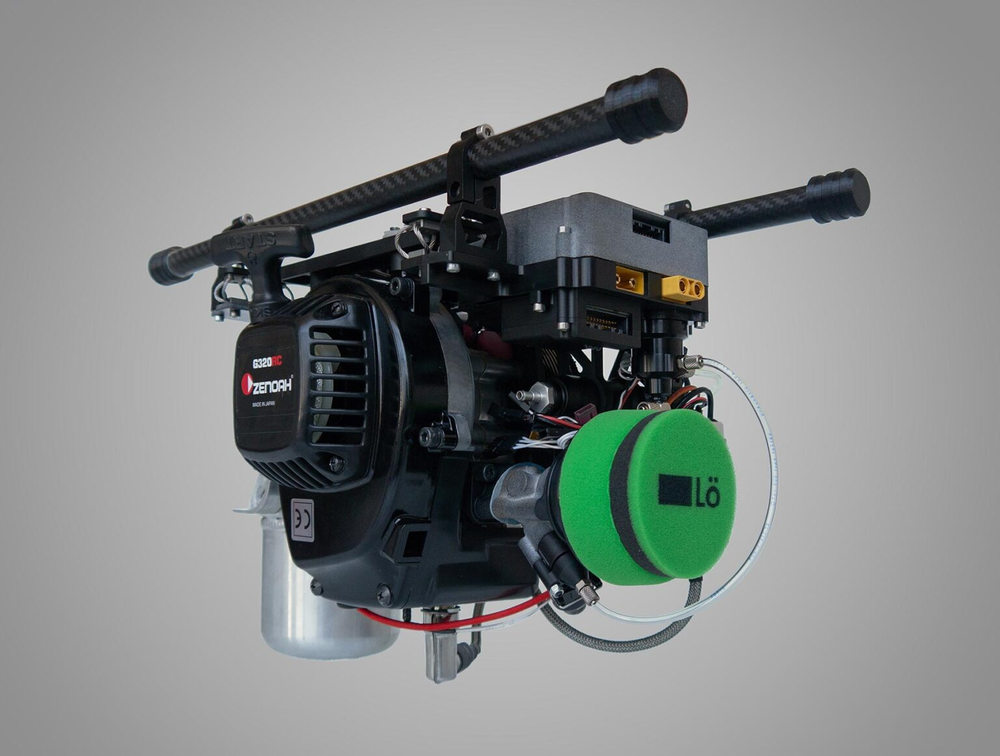
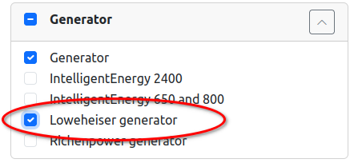

.. _common-loweheiser-generator:

====================
Loweheiser Generator
====================

The `Loweheiser Hybgen <https://www.loweheiser.com/hybrid-drone-generators/>`__ is an electric generator that can be installed into a multirotor drone to extend the flight time. This hybrid powertrain is suitable for drones up to 25 kg MTOM that require long flight times or heavy payloads. It consists of a two-stroke combustion engine of 32cc with a permanent-magnet generator attached to the crankshaft.

Compilation
===========

.. note:: the driver for this device is not included by default in the firmware built and available on the `Firmware Server <https://firmware.ardupilot.org>`__ . Either the user must build his own firmware with this backend enabled or use the `Custom Firmware Server <https://custom.ardupilot.org>`__

Usage
=====

Parameter configuration
-----------------------

This generator is a serial device. Connect it to a serial port of the flight controller and set the corresponding ``SERIALx_PROTOCOL=2`` (MAVLink). Also set  the corresponding ``MAVx_OPTIONS`` bit 1 (Don’t forward mavlink to/from).

Set :ref:`EFI_TYPE <EFI_TYPE>` = 4 (Loweheiser) and :ref:`GEN_TYPE <GEN_TYPE>` = 4 (Loweheiser).
Restart the flight controller to load the rest of the generator and EFI parameters.

Configure a 3-position switch on an RC input channel with ``RCx_OPTION=85`` (Generator). This will act as the generator state control switch.

(OPTIONAL) Configure an analog RC input channel (not a switch) with ``RCy_OPTION=218`` (Loweheiser throttle). This will act as manual throttle input for the generator throttle body. It is encouraged to use your throttle stick to drive this input channel.

(OPTIONAL) Configure an switch-type RC input channel with ``RCz_OPTION=111`` (Loweheiser starter). This is a switch that will control the generator starter.

There is no need to configure output channels, as the generator is operated entirely through the serial port.

To monitor the generator performance, configure a battery monitor with ``BATTx_TYPE=17`` (Generator-Elec). To monitor the engine performance, configure a battery monitor with ``BATTy_TYPE=18`` (Generator-Fuel). Set the volume of the fuel in the tank in ``BATTy_CAPACITY`` (in mL).

:ref:`GEN_IDLE_TH <GEN_IDLE_TH>` can be used to adjust the throttle percent that will be sent to the generator throttle body during idling.

:ref:`GEN_IDLE_TH_H <GEN_IDLE_TH_H>` can be used to adjust the throttle percent that will be sent to the generator throttle body, during warming up or cooldown.

The following parameters can be used to adjust the temperature limits of the generator:

    - :ref:`GEN_RUN_TEMP <GEN_RUN_TEMP>`: The cylinder head temperature required for the generator to start producing power, in deg Celsius.
    - :ref:`GEN_IDLE_TEMP <GEN_IDLE_TEMP>`: The cylinder head temperature required for the generator to return to idle after having run.
    - :ref:`GEN_OVER_TEMP <GEN_OVER_TEMP>`: The cylinder head overheat temperature. Above this threshold a warning message gets sent over MAVLink.

Leave :ref:`GEN_AUTO_START <GEN_AUTO_START>` = 0 and manually start the engine as needed.

.. warning:: Do not set :ref:`GEN_AUTO_START <GEN_AUTO_START>` = 1! The auto-starting feature of the Loweheiser generator does not operate correctly.

.. note:: The following parameters are not yet supported by the generator manufacturer:

    - :ref:`GEN_MNT_TIME <GEN_MNT_TIME>`: Seconds until maintenance is required.
    - :ref:`GEN_RUNTIME <GEN_RUNTIME>`: Total time this generator has run, in seconds.

Controls
--------

The switch configured as Generator has 3 values: STOP, IDLE, RUNNING. Begin on the STOP command. The generator is stopped.

Set the generator switch to IDLE. The goal of the IDLE state is to start the engine and bring it up to temperature.
If you have configured a Loweheiser throttle input channel, you can now use it to select the throttle during IDLE state. Otherwise, ``GEN_IDLE_TH`` will be applied.
If you have configured a Loweheiser starter input channel, you can now use it to activate the starter motor and crank the engine. Otherwise, crank the engine manually.

Set the generator switch to RUNNING. The driver will actually wait until the engine reaches a temperature of ``GEN_RUN_TEMP``, before it switches to the RUN state. Until then, it will set the throttle to ``GEN_IDLE_TH_H``.

Once temperature is reached, the generator will proceed to the RUN state. In this state the throttle is controlled automatically by a governor and the generator produces power.

To stop the engine, set the Generator switch to STOP. The driver will actually wait until the engine cools down to a temperature of ``GEN_IDLE_TEMP`` before it stops. During that time, it will apply ``GEN_IDLE_TH_H`` throttle.

.. note:: No state transitions will take place once the vehicle is armed.

.. note:: The Loweheiser driver will apply additional pre-arm checks, to ensure safety of operations.

MAVLink messages
----------------

The generator will emit the following MAVLink telemetry messages:

    - ``GENERATOR_STATUS``
    - ``EFI_STATUS``

Logging
=======

This driver will add the following messages to the onboard log:

    - ``LOEC``: Debug information for the driver state machine.
    - ``LOEG``: Generator telemetry.

